<div id="part-intro" class="chapter-title">
# Introduction
</div>


## Time series data {#timeseriesdata}

A **time series** is a collection of data in which the observations correspond to consecutive time periods. A common notation for time series data is $y_{t}$, $t=1,\ldots,T$, where $t$ denotes the time period and $T$ the total number of observations. The interval between observations $y_{t-1}$ and $y_{t}$, or $y_{t}$ and $y_{t+1}$, is a some unit of time, for example, an hour, a month, a quarter or one year. In many cases, it may be natural to use more concrete labels for the time periods, for instance $t=2000,\ldots,2024$ for yearly data, or $t=2000:1, 2000:2,\ldots,2024:12$ for monthly observations. Therefore, occasionally $T$ also denotes the concrete final time label such as 2024:12 (December 2024).

- Time series data are used and analysed in various fields, such as economics and finance, but also in social, natural, engineering, and medical sciences. 

- In economics and finance, data sets are typically time series, which have led to relatively specific subfields of macroeconometrics and financial econometrics.

In this course, we assume that the observations recorded are equally spaced in time (or can be approximately treated as such). Irregularly spaced data call for different methods and are not treated here. If the time series observations $y_{t}, \, t=1,\ldots,T,$ are scalar valued, we talk about **univariate time series**. On the other hand, if $\boldsymbol{y}_{t}=(y_{1t},\ldots,y_{nt})$ is vector-valued, which is emphasized by the bolded symbol, we talk about **multiple time series** or **vector-valued time series**. In these latter cases, relationships between two or more time series is of interest. 

We restrict ourselves to the common case where $y_t$ is a real-valued time series, or is at least treated as such, meaning that realizations are real numbers. In discrete and limited dependent time series, $y_t$ takes only discrete values, such as binary values ($y_t=1$ or $y_t=0$) or values where the range is limited (such as the case where $y_t$ is nonnegative). These type of time series variables require specific (nonlinear) models, which we will not consider in this course (except models used for volatility modelling and hence positive-valued variables).

When analyzing time series data, often a useful and natural first step is to plot the data and inspect its main characteristics visually. Below we plot the monthly Consumer Price Index (CPI) in the United States for the time period $1990:1$--$2025:6$. In this figure, and as almost always when plotting time series data, to point out the nature of time series data (dependency between observations) the depicted line goes through observation points. 
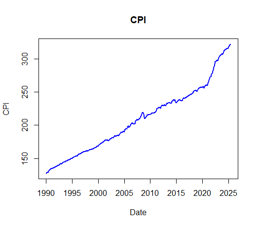
<center>
<span style="color: #0069d9;">Figure: Monthly U.S. Consumer Price Index between January 1990 to June 2025 (1990:1--2025:6) (source: Shiller data).</span>
</center>

&nbsp;

The aim in time series analysis is often to build a **statistical model** that aims to represent the observed time series and its fluctuation over time. This typically happens by considering the dependence structure of consecutive observations. **Autocorrelation** (serial correlation) between observations is an essential property of the time series, which needs to be taken into account in statistical/econometric modelling.

- This violates the no-autocorrelation assumption typically imposed on the linear regression model (for cross-sectional datasets).

- With cross-sectional data, random sampling (usually) guarantees that the error terms of the linear regression model for different observations are mutually independent, and hence autocorrelation is (typically) not an issue.

When analyzing time series data often a useful and natural first step is to plot the series and inspect its main characteristics visually in addition to possible underlying theory or background knowledge of the phenomenon that the time series presents. This will bring (at least) preliminary idea on dependence structures behind the data generating mechanism of the time series. Some important questions to consider when looking at a time series graph:

- Is there a **trend** (i.e. the values of the time series tend to increase or decrease over time)?

- Are there **seasonal effects** (a regularly repeating pattern of highs and lows related to calendar time such as seasons, quarters, months or days of the week)?

- Any major **outliers** (observations far away from other data points)? 
    
- Is the **variability** (variance) relatively **constant** over time? 

- Are there any **abrupt changes** such as **breaks** or **regime switches** to either the level or variance of the series?

As an example, in the U.S. CPI time series above, a clear feature is an increasing trend over time. It turns out that instead of the levels, we are mainly interested in the changes of the CPI series as a measure of inflation, as will be discussed below.

An increasing trend can also be observed in the (monthly) S\&P 500 stock market index. Stock prices rallied substantially between the years 1990 and 2025 (that is, stock prices experienced a substantial surge), while there are also a few substantial market corrections ("bear markets") throughout the years. What is also important to notice at this stage is that this trending behaviour is clearly different than the one behind the CPI series. 

- Characteristics behind these type of "stochastic" trends, as in the S\&P 500 index, will be addressed later in this course when discussing nonstationary time series data.


<center>
<span style="color: #0069d9;">Figure: S\&P 500 stock market index between January 1990 and June 2025 (source: Shiller data).</span>
</center>

&nbsp;

Next figure depicts the monthly number of fatalities in traffic accidents in the U.S. between $1973:1$--$1978:12$. In this series, there is no apparent increasing or decreasing trend. Instead, the series exhibits clear **seasonal variation**, with the yearly maximum always in July and the minimum in February.

<center>
<span style="color: #0069d9;">Figure: Monthly traffic accidents between January 1973 and December 1978. (source: Brockwell and Davis, 1996).</span>
 </center>

&nbsp;

Next figure shows the yearly number of sunspots for the period 1770--1870. This series has no trend or seasonal variation, although the **cyclical** pattern of the series could be confused with seasonal variation. However, the pattern is not seasonal because the nature of the cycle changes. In particular, the distance between consecutive peaks is not constant, as would be the case with seasonal variation. An apparent feature is a positive correlation between consecutive observations; a large observation is typically followed by another large one, and a small observation by another small one.
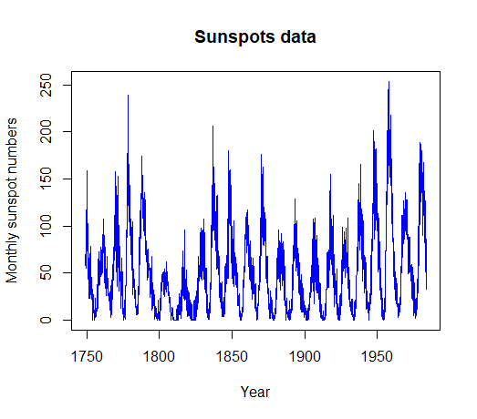
<center><span style="color: #0069d9;">Figure: The number of sunspots between the years 1770--1870 (source: Brockwell and Davis, 1996).</span>
 </center>

&nbsp;

Overall, these visual findings might already suggest which type of **time series model** could be useful. After (at least a preliminary) a statistical model, as we will consider more detail in the coming sections, has been chosen, one can then for example:

- estimate the unknown parameters of the model,

- check whether the estimated model and the observations are compatible,

- test hypotheses concerning the model parameters, 

- and finally, use the model for the intended end purpose.

The end purpose of how the statistical model will be eventually used varies depending on the situation and the fields of application. 

- One use is to give a **summarized description** of the observed data set, which may be useful in understanding the underlying data generation process producing the data. 

- Another central use of a time series model is to **forecast** the future values of the single or multiple time series. In the multivariate case, one time series of interest may be predicted by making use of information contained in other time series as predictive variables. 

- One is often also interested in exploring potential **temporal and contemporaneous dependencies** between the time series, such as the relationship between inflation and stock market returns, after relevant transformations as discussed next. One may be interested in investigating whether higher inflation typically occurs simultaneously with increasing stock prices (in such an investigation, it would be appropriate to take also various other time series variables into account).


&nbsp;


## Transformations

As described above, in time series modelling a good first step is always to plot the time series under investigation. This gives an idea of the main features of the time series such as trends, seasonal patterns and/or apparent sudden breaks or outlying observations. In what follows in the next few Sections, it is assumed that these patterns do not exist. If the observed series does exhibit several such patterns, one should use a transformation is to eliminate these patterns. 

In time series analysis, a few transformations and "manipulations" are generally used and they are even natural and common parts of the empirical analyses in certain applications.

- The **first lag** of the time series $y_t$ is denoted by $y_{t-1}$. Generally **$k$th lag** is $y_{t-k}$.

- Perhaps the most commonly used transformation for time series data is **differencing**. The **first difference** of the series, $\Delta y_t$, is the **change** between $y_t$ and $y_{t-1}$. In other words,
\begin{equation*}
\Delta y_t = y_t - y_{t-1}.
\end{equation*}

- Often differencing is combined with taking natural **logarithms** (when assuming $y_t > 0, \, \forall t$). Taking logarithms is common especially when the series exhibits exponential growth or when the variation in the series increases as the level increases. The **logarithmic change** is 
\begin{equation*}
\Delta \mathrm{log}(y_t) = \mathrm{log}(y_t) - \mathrm{log}(y_{t-1}).
\end{equation*}
Importantly, the logarithmic changes can be interpreted as relative changes when the changes are small:
\begin{equation*}
\Delta \mathrm{log}(y_t) \approx (y_t - y_{t-1})/y_{t-1}.
\end{equation*}

- The **percentage of change** between periods $t$ and $t-1$ is $100 \Delta \mathrm{log}(y_t)$. With quarterly data $y_t$, **annualized growth rates** are obtained by multiplying 400, that is $400 \Delta \mathrm{log}(y_t)$, whereas annualized growth rates with monthly data can be approximated as $1200 \Delta \mathrm{log}(y_t)$. 

As an example, consider the quarterly U.S. CPI time series. Taking log-differences (first logs and then differences), and multiplying the resulting series with 1200 we obtain yearly inflation rate. Due to an increasing trend in the CPI, after log-differencing, we obtain a time series without clear trend. This detrending via log-differencing means that instead of an increasing trend, we have nonzero positive mean that can be seen here as an average inflation rate.
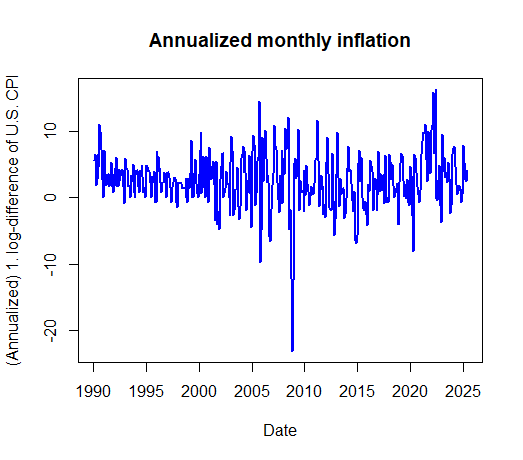
<center>
<span style="color: #0069d9;">Figure: Annualized U.S. inflation (CPI inflation) rate between February 1990 to June 2025 (1990:2--2025:6). </span>
</center>

&nbsp;


**More on differencing**. Differencing may also happen with a longer lag than the first lag: $y_{t}-y_{t-s},\, \left(s\geq1\right)$.

- As discussed above, the above case $s=1$ is the most common (representing change from one period to another). 

- In the case of seasonal variation, $s$ is often selected to match the length of the seasonal pattern. That is, for example, $s=4$ for the quarterly data and $s=12$ for the monthly series.

If denoting temporarily $y_t$ as the log CPI, taking seasonal differencing $100 (y_{t}-y_{t-12})$ yields another proxy for the U.S. inflation (cf. the time series above)
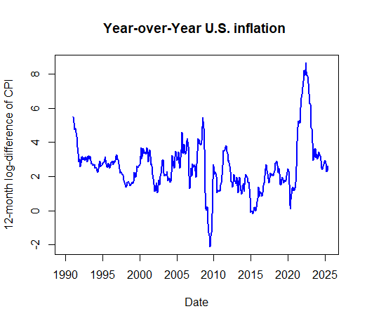
<center>
<span style="color: #0069d9;">Figure: Annualized U.S. inflation (CPI inflation) obtained as year-to-year changes in the CPI (1990:2--2025:6).</span>
</center>

&nbsp;

As another use of differencing, especially in financial econometrics and empirical finance, is to financial time series and returns that different assets yield for investors. Let $P_t$ the price of an asset at time $t$. Holding the asset for one period from $t-1$ to $t$ would result in a simple return
\begin{equation*}
R_t = \frac{P_t}{P_{t-1}} - 1 = \frac{P_t - P_{t-1}}{P_{t-1}}.
\end{equation*}
Moreover, so called continuously compounded return (or log return) is
\begin{equation*}
r_t = \mathrm{log}(1+R_t) = \mathrm{log} \Big(\frac{P_t}{P_{t-1}}\Big) =p_t - p_{t-1},
\end{equation*}
where $p_t = \mathrm{log} (P_t)$ and having some advantages over simple returns. In both cases percentage returns are obtained by multiplying $r_t$ or $R_t$ by 100. 

- Importantly, in various financial applications, dividend (and equivalent) payments must also be taken into account when computing returns. If an asset pays dividends periodically, we must modify the definitions of asset returns. We will not consider these issues more detail in this course and details are left to more detailed studies in finance.

Below we depict the annualized 1. log-differences of the monthly S\&P 500 index (as percentages when multiplied by 100), as presented above). We therefore use simple log-differences approximating percentage returns in the general U.S. market index. The shape of the time series is now clearly very different than the price level data depicted above.
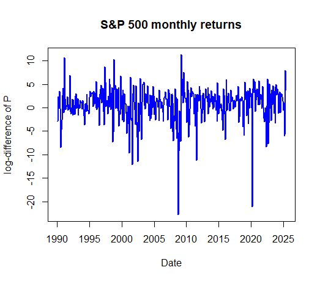
<center>
<span style="color: #0069d9;">Figure: (Annualized) monthly percentage changes in the S\&P 500 index.</span>
</center>

&nbsp;

**Detrending**. The trend and/or seasonal patterns etc. of the original time series are often modelled via transformation so that  this step may itself require estimation of some parameters. For example, in the case of a linear trend, one can fit a trending line using least squares regression, and then consider modelling the resulting residual series using time series methods. In that case, an observed time series $y_{t}$ would be replaced by the time series
\begin{equation*}
    \hat{x}_{t}=y_{t}-\hat{\alpha}-\hat{\boldsymbol{\beta}}t,\,\,t=1,\ldots,T,
\end{equation*}
where the estimates $\hat{\alpha}$ and $\hat{\boldsymbol{\beta}}$ are obtained by regressing $y_{t}$\ on a constant and $t$. More generally, instead of the linear function (of time), one can use more general polynomials as well. 

- To model seasonal variation, one could use trigonometric functions of time. 

- An often used alternative to remove seasonal variation (if not using already existing seasonally adjusted data) is the so-called seasonal indicators. As an example of this, for quarterly data, one would obtain seasonally-adjusted series by
\begin{equation*}
    \hat{x}_{t}=y_{t}-\hat{\boldsymbol{\beta}}_{1}d_{1t}-\cdots-\hat{\boldsymbol{\beta}}_{4}d_{4t},\,\,t=1,\ldots,T,
\end{equation*}
where the $i$th seasonal indicator $d_{it}$ takes value one when the observation in question corresponds to quarter $i$ and zero otherwise ($i=1,\ldots,4)$.

As for additional information (in this course), there is also a relatively broad literature on more advanced detrending techniques than differencing and seasonal dummies in econometrics.


&nbsp;


## Assumptions and limitations of this course

In summary, we consider time series models/processes assuming that the observed time series do not exhibit clear seasonal patterns. If necessary, those patterns have been eliminated using some transformation or using some seasonal adjustment methods, and one is eventually modelling the transformed series.

- The typical approach especially with macroeconomic data is to use **seasonally-adjusted datasets** provided by official statistics organizations (like Statistics Finland). Therefore, we can assume that the seasonal effects are, at least at reasonable degree, already taken into account.

Concerning trends, in the first part of this course (Sections 2--9) we consider **stationary time series processes** and their realizations (i.e. time series). These assume that there are no clear trends and/or trending type behaviour in the time series. 

- That is the time series are more or less realizations which resemble more U.S. inflation series and stock market returns above than the CPI level series or the s&P 500 price series.

- As for now, it suffices to understand that non-stationary time series can usually (though not always) be transformed by differencing such that stationarity assumptions hold reasonably well and thus a stationary such as ARMA($p,q$) process is possible.

- An exception to the stationary time series starts becomes at the later part of the material where trending type of behaviour will be considered more detail. The basics of nonstationary processes will be discussed in Sections 12--13 where modelling the deterministic and/or especially the stochastic trend is of interest in several applications. 

Finally, we will start with univariate time series. That is we are analysing one time series at hand. Later on in Sections 10--11 and 13, we will also consider basics of multiple (multivariate) time series. 


## R Lab

All the R codes considered in this section are compiled in the following link (Tab). Notice that you might need to download some datasets from the course website and include them to the same folder as this file.

<button class="toggle-button toggle-button-r" onclick="toggleCode('r-code2')">R Code</button>
<div id="r-code2" style="display:none;">
<!-- <div class="toggle-button" onclick="toggleCode('code2')">Show/Hide R codes (full section)</div> 
<div id="code2" style="display:none;"> -->

``` r
# Introduction

# Shiller data

# This script reads monthly data and creates separate plots for CPI and 
# S&P 500 (variable P) using both base R and the ggplot2 package.

# --- Setup ---

# Install and load necessary packages
# If you don't have these packages, uncomment the following lines to install them
# install.packages("ggplot2")
# install.packages("zoo")

library(ggplot2)
library(zoo) # Used for handling year.month date formats in this Shiller data

# Set locale to English to ensure month names are not localized
Sys.setlocale("LC_TIME", "C")
```

```
## [1] "C"
```

``` r
# --- Define/select data and sample period ---

# Set the sample period. The format (for this monthly data) is "YYYY-MM".
start_period <- "1990-01"
end_period <- "2025-06"

# Define the data file name
data_file <- "Shiller_data_031025.txt"


# --- Load and prepare data ---

# Read the data from the text file. This assumes a tab-separated file with a header.
# If your separator is different (e.g., a comma), use read.csv() instead.
tryCatch({
  shiller_data <- read.delim(data_file, header = TRUE)
}, error = function(e) {
  stop(paste("Error reading the file:", 
             data_file, ". Make sure it's in the same folder as the script."))
})

# Convert the 'Date' column to a proper time series date object
shiller_data$Date_ts <- as.yearmon(as.character(shiller_data$Date), "%Y.%m")

# Filter the data to the desired sample period
data_subset <- subset(shiller_data, Date_ts >= as.yearmon(start_period) & 
                        Date_ts <= as.yearmon(end_period))


# --- Create Time Series Objects for Base R plotting ---

# Get the start year and month from the first data point in our subset
start_year <- floor(as.numeric(data_subset$Date_ts[1]))
start_month <- cycle(data_subset$Date_ts[1])

# Create 'ts' (time series) objects, here monthly data
cpi_ts <- ts(data_subset$CPI, start = c(start_year, start_month), frequency = 12)
p_ts <- ts(data_subset$P, start = c(start_year, start_month), frequency = 12)


# --- Plot (i): CPI Time Series ---

# (i) Base R Implementation for CPI using plot.ts
plot.ts(cpi_ts,col = "blue",lwd = 2,main = "CPI",xlab = "Date",ylab = "CPI")
```

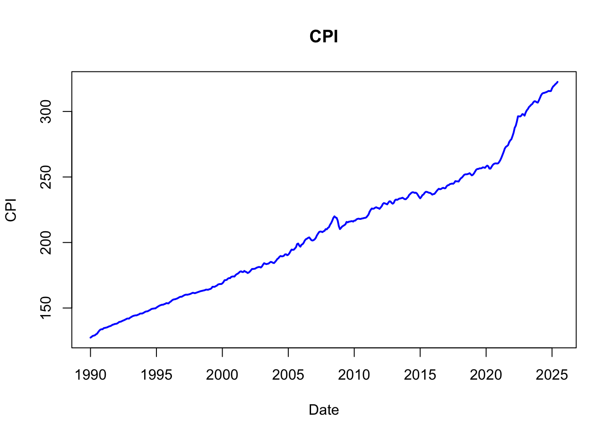

``` r
# (i) ggplot2 Implementation for CPI
cpi_plot_ggplot <- ggplot(data_subset, aes(x = Date_ts, y = CPI)) +
  geom_line(color = "steelblue", size = 1) +
  labs(title = "CPI",subtitle = paste("From", start_period, "to", end_period),
    x = "Date",y = "Consumer Price Index (CPI)") +
  theme_minimal() + theme(plot.title = element_text(hjust = 0.5),
        plot.subtitle = element_text(hjust = 0.5))

# Print the ggplot object to display it
print(cpi_plot_ggplot)
```

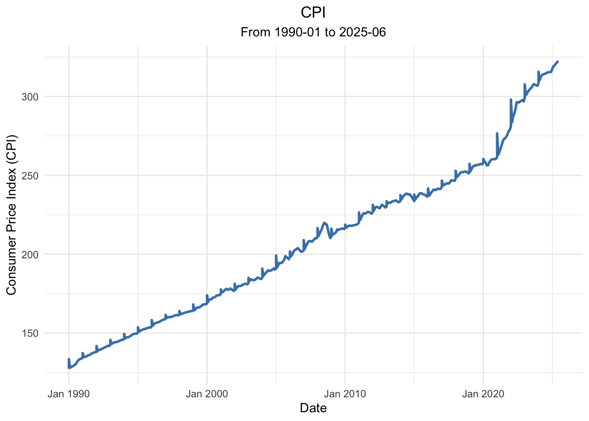

``` r
# --- Plot (ii): S&P 500 (P) Time Series ---

# (ii) Base R Implementation for S&P 500 (P) using plot.ts
plot.ts(p_ts,col = "blue",lwd = 2,main = "S&P 500 (variable P)",
        xlab = "Date", ylab = "S&P 500 Index")
```

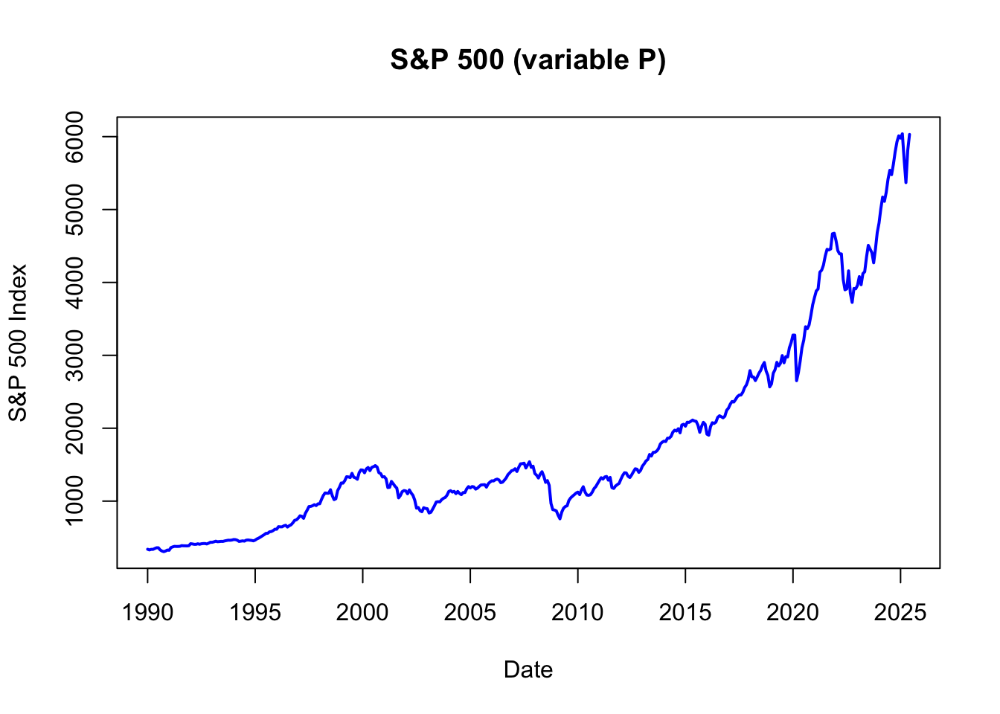

``` r
# (ii) ggplot2 Implementation for S&P 500 (P)
p_plot_ggplot <- ggplot(data_subset, aes(x = Date_ts, y = P)) +
  geom_line(color = "darkseagreen4", size = 1) +labs(
    title = "S&P 500 (P) Time Series (ggplot2)", subtitle = paste("From", 
    start_period, "to", end_period),x = "Date",y = "S&P 500 Index (P)") +
  theme_minimal() + theme(plot.title = element_text(hjust = 0.5),
        plot.subtitle = element_text(hjust = 0.5))

# Print the ggplot object
print(p_plot_ggplot)
```

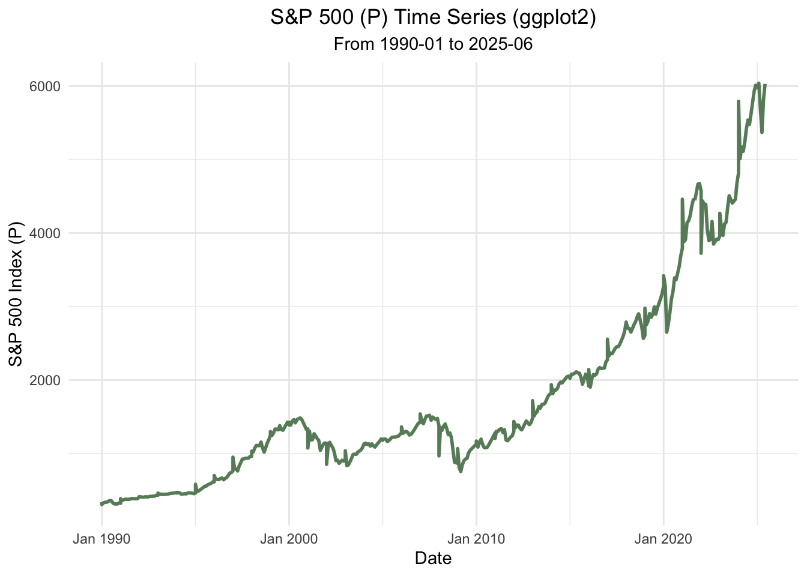

``` r
# --- Differencing: Calculate and plot log-differences ---

# Calculate log-differences. The result is shorter, so we add NA to align it.
data_subset$cpi_log_diff_1m <- c(NA, 1200*diff(log(data_subset$CPI))) # annualized
data_subset$cpi_log_diff_12m <- c(rep(NA, 12), 100*diff(log(data_subset$CPI), 12))
data_subset$p_log_diff <- c(NA, 100*diff(log(data_subset$P)))

# Create new 'ts' objects for the differenced series
cpi_log_diff_1m_ts <- ts(data_subset$cpi_log_diff_1m, start = c(start_year, 
                        start_month), frequency = 12)
cpi_log_diff_12m_ts <- ts(data_subset$cpi_log_diff_12m, start = c(start_year, 
                        start_month), frequency = 12)
p_log_diff_ts <- ts(data_subset$p_log_diff, start = c(start_year, 
                        start_month), frequency = 12)


# --- Plot (iii): 1. log-difference in CPI (Monthly Inflation) ---

# (iii) Base R Implementation
plot.ts(cpi_log_diff_1m_ts, col = "blue", lwd = 2, 
        main = "Annualized monthly inflation", xlab = "Date",
        ylab = "(Annualized) 1. log-difference of U.S. CPI")
```


``` r
# (iii) ggplot2 Implementation
ggplot(data_subset, aes(x = Date_ts, y = cpi_log_diff_1m)) +
  geom_line(color = "purple", size = 1) +
  labs(title = "Annualized monthly inflation (ggplot2)",
    subtitle = "(Annualized) 1. log-difference of CPI",
    x = "Date", y = "Log-Difference"
  ) +
  theme_minimal() + theme(plot.title = element_text(hjust = 0.5),
        plot.subtitle = element_text(hjust = 0.5))
```

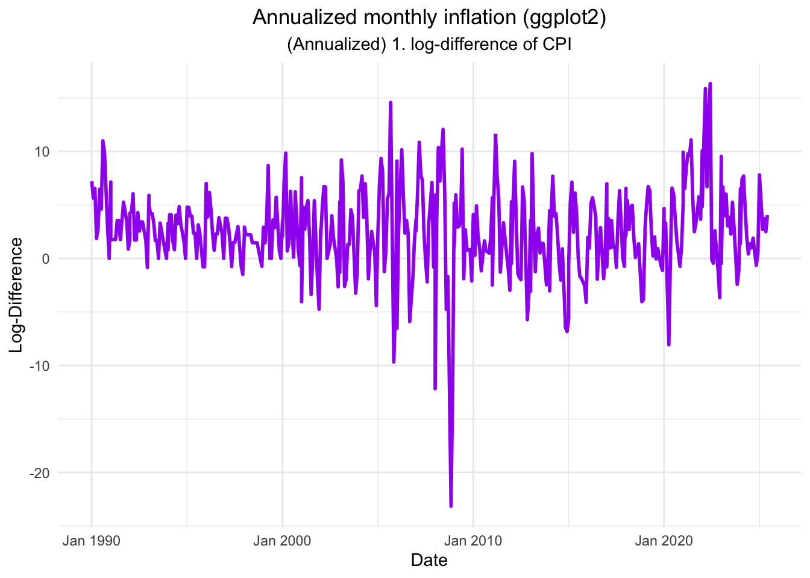

``` r
# --- Plot (iv): 12-month log-difference in CPI (Year-over-Year Inflation) ---

# (iv) Base R Implementation
plot.ts(cpi_log_diff_12m_ts,col = "blue", lwd = 2,
        main = "Year-over-Year U.S. inflation ", xlab = "Date", 
        ylab = "12-month log-difference of CPI")
```

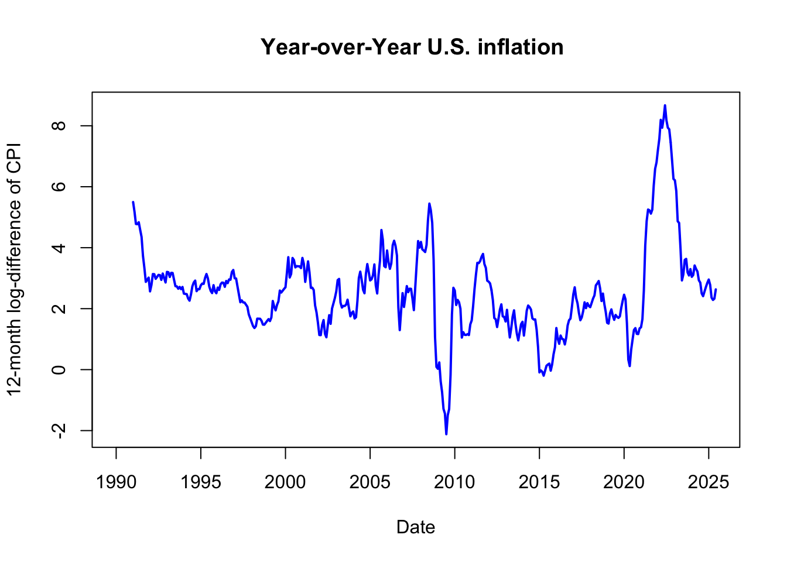

``` r
# (iv) ggplot2 Implementation
ggplot(data_subset, aes(x = Date_ts, y = cpi_log_diff_12m)) + 
  geom_line(color = "orange", size = 1) + labs(
    title = "Year-over-Year Inflation (ggplot2)",
    subtitle = "12-month log-difference of CPI",
    x = "Date", y = "Log-Difference"
  ) +
  theme_minimal() +
  theme(plot.title = element_text(hjust = 0.5),
        plot.subtitle = element_text(hjust = 0.5))
```

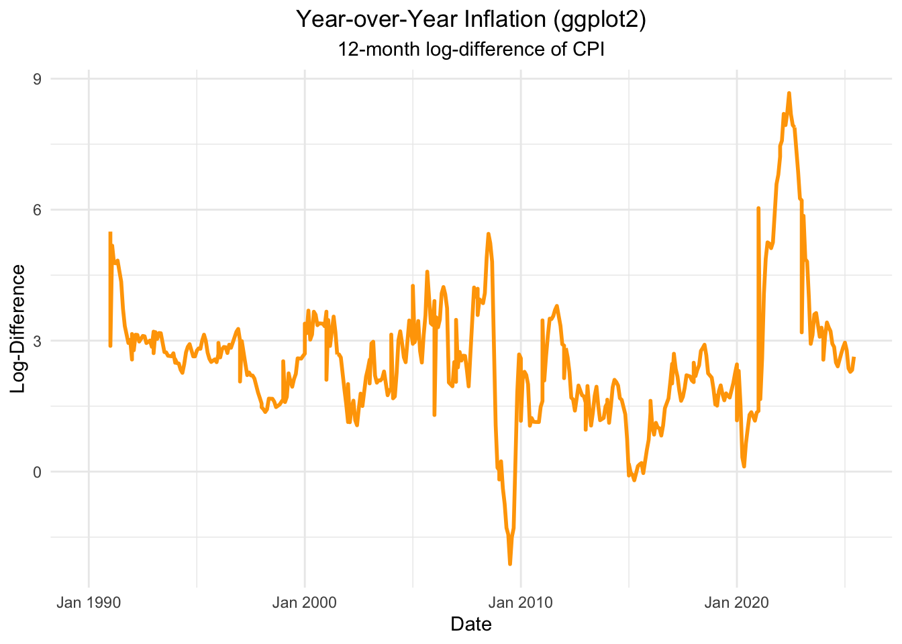

``` r
# --- Plot (v): Log-difference of P (S&P 500 monthly returns) ---

# (v) Base R Implementation
plot.ts(p_log_diff_ts,col = "blue",lwd = 2, main = "S&P 500 monthly returns",
        xlab = "Date",
        ylab = "log-difference of P")
```

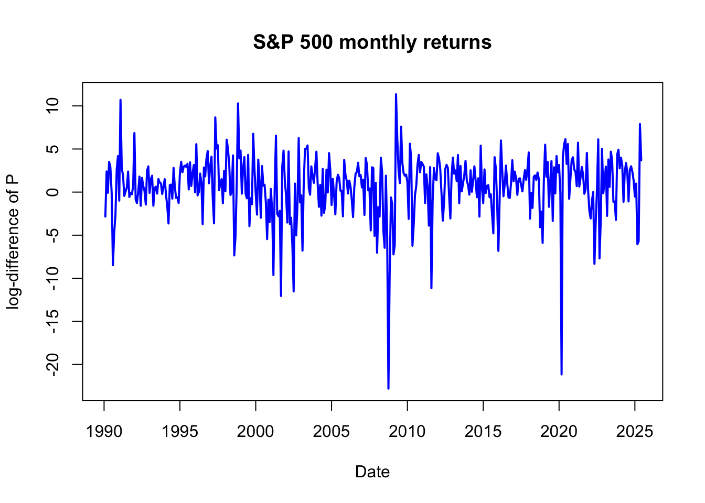

``` r
# (v) ggplot2 Implementation
ggplot(data_subset, aes(x = Date_ts, y = p_log_diff)) +
  geom_line(color = "red", size = 1) +
  labs(
    title = "S&P 500 monthly returns (ggplot2)",
    subtitle = "log-difference of P",
    x = "Date", y = "Log-Difference") +
  theme_minimal() +
  theme(plot.title = element_text(hjust = 0.5),
        plot.subtitle = element_text(hjust = 0.5))
```

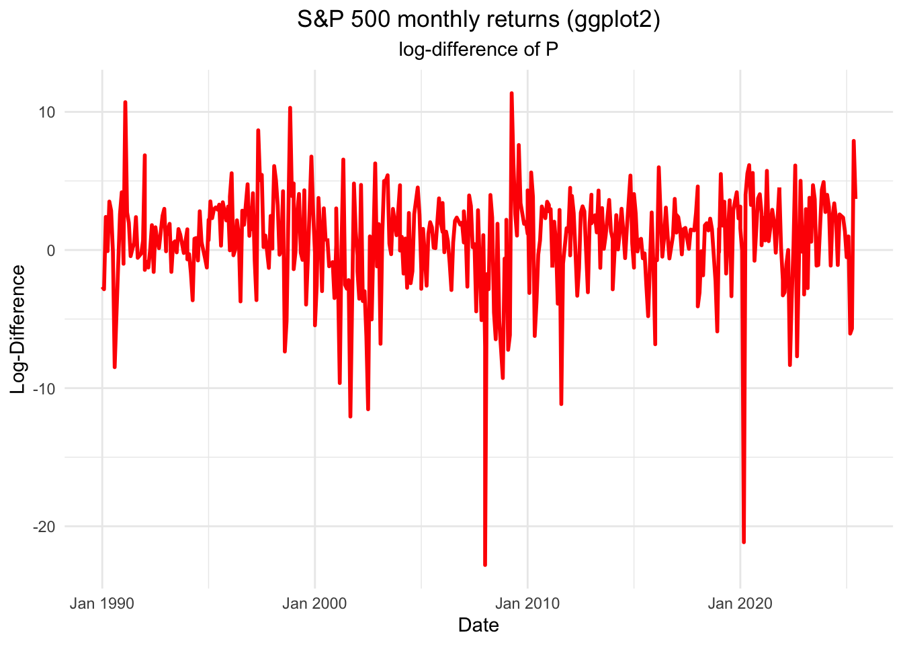

``` r
# --- Plot Built-in Dataset: sunspots ---
plot(sunspots, main = "Sunspots data", xlab = "Year",
     ylab = "Monthly sunspot numbers",col = "blue")
```

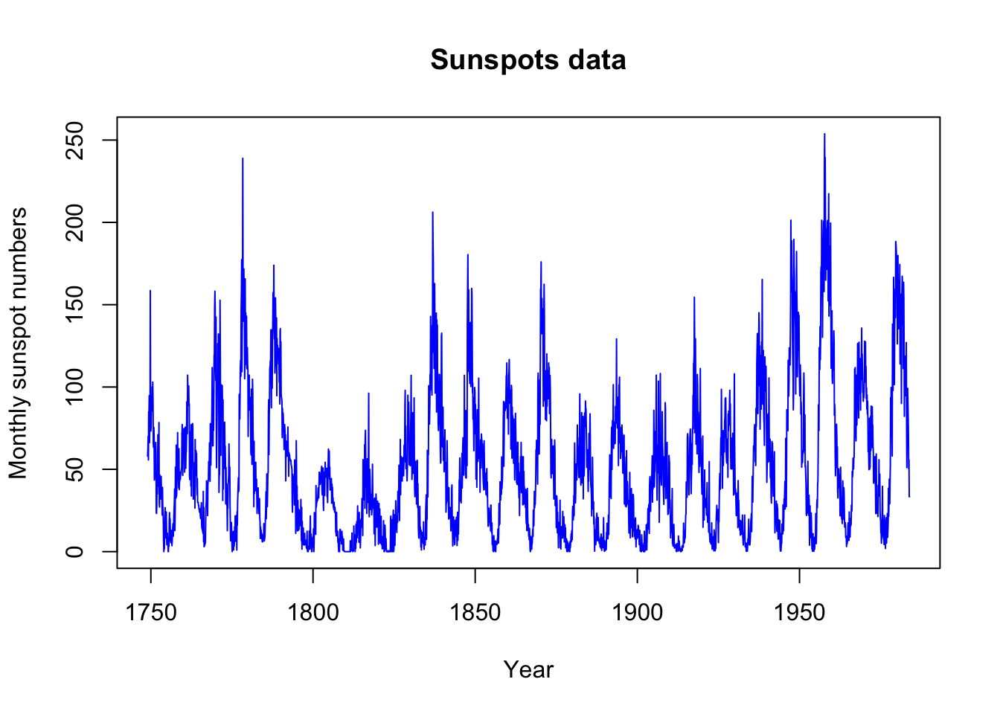

``` r
# --- Plot Built-in Dataset: USAccDeaths ---
plot.ts(USAccDeaths,main = "Accidental Deaths in the US 1973-1978",
        xlab = "Year", ylab = "Number of Accidental Deaths", col = "blue")
```

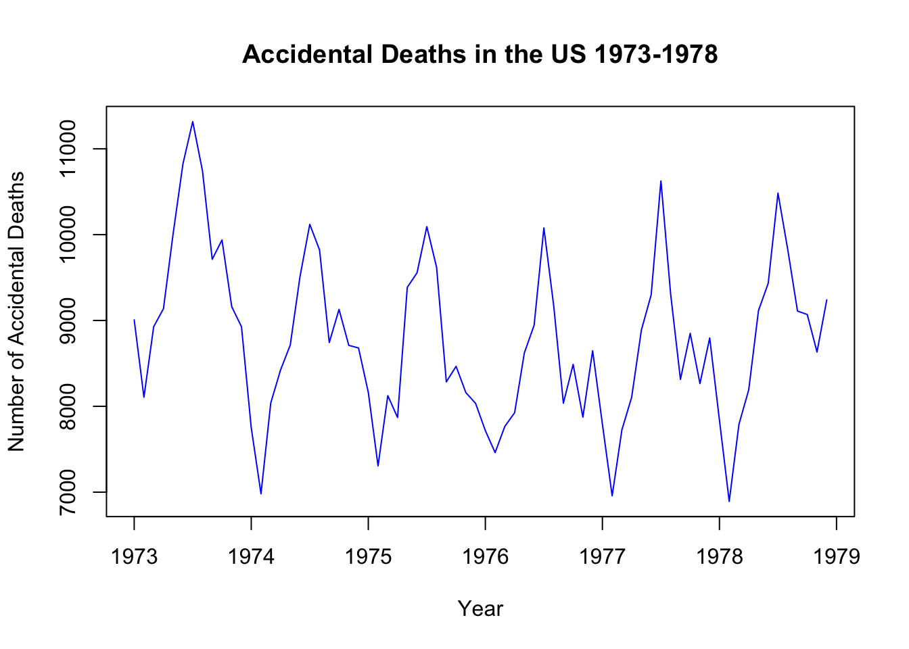
</div>


&nbsp;
