<div id="part-ch11" class="chapter-title">
# Basics of vector autoregression {#varmodel}
</div>

Univariate ARMA models can be generalized to the multivariate case where **multiple time series are analyzed simultaneously**. In this course, we concentrate on a brief introduction of basic ideas of a **vector autoregressive (VAR) model**. The VAR model provides a very common framework for analyzing time series dynamics, such as the effects of random shocks (e.g., changes in economic policy or technology).

- VAR model and its statistical details will be considered more detail in **Advanced Time Series Econometrics course**.

- VAR model and its very important role for applied macroeconometrics and empirical macroeconomics will be considered more detail in **Macroeconometrics course**. 

&nbsp;

## VAR($p$) process

Let us start with a bivariate model. That is we have two stationary time series $y_{1t}$ and $y_{2t}$ with $\mathsf{E}(y_{1t}) = \mu_1$ and $\mathsf{E}(y_{2t})=\mu_2$. **A bivariate (i.e., a two-variable) first-order VAR process** (i.e., a bivariate **VAR(1) process**) is given as 
\begin{eqnarray*}
y_{1t} &=& \nu_1 + a_{11} y_{1, t-1} + a_{12} y_{2, t-1} + u_{1t} \\
y_{2t} &=& \nu_2 + a_{21} y_{1, t-1} + a_{22} y_{2, t-1} + u_{2t},
\end{eqnarray*}
where $u_{1t}$ and $u_{2t}$ are two error terms (independent of the history of $y_{1t}$ and $y_{2t}$) that may be correlated. In a matrix notation, the VAR(1) process can be rewritten
\begin{eqnarray*}
\left[ \begin{array}{c}
y_{1t} \\
y_{2t} \end{array} \right] = 
\left[ \begin{array}{c}
\nu_{1} \\
\nu_{2} \end{array} \right] +
\left[ \begin{array}{cc}
a_{11} & a_{12}  \\
a_{21} & a_{22}  \end{array} \right]
\left[ \begin{array}{c}
y_{1, t-1} \\
y_{2, t-1} \end{array} \right] +
\left[ \begin{array}{c}
u_{1t} \\
u_{2t} \end{array} \right].
\end{eqnarray*}
\item Equivalently,
\begin{equation*}
\boldsymbol{y}_t = \boldsymbol{\nu} + \boldsymbol{A}_1 \boldsymbol{y}_{t-1} + \boldsymbol{u}_t,
\end{equation*}
where now $\boldsymbol{y}_t = (y_{1t}, y_{2t})$, $\boldsymbol{\nu}_t = (\nu_{1}, \nu_{2})$ and $\boldsymbol{u}_t = (u_{1t}, u_{2t})$ are two $2 \times 1$ vectors.

- In this notation, likewise throughout this material, with bolded font we emphasize vectors and matrices, to distinguish scalar-valued components and processes.

&nbsp;

As an extension of two-variable and first-order case, **$K$-variable VAR($p$) process** is 
\begin{equation*}
\boldsymbol{y}_t = \boldsymbol{\nu} + \boldsymbol{A}_1 \boldsymbol{y}_{t-1} + \cdots +  \boldsymbol{A}_p \boldsymbol{y}_{t-p}  + \boldsymbol{u}_t, \quad \boldsymbol{u}_t \thicksim \mathsf{iid}(\boldsymbol{0}, \boldsymbol{\Sigma}_u)
\end{equation*}
where $y_t= (y_{1t} \, \cdots \, y_{Kt})$ is a $K \times 1$ vector of variables and $\boldsymbol{A}_1, \ldots, \boldsymbol{A}_p$ are $K \times K$ coefficient matrices. In other words, the VAR($p$) process depends on the $p$ lags of $y_{1t}, \ldots, y_{Kt}$. The error term ("shock" or "innovation") $\boldsymbol{u}_t = (u_{1t}, \ldots , u_{Kt})$ is an unobserved $K \times 1$ (vector) iid process.

- Hence $\mathsf{E}(\boldsymbol{u}_t)=\boldsymbol{0}$, $\mathsf{E}(\boldsymbol{u}_t \boldsymbol{u}_t^{\prime}) = \boldsymbol{\Sigma}_u$, and $\mathsf{E}(\boldsymbol{u}_t \boldsymbol{u}_s^{\prime}) = \boldsymbol{0}, \, s \neq t$.

- The bivariate and more general model show the basic idea: The idea of the VAR($p$) model is to regress each component of $y_t$ on its own lags and on the lags of the other components. The model can describe lagged or dynamic dependencies among variables. For example, one may ask how $y_{2t}$ affects the future path of $y_{1t}$, and other way round.

&nbsp;

**A companion form**: The VAR($p$) process can be rewritten
\begin{eqnarray*}
\boldsymbol{Y}_t = \boldsymbol{\nu}^* + \mathbf{A} \boldsymbol{Y}_{t-1} + \boldsymbol{U}_t,
\end{eqnarray*}
where $\boldsymbol{Y}_t = [\boldsymbol{y}^{\prime}_t \, \cdots \, \boldsymbol{y}^{\prime}_{t-p+1}]^{\prime}$ and $\boldsymbol{\nu}^{*} = [\boldsymbol{\nu}^{\prime} \,\, \boldsymbol{0}^{\prime} \cdots \, \boldsymbol{0}^{\prime}]^{\prime}$ are ($Kp \times 1$) and $\boldsymbol{U}_t = [\boldsymbol{u}^{\prime}_t \,\, \boldsymbol{0}^{\prime} \cdots \, \boldsymbol{0}^{\prime}]^{\prime}$ are ($Kp \times 1$) vectors, and  
\begin{equation*}
\mathbf{A}=
\left[
\begin{array}{ccccc}
\boldsymbol{A}_1	&	\boldsymbol{A}_2	& \cdots & \boldsymbol{A}_{p-1}  & \boldsymbol{A}_p   \\
\boldsymbol{I}_K	&	\boldsymbol{0}_K 	& \cdots & \boldsymbol{0}_K 	& \boldsymbol{0}_K  \\
\boldsymbol{0}_K	&  \boldsymbol{I}_K & \cdots & \boldsymbol{0}_K	& \boldsymbol{0}_K  \\
\vdots 	&    	& \ddots & \vdots 		& \vdots  \\
\boldsymbol{0}_K 	&  \boldsymbol{0}_k 	& \cdots & \boldsymbol{I}_K 	& \boldsymbol{0}_K  \\
\end{array}\right] \quad (Kp \times Kp)
\end{equation*}
In other words,
\begin{equation*}
\left[
\begin{array}{c}
\boldsymbol{y}_t \\
\boldsymbol{y}_{t-1} \\
\vdots \\
\boldsymbol{y}_{t-p+1}
\end{array}\right] =
\left[
\begin{array}{c}
\boldsymbol{\nu} \\
\boldsymbol{0}  \\
\vdots \\
\boldsymbol{0}
\end{array}\right] 
+
\left[
\begin{array}{ccccc}
\boldsymbol{A}_1	&	\boldsymbol{A}_2	& \cdots & \boldsymbol{A}_{p-1}  & \boldsymbol{A}_p   \\
\boldsymbol{I}_K	&	\boldsymbol{0}_K 	& \cdots & \boldsymbol{0}_K 	& \boldsymbol{0}_K  \\
\boldsymbol{0}_K	& \boldsymbol{I}_K & \cdots & \boldsymbol{0}_K	& \boldsymbol{0}_K  \\
\vdots 	&   	& \ddots & \vdots 		& \vdots  \\
\boldsymbol{0}_K 	&  \boldsymbol{0}_K 	& \cdots & \boldsymbol{I}_K 	& \boldsymbol{0}_K  \\
\end{array}\right]
\left[
\begin{array}{c}
\boldsymbol{y}_{t-1} \\
\boldsymbol{y}_{t-2} \\
\vdots \\
\boldsymbol{y}_{t-p}
\end{array}\right] 
+
\left[
\begin{array}{c}
\boldsymbol{u}_t \\
\boldsymbol{0}  \\
\vdots \\
\boldsymbol{0}
\end{array}\right]
\end{equation*}
indicating that there holds equalities $\boldsymbol{y}_t = \boldsymbol{\nu} + \boldsymbol{A}_1 \boldsymbol{y}_{t-1} + \cdots + \boldsymbol{A}_p \boldsymbol{y}_{t-p}  + \boldsymbol{u}_t$, $\boldsymbol{y}_{t-1} = \boldsymbol{y}_{t-1}$, and so on to $\boldsymbol{y}_{t-p+1}= \boldsymbol{y}_{t-p+1}$.


&nbsp;

**Lag-operator** and the **lag-polynomial presentation of the VAR($p$)**. Define again the lag-operator as $B^k \boldsymbol{x}_t = \boldsymbol{x}_{t-k}$, $k=0,\pm 1, \pm 2, \ldots$, where $\boldsymbol{x}_t$ might be a vector. Therefore, using the lag-operators, the VAR($p$) process can be rewritten
\begin{eqnarray*}
\boldsymbol{A}(B) \boldsymbol{y}_t = \boldsymbol{\nu} + \boldsymbol{u}_t,
\end{eqnarray*}
where $\boldsymbol{A}(B) = (\boldsymbol{I}_n - \boldsymbol{A}_1 B - \cdots - \boldsymbol{A}_p B^p)$.

&nbsp;

**Stationarity (stability) of the VAR($p$) process**. A VAR($p$) process is (strictly) stationary (stable) (given $\boldsymbol{u}_t \thicksim \mathrm{iid}(\boldsymbol{0}, \boldsymbol{\Sigma}_u)$) if the roots of the determinant
\begin{equation*}
\mathrm{det} \Big(\mathbf{I}_K - \boldsymbol{A}_1 z - \cdots - \boldsymbol{A}_p z^p \Big) = 0
\end{equation*}
are outside the unit circle in absolute value (i.e., $|z| > 1$). 

Notice, however, that many statistical software packages, including the **vars* package in R**, use an alternative but equivalent presentation.

- They first represent the VAR(p) process in its companion form (see above). The stability of the system is then determined by the eigenvalues of the companion matrix $\mathbf{A}$.

- In vars package and VAR-function, the part "Roots of the characteristic polynomial" reported by R are precisely these eigenvalues. The key relationship is that these eigenvalues of the companion matrix are the reciprocals of the roots of the determinant polynomial. Therefore, the two conditions are equivalent:

    - Roots of $\mathrm{det} \Big(\mathbf{I}_n - \boldsymbol{A}_1 z - \cdots - \boldsymbol{A}_p z^p \Big) = 0$ are outside the unit circle ($|z| > 1$).
 
    - Eigenvalues of the companion matrix $\mathbf{A}$ are inside the unit circle ($|\lambda| < 1$).

- So, when using R's output, we check if the moduli of the reported roots (the eigenvalues) are **all less than 1** to confirm that the VAR model is stable.

&nbsp;

**Linear process**. As the AR($p$) process, the stationary (stable) VAR($p$) process can be written 
\begin{equation*}
\boldsymbol{y}_t = \boldsymbol{\mu} + \sum_{j=0}^{\infty} \boldsymbol{\Psi}_j \boldsymbol{u}_{t-j}= \boldsymbol{\Psi}(B) \boldsymbol{u}_t,
\end{equation*}
where $\boldsymbol{\Psi}(B) = [\boldsymbol{A}(B)]^{-1} = \boldsymbol{\Psi}_0 + \boldsymbol{\Psi}_1 B + \boldsymbol{\Psi}_2 B^2 + \cdots$ defines matrix-valued lag-polynomial. In addition to this linear process presentation, the sequence $\boldsymbol{\Psi}_0, \boldsymbol{\Psi}_1, \boldsymbol{\Psi}_2, \ldots$ have also other important role in macroeconometrics. It turns out that the matrix $\boldsymbol{\Psi}_s$ ($\boldsymbol{\Psi}_0 = \boldsymbol{I}_K$) measures the effect of one-unit increase in $u_{jt}$ upon $y_{i,t+s}$, \, $i,j=1,\ldots,K$, or equivalently
\begin{equation*}
\boldsymbol{\Psi}_s = \frac{\partial \boldsymbol{y}_{t+s}}{\partial \boldsymbol{u}^{\prime}_t}.
\end{equation*}
A function of elements $\boldsymbol{\Psi}_0$, $\boldsymbol{\Psi}_1$, $\boldsymbol{\Psi}_2, \ldots$ is the **(forecast error) impulse response function** (IRF) of the VAR($p$) process. 

- In other words, the row $i$, column $j$ element of $\boldsymbol{\Psi}_s$ gives the effect of a one-unit increase in the error term of the $j$th variable at time $t$ on the $i$th variable at time $t+s$, holding all other errors constant.

- For instance, the first column of $\Psi_1$ gives the effect in period 1 of a unit increase in the error term of the first variable (first shock) in period 0 on each variable in the system. 

- Especially in (structural) macroeconometrics, the VAR model is extended by economic identification assumption, which leads to **structural VAR models** and identified impulse response functions. These will be considered more detail in **Macroeconometrics** course.

As in the univariate case, here defined element-by-element, due to the typical assumption $\boldsymbol{\Psi}_s \longrightarrow \boldsymbol{0}, \, s \longrightarrow \infty$, the effects decay in time. In empirical analysis, the unknown $\boldsymbol{\Psi}_s$ must also be replaced by their estimates, obtained from the estimation result of the VAR model.

&nbsp;

**VAR($p$) model: Estimation and model selection**. The stationary VAR($p$) model can be estimated by ordinary least squares (OLS).

- More specifically, estimation can be done equation by equation by OLS (cf. the model structure).

- If the distribution of $\boldsymbol{u}_t$ is known (asssumed to be known), the model can also be estimated by the method of maximum likelihood (ML). Under normality assumption, that is $\boldsymbol{u}_t \sim \mathsf{nid}(\boldsymbol{0}, \boldsymbol{\Sigma}_u)$, the conditional ML estimator is numerically equivalent to the OLS estimator.

- The OLS estimator is consistent and asymptotically normally distributed. Thus, the $t$-statistics of the parameter estimates can be used as usual to test for the statistical significance of individual parameter coefficients.

As for the univariate AR($p$) model, there are several approaches to determine the lag length $p$ for the VAR($p$) model.

- Sequential testing procedure (cf. the sequential testing for univariate models)

- Information criteria (including intercept parameters):

  - AIC: $\mathrm{log} (\mathrm{det}(\boldsymbol{\Sigma}_u)) + \frac{2}{T} K(Kp+1)$

  -  BIC: $\mathrm{log} (\mathrm{det}(\boldsymbol{\Sigma}_u)) + \frac{\mathrm{log}(T)}{T} K(Kp+1)$

For the competing models (recall that exactly the same sample period must be used!) the one with the lowest value of the selected information criterion is the selected (preferable) model.

&nbsp;

**VAR($p$): Model selection and residual diagnostics**

Overall, the model selection can be based on the specification cycle presented in the case of univariate AR models but modified suitable to VARs. However, due to multiple time series and hence more complicated dynamic interrelationships between the variables, autocorrelation functions cannot be directly used to select the lag length $p$.

- Especially information criteria, such as AIC and BIC, can be used like in the univariate case. 

- At times the lag length selections correspond the frequency of the data. That is, for the quarterly data $p=4$ and for monthly data $p=12$.

&nbsp;

**The adequacy of the selected and estimated VAR($p$) model** can be evaluated by diagnostic checks (like for ARMA models). A well-specified model should capture all the systematic, linear dynamics present in the (multivariate) time series data. The primary goal of these checks is to determine if there is any significant autocorrelation left in the vector of residuals $\widehat{\boldsymbol{u}}_t = \boldsymbol{y}_t - \widehat{\boldsymbol{y}}_t$, where $\widehat{\boldsymbol{y}}_t$ are the fitted values of the selected VAR model.

- If autocorrelation is still present in residuals, it means the model has failed to capture some of the predictable patterns in the data, making it unreliable for forecasting or structural analysis.

To formally test for remaining autocorrelation in the residuals, we use a multivariate extension of the Ljung-Box test. This is called the **Portmanteau test**. It jointly examines whether a group of residual autocovariance matrices up to a certain lag are statistically different from zero. The **null hypothesis** ($H_0$) of the test is that there is no serial correlation in the residuals up to a specified lag $H$. The Portmanteau test statistic, often denoted as $Q_H$, is calculated as follows:
\begin{equation*}
Q_H = T \sum_{h=1}^{H} \text{tr}(\widehat{C}_h^{\prime} \widehat{C}_0^{-1} \widehat{C}_h \widehat{C}_0^{-1}),
\end{equation*}
where $\hat{C}_j = \frac{1}{T} \sum_{t=j+1}^{T} \widehat{u}_t \widehat{u}_{t-j}^{\prime}$ is the estimated residual autocovariance matrix at lag $j$ and $\text{tr}(\cdot)$ is the trace operator, which sums the diagonal elements of a matrix. Under the null hypothesis of no serial correlation, the $Q_H$ statistic approximately follows a $\chi^2$-distribution with $K^2(H-p)$ degrees of freedom and the associated $p$-value can be constructed.

Should the model fail in the Portmanteau test or overall in diagnostic checking, the model should be respecified, such as to increase the lag length of the model (e.g., from VAR($p$) to VAR($p+1$) or higher) and re-estimate it. The logic is that by including more past values, the model can better capture the complex temporal dependencies in the data. After respecification, the diagnostic checks must be performed again to ensure the new model is adequate.

However, especially with complex multivariate data, it is often challenging to find a model that can be considered completely adequate from a diagnostic perspective. When the diagnostic checks indicate that the model is misspecified (for instance, due to some persistent residual autocorrelation), the standard assumptions for maximum likelihood estimation are violated. In such cases, the parameter estimates can be interpreted as Quasi-Maximum Likelihood Estimates (QMLE), a concept that was introduced on a general level in the AR-GARCH section.

&nbsp;

**VAR($p$): Forecasting**

Similarly as in the univariate AR($p$) model, forecasts can be obtained as conditional expectations, conditional
on the information at time $t$. The properties CEV1--CEV4 of the conditional expectation can be extended to the vector-valued case straigtforwardly (element-by-element treatment).

- One-period-ahead forecasts with the VAR($p$):
\begin{equation*}
\mathsf{E}_t(\boldsymbol{y}_{t+1}) = \boldsymbol{\nu} + \boldsymbol{A}_1 \boldsymbol{y}_t + \cdots +  \boldsymbol{A}_p \boldsymbol{y}_{t-p+1}. 
\end{equation*}

- Multiperiod $h$-step forecasts can be obtained iteratively following the recursion (cf. the AR($p$) case):
\begin{equation*}
\mathsf{E}_t(\boldsymbol{y}_{t+h}) = \boldsymbol{\nu} + \boldsymbol{A}_1 \mathsf{E}_t(\boldsymbol{y}_{t+h-1}) + \cdots + \boldsymbol{A}_p \mathsf{E}_t(\boldsymbol{y}_{t+h-p}),
\end{equation*}
where $\mathsf{E}_t(\boldsymbol{y}_{t+h-j}) = \boldsymbol{y}_{t+h-j}$ for $h \le j$.

Similarly as in the univariate AR models, to include nonzero mean vector to the VAR model is assumed above. Alternatively, you can construct the VAR model for the deamed time series and add the mean vector to the forecasts obtained with the VAR model with demeaned data.

&nbsp;

**Empirical example**. Consider an application of a VAR model to the classic dataset from Stock and Watson (2001), which is a benchmark for macroeconomic analysis. 

- See J.H. Stock and M.W. Watson (2001). Vector autoregressions. Journal of Economic Perspectives, 115(4), 101--115.

The VAR model utilizes three ($K=3$) key quarterly U.S. macroeconomic variables:

- Inflation: Measured as the percent change from the preceding period in the Gross Domestic Product Implicit Price Deflator, expressed at a seasonally adjusted annual rate.

- Unemployment: The seasonally adjusted quarterly average of the civilian unemployment rate.

- Interest Rate: The quarterly average of the effective Federal Funds Rate, which is not seasonally adjusted.

These three series are modeled as an interdependent system where each variable is influenced by its own past values and the past values of the other two variables. The following analysis covers the sample period from 1960:Q1 to 2000:Q4 as in Stock and Watson (2001).

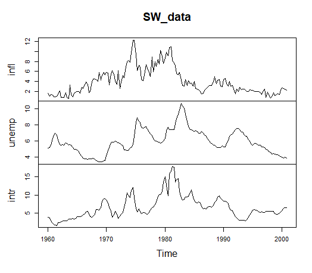
<center>

<span style="color: #0069d9;">Figure: Stock and Watson (2001): U.S. macroeconomic time series (inflation, unemployment rate and interest rate).</span> </center>

&nbsp;

Lag length selection: For this analysis and illustration, we follow Stock and Watson (2001) and specify a VAR(4) model. This choice is common in quarterly macroeconomic data as it captures potential year-over-year dynamics.

Parameter estimation: The VAR(4) model is estimated assuming the error terms are normally distributed. Because each equation in the VAR system has the same set of explanatory variables (the lagged values of all variables in the system), Ordinary Least Squares (OLS) applied equation-by-equation is an efficient estimation method.

- A key feature of VAR models is the large number of parameters. In this three-variable VAR(4) model, each of the three equations includes an intercept and four lags of all three variables, resulting in 3×(1+4×3)=39 parameters to be estimated. Due to this high dimensionality, interpreting individual coefficient estimates is often impractical. Instead, analysis typically focuses on system-wide properties through Granger causality tests, as well as impulse response functions and forecast error variance decomposition (Macroeconometrics course)

Residual diagnostics: After estimation, diagnostic tests are crucial for assessing the model's adequacy.

- Portmanteau Test: The Portmanteau test for serial correlation in the residuals indicates some remaining unmodelled dynamics. The test's statistically significant result suggests that the VAR(4) specification may not fully capture all the linear dependencies within the data.

- While the residuals from the different variable equations appear to have low cross-correlation, an analysis of the squared residuals reveals a different pattern. The presence of autocorrelation in the squared residuals is a strong indicator of conditional heteroskedasticity. This means the volatility of the shocks to the system is not constant over time. While the VAR(4) model may adequately capture the conditional mean of the variables, it fails to account for this time-varying variance in the error terms. A more advanced model, such as a VAR-GARCH (not considered in this course), would be required to model these volatility dynamics.

<div class="toggle-button" onclick="toggleCode('Extra18')">Details of the estimated VAR(4) model</div>
<div id="Extra18" style="display:none;">
```markdown
VAR Estimation Results:
========================= 
Endogenous variables: Inflation, Unemployment, Fedfunds 
Deterministic variables: const 
Sample size: 160 
Log Likelihood: -396.638 
Roots of the characteristic polynomial:
0.9696 0.9696 0.7928 0.7928 0.686 0.686 0.5674 0.5674 0.4609 0.4609 0.2053 0.2053
Call:
VAR(y = SW_data, p = 4, type = c("const"), exogen = NULL, lag.max = NULL)


Estimation results for equation Inflation: 
========================================== 
Inflation = Inflation.l1 + Unemployment.l1 + Fedfunds.l1 + Inflation.l2 + Unemployment.l2 + Fedfunds.l2 + Inflation.l3 + Unemployment.l3 + Fedfunds.l3 + Inflation.l4 + Unemployment.l4 + Fedfunds.l4 + const 

                  Estimate Std. Error t value Pr(>|t|)    
Inflation.l1     0.5886863  0.0821552   7.166 3.47e-11 ***
Unemployment.l1 -0.8356913  0.4006087  -2.086  0.03870 *  
Fedfunds.l1      0.2370805  0.1082335   2.190  0.03007 *  
Inflation.l2     0.0902554  0.0937902   0.962  0.33747    
Unemployment.l2  1.3545379  0.6841360   1.980  0.04958 *  
Fedfunds.l2     -0.2168750  0.1453158  -1.492  0.13773    
Inflation.l3     0.1205897  0.0944654   1.277  0.20377    
Unemployment.l3 -1.0953222  0.6779667  -1.616  0.10833    
Fedfunds.l3     -0.0005773  0.1455216  -0.004  0.99684    
Inflation.l4     0.1866837  0.0846107   2.206  0.02891 *  
Unemployment.l4  0.4122130  0.3765054   1.095  0.27538    
Fedfunds.l4     -0.0231108  0.1113078  -0.208  0.83581    
const            1.0641191  0.3968301   2.682  0.00817 ** 
---
Signif. codes:  0 ‘***’ 0.001 ‘**’ 0.01 ‘*’ 0.05 ‘.’ 0.1 ‘ ’ 1


Residual standard error: 1.053 on 147 degrees of freedom
Multiple R-Squared: 0.8509,	Adjusted R-squared: 0.8387 
F-statistic:  69.9 on 12 and 147 DF,  p-value: < 2.2e-16 


Estimation results for equation Unemployment: 
============================================= 
Unemployment = Inflation.l1 + Unemployment.l1 + Fedfunds.l1 + Inflation.l2 + Unemployment.l2 + Fedfunds.l2 + Inflation.l3 + Unemployment.l3 + Fedfunds.l3 + Inflation.l4 + Unemployment.l4 + Fedfunds.l4 + const 

                  Estimate Std. Error t value Pr(>|t|)    
Inflation.l1     0.0066525  0.0181442   0.367 0.714410    
Unemployment.l1  1.4696483  0.0884753  16.611  < 2e-16 ***
Fedfunds.l1      0.0006271  0.0239036   0.026 0.979106    
Inflation.l2    -0.0115173  0.0207138  -0.556 0.579040    
Unemployment.l2 -0.5155262  0.1510930  -3.412 0.000833 ***
Fedfunds.l2      0.0604859  0.0320933   1.885 0.061446 .  
Inflation.l3     0.0317894  0.0208629   1.524 0.129724    
Unemployment.l3 -0.0057705  0.1497305  -0.039 0.969310    
Fedfunds.l3     -0.0399995  0.0321388  -1.245 0.215265    
Inflation.l4    -0.0200840  0.0186865  -1.075 0.284230    
Unemployment.l4 -0.0050194  0.0831521  -0.060 0.951947    
Fedfunds.l4      0.0114985  0.0245826   0.468 0.640657    
const            0.0854091  0.0876408   0.975 0.331392    
---
Signif. codes:  0 ‘***’ 0.001 ‘**’ 0.01 ‘*’ 0.05 ‘.’ 0.1 ‘ ’ 1


Residual standard error: 0.2326 on 147 degrees of freedom
Multiple R-Squared: 0.9786,	Adjusted R-squared: 0.9768 
F-statistic: 559.3 on 12 and 147 DF,  p-value: < 2.2e-16 


Estimation results for equation Fedfunds: 
========================================= 
Fedfunds = Inflation.l1 + Unemployment.l1 + Fedfunds.l1 + Inflation.l2 + Unemployment.l2 + Fedfunds.l2 + Inflation.l3 + Unemployment.l3 + Fedfunds.l3 + Inflation.l4 + Unemployment.l4 + Fedfunds.l4 + const 

                Estimate Std. Error t value Pr(>|t|)    
Inflation.l1     0.07293    0.06945   1.050  0.29536    
Unemployment.l1 -1.38408    0.33865  -4.087 7.16e-05 ***
Fedfunds.l1      0.95325    0.09149  10.419  < 2e-16 ***
Inflation.l2     0.20379    0.07928   2.570  0.01115 *  
Unemployment.l2  1.27436    0.57832   2.204  0.02911 *  
Fedfunds.l2     -0.40302    0.12284  -3.281  0.00129 ** 
Inflation.l3    -0.07175    0.07985  -0.899  0.37035    
Unemployment.l3 -0.49829    0.57311  -0.869  0.38601    
Fedfunds.l3      0.34476    0.12301   2.803  0.00575 ** 
Inflation.l4    -0.04306    0.07152  -0.602  0.54804    
Unemployment.l4  0.49476    0.31827   1.555  0.12221    
Fedfunds.l4      0.03129    0.09409   0.333  0.73997    
const            0.53914    0.33545   1.607  0.11015    
---
Signif. codes:  0 ‘***’ 0.001 ‘**’ 0.01 ‘*’ 0.05 ‘.’ 0.1 ‘ ’ 1


Residual standard error: 0.8905 on 147 degrees of freedom
Multiple R-Squared: 0.9273,	Adjusted R-squared: 0.9214 
F-statistic: 156.3 on 12 and 147 DF,  p-value: < 2.2e-16 


Covariance matrix of residuals:
             Inflation Unemployment Fedfunds
Inflation     1.109681     0.001595   0.1486
Unemployment  0.001595     0.054126  -0.0928
Fedfunds      0.148558    -0.092796   0.7930

Correlation matrix of residuals:
             Inflation Unemployment Fedfunds
Inflation     1.000000     0.006508   0.1584
Unemployment  0.006508     1.000000  -0.4479
Fedfunds      0.158370    -0.447925   1.0000

=====
Portmanteau Test (adjusted)
	
serial.test(VAR_lag_p, lags.pt = 12, type = "PT.adjusted") #

Chi-squared = 132.39, df = 72, p-value = 1.904e-05

> serial.test(VAR_lag_p, lags.pt = 15, type = "PT.adjusted") # 

Chi-squared = 149.51, df = 99, p-value = 0.0007889

> serial.test(VAR_lag_p, lags.pt = 6, type = "PT.adjusted") # 

Chi-squared = 48.748, df = 18, p-value = 0.0001165
```
</div> 


&nbsp;

## Granger causality in VARs 

Granger causality is a concept used to determine whether one time series can predict another. It doesn’t imply true causality in the philosophical or scientific sense, but rather predictive causality based on temporal dependence and information content. 

- Granger causality (note that here "causality" refers to predictive ability, not actual causality) can be examined for single-equation models, such as the ones considered in the previous chapter, examining whether the additional predictor Granger cause $y_t$. 

- Granger causality is most often studied in the context of VAR models.

**Bivariate VAR model** ($n=2$): Granger-causality can be easily tested within a VAR model. Consider first, for simplicity, the bivariate VAR($p$) process
\begin{eqnarray*}
\left[ \begin{array}{c}
y_{1t} \\
y_{2t} \end{array} \right] =
\left[ \begin{array}{c}
\nu_{1} \\
\nu_{2} \end{array} \right]
+
\sum_{j=1}^{p}
\left[ \begin{array}{cc}
a_{11,j} & a_{12,j}  \\
a_{21,j} & a_{22,j}  \end{array} \right]
\left[ \begin{array}{c}
y_{1, t-j} \\
y_{2, t-j} \end{array} \right] +
\left[ \begin{array}{c}
u_{1t} \\
u_{2t} \end{array} \right].
\end{eqnarray*}
If $a_{12,j}$=0, $j=1,2, \ldots, p$, then the lags of $y_{2t}$ do not help to forecast $y_{1t}$ and there is no Granger-causality from $y_{2t}$ to $y_{1t}$ (or $y_{2t}$ is not Granger-causal for $y_{1t}$).

The restriction $a_{12,1} = a_{12,2} = \cdots = a_{12,p} = 0$ implies that there is not such Granger causality relationship. 

- When working with estimated VAR model, this hypothesis can be tested by the Wald or likelihood ratio (LR) test, following $\chi^2_p$-distribution under Granger noncausality in this bivariate case.

- At times, such as in R program, also the $F$-test statistic (instead of the Wald test statistic) will be used where the critical values are coming from the $F$-distribution.

&nbsp;

**Larger VAR models** ($n > 2$): When the VAR model contains more than two variables, Granger causality between two variables cannot be tested by testing zero-restrictions in a straightforward manner (as above). As an example, consider the following three-variable VAR process
\begin{eqnarray*}
\left[ \begin{array}{c}
y_{1t} \\
y_{2t} \\ 
y_{3t} 
\end{array} \right] =
\left[ \begin{array}{c}
\nu_{1} \\
\nu_{2} \\
\nu_{3} \end{array} \right]
+
\sum_{j=1}^{p}
\left[ \begin{array}{ccc}
a_{11,j} & a_{12,j} & a_{13,j}  \\
a_{21,j} & a_{22,j} & a_{23,j} \\
a_{31,j} & a_{32,j} & a_{33,j} \\
\end{array} \right]
\left[ \begin{array}{c}
y_{1, t-j} \\
y_{2, t-j} \\
y_{3, t-j} 
\end{array} \right] +
\left[ \begin{array}{c}
u_{1t} \\
u_{2t} \\
u_{3t} 
\end{array} \right].
\end{eqnarray*}
If, for instance, $a_{12,1}= \cdots = a_{12,p} = 0$, the lags of $y_{2t}$ do not help forecasting $y_{1t}$ one period ahead. However, because the lags of $y_{2t}$ may affect $y_{3t}$, which, in turn, affects $y_{1t}$, the lags of $y_{2t}$ may help forecasting $y_{1,t+1}$, $y_{1,t+2}$ etc. In other words, there may be Granger causality through indirect effects.

&nbsp;

Generally, Granger causality from one **group of variables** to another is defined similarly. Partition $\boldsymbol{y}_t = [\boldsymbol{y}_{1t}^{\prime} \quad \boldsymbol{y}_{2t}^{\prime}]^{\prime}$, where $\boldsymbol{y}_{1t}$ is $n_1 \times 1$ and $\boldsymbol{y}_{2t}$ is $n_2 \times 1$ \, ($n_1+n_2=n$), and write the VAR($p$) process
\begin{eqnarray*}
\left[ \begin{array}{c}
\boldsymbol{y}_{1t} \\
\boldsymbol{y}_{2t} \end{array} \right] =
\left[ \begin{array}{c}
\boldsymbol{\nu}_1 \\
\boldsymbol{\nu}_2 \end{array} \right]
+
\sum_{j=1}^{p}
\left[ \begin{array}{cc}
\boldsymbol{A}_{11,j} & \boldsymbol{A}_{12,j}  \\
\boldsymbol{A}_{21,j} & \boldsymbol{A}_{22,j}  \end{array} \right]
\left[ \begin{array}{c}
\boldsymbol{y}_{1, t-j} \\
\boldsymbol{y}_{2, t-j} \end{array} \right] +
\left[ \begin{array}{c}
\boldsymbol{\zeta}_{1t} \\
\boldsymbol{\zeta}_{2t} \end{array} \right],
\end{eqnarray*}
where $\boldsymbol{A}_{\cdot \cdot , \,j}$ are generally matrices (but of course may reduce to scalar-valued components in certain situations)

- If, for instance, $\boldsymbol{A}_{12,j} = \boldsymbol{0}, \, \forall j=1, \ldots, p$, then the variables in $\boldsymbol{x}_t$ are not Granger-causal for the variables in $\boldsymbol{w}_t$.

The general restriction $\boldsymbol{A}_{12,1} = \boldsymbol{A}_{12,2} = \ldots = \boldsymbol{A}_{12,p} = \boldsymbol{0}$ can be tested by the Wald ($F$-test) or likelihood ratio (LR) test.

- The above restrictions and test statistic apply also when there is a constant term included in the VAR($p$).

The hypothesis of interest
\begin{equation*}
\boldsymbol{A}_{12,1} =  \boldsymbol{A}_{12,2} = \cdots = \boldsymbol{A}_{12,p} = \boldsymbol{0}
\end{equation*}
implies that there is $n_1 n_2 p$ zero restrictions. Wald and LR tests can be used to test the above null hypothesis. 

- Under the null hypothesis, the Wald and LR tests are asympotically $\chi^2_{n_1 n_2 p}$-distributed and large values of the test statistics are critical for the null.

- As mentioned, at times $F$-test statistic is used where the number of restrictions (the first degree-of-freedom parameter in the $F$-distribution) is the above number of restrictions.

&nbsp;

**Example: Three-variable process/model**. Consider the VAR(1) process/model:
\begin{equation*}
\boldsymbol{y}_t = \left[ \begin{array}{c}
y_{1t} \\ y_{2t} \\ y_{3t}   \end{array} \right] =
\left[ \begin{array}{c}
0 \\ 2 \\ 1   \end{array} \right] + 
\left[ \begin{array}{ccc}
0.5 & 0 & 0 \\
0.1 & 0.1 & 0.3 \\
0 & 0.2 & 0.3
\end{array} \right] \boldsymbol{y}_{t-1} +\boldsymbol{u}_t. 
\end{equation*}
Partitioning $\boldsymbol{y}_t = [y_{1t} \quad \boldsymbol{y}^{\prime}_{2t}]^{\prime}$ so that $\boldsymbol{y}_{2t} = [y_{2t} \quad y_{3t}]^{\prime}$, $\boldsymbol{y}_{2t}$ does not Granger cause $\boldsymbol{y}_{1t} = y_{1t}$ because the matrix $\boldsymbol{A}_{12,1} = \boldsymbol{0}$. On the other hand, $y_{1t}$ Granger causes $\boldsymbol{y}_{2t}$.

&nbsp;

**Instantaneous causality**. In the bivariate VAR, there is no instantaneous causality between $y_{1t}$ and $y_{2t}$ if the errors $u_{1t}$ and $u_{2t}$ are uncorrelated. In general (not necessarily related to the VAR), a variable $y_{1t}$ is said to be instantaneously causal for another variable $y_{2t}$, if knowing the value of $y_{1t}$ in the forecast period helps to improve forecasts of $y_{2t}$.

It can be proved that instantaneous causality is symmetric so that if $y_{1t}$ causes $y_{2t}$, then also $y_{2t}$ causes $y_{1t}$. That is the concept is symmetric: This definition does not account for the "direction" of causality which must be determined from other sources.

- For instance, economic theory may suggest that the (instantaneous) causality runs only in one direction. Then significant correlation can be interpreted in favour of a causal relation.

In systems with more than two variables, there is no instantaneous causality between two groups of variables if the covariance matrix of the errors, $\Sigma_u$, is block diagonal. 

- As an example, if the covariance matrix in a VAR process for $\boldsymbol{y}_t = (y_{1t}, y_{2t}, y_{3t})$ is
\begin{equation*} \Sigma_u= \left[
\begin{array}{ccc}
2.0 &  0  &  0 \\
0 & 1.5  & 0.4 \\
0 & 0.4  & 1.0 \\
\end{array} \right],
\end{equation*}
then there is no instantaneous causality between $y_{1t}$ and $\boldsymbol{y}_{2t} = (y_{2t}, y_{3t})$.

- Instantaneous causality can be tested by a Wald type of test of zero restrictions on the corresponding elements of the covariance matrix of the error terms of a VAR model.

&nbsp;

**Empirical example: Three-variable monetary policy VAR**. Continue with the three-variable VAR(4) model selected above. Consider Granger causality and instantaneous causality tests. The goal is to determine if past values of certain variables are useful in predicting others. The null hypothesis for each test is that no Granger causality/instantaneous causality exists.

The results, obtained using R, strongly indicate a highly interconnected dynamic system. We find statistically significant Granger causality in all tested directions, meaning the variables have substantial predictive power over each other. A summary of the test results is provided below:

```markdown
| (Infl., Unemp.) -> Int. rate  | Granger (F-Test) | 4.86 | < 0.001 | Inst. causality (\chi^2) | 29.56 | < 0.001 
| (Unemp., Int. rate) -> Infl.  | Granger (F-Test) | 3.40 | < 0.001 | Inst. causality (\chi^2) | 5.05  | 0.080
| (Infl., Int. rate) ->  Unemp. | Granger (F-Test) | 4.82 | < 0.001 | Inst. causality (\chi^2) | 27.42 | < 0.001
```
In short, the past values of each pair of variables are useful for predicting the third. 

- That is we are rejecting the null hypotheses of no Granger causality at the conventional statistical significance levels.

Significant instantaneous (contemporaneous) relationships are also present in almost all cases, with the only exception being the link between inflation and the other two variables (unemployment rate and interest rate), which is not significant at the 5% level. Overall, these results confirm strong dynamic interlinkages among the interest rate, inflation, and unemployment rate.

&nbsp;

## R Lab

All the R codes considered in this section are compiled in the following tab

<button class="toggle-button toggle-button-r" onclick="toggleCode('r-code12')">R Lab: VAR modelling</button>
<div id="r-code12" style="display:none;">

``` r
# VAR modeling

# see details: http://www.jstatsoft.org/v27/i04/paper  % vars package

#-------------------------------------------------------------------------#

# install.packages("vars") ## needed in the estimation VAR models, install ones
library(vars)
#library(stats)  # 

#-------------------------------------------------------------------------#

# Data

Data=read.table("US_macrodata.txt",header=TRUE)

attach(Data) 

# Attached data to time series 
# deltat=1/12 -> monthly data, deltat=1/4 quarterly data  
US_data=ts(Data[,],start=c(1960,1),deltat=1/4)  # full sample period

infl=US_data[,"Inflation"]   # Inflation (GDP deflator)
unemp=US_data[,"Unrate"]   # unemployment rate 
intr=US_data[,"FedFunds"]   # Fed funds rate

# Plot the time series
plot(intr) # Interest rate
```

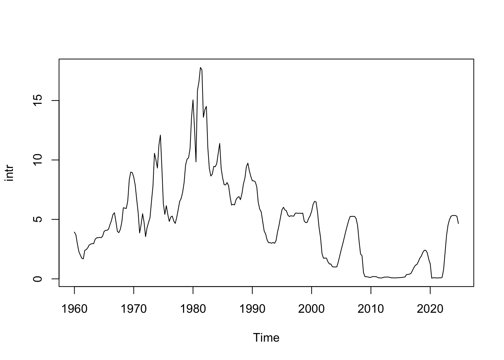

``` r
#----------------Stock and Watson (2001) (type of) data-----------------------#

# - Variables: Inflation, unemployment rate and interest rate
SW_system = cbind(infl,unemp,intr)  # full sample period

# - Sample period 1960:Q1 - 2000:Q4 used below
SW_data = ts(SW_system,start=c(1960,1),end=c(2000,4),deltat=1/4)

# Plot the time series
plot.ts(SW_data)
```

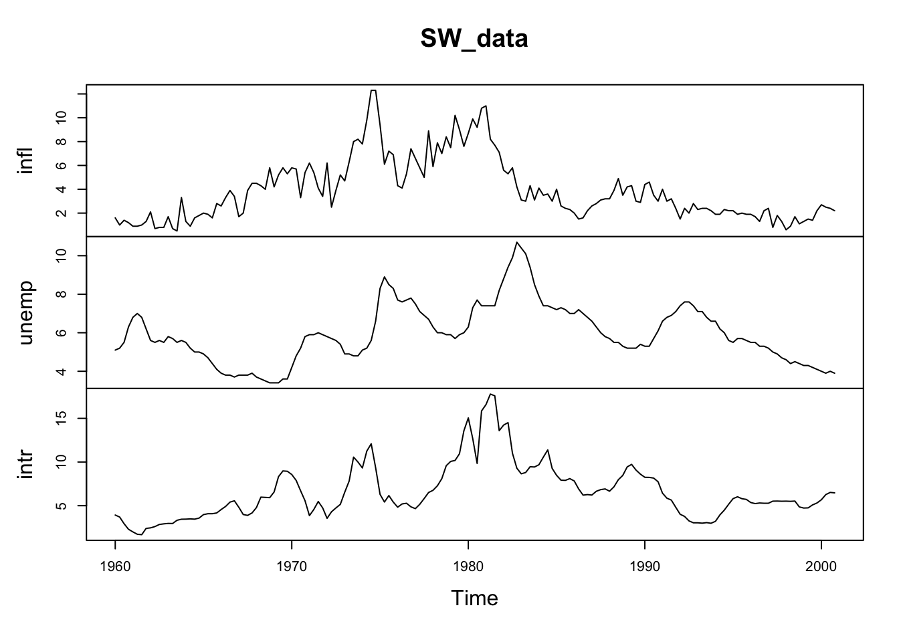

``` r
# The three-variable model of SW (2001), for Granger causality testing
colnames(SW_data)=c("Inflation","Unemployment","Fedfunds") 


#--------------------AutoCorrelation structure------------------------------
# 

# freq=1 is needed to get x-axis reasonable 
# autocorrelations and cross-correlations

acf(ts(SW_data,freq=1), lag.max=10, type="correlation") 
```

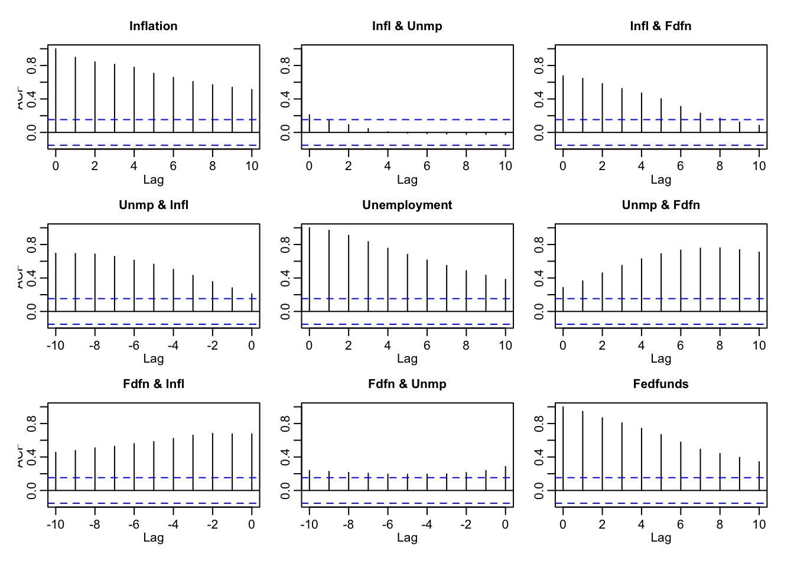

``` r
ccf(SW_data[,3], SW_data[,1])
```

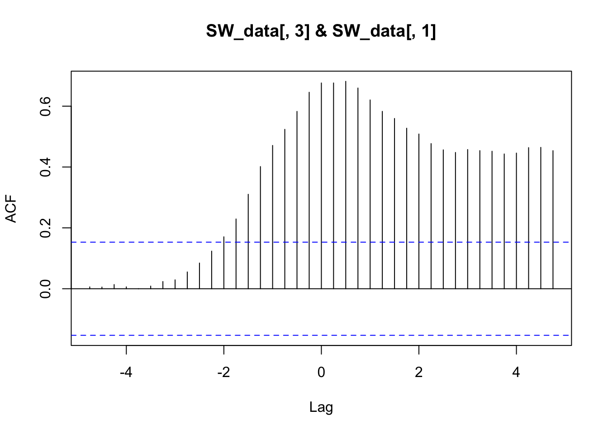

``` r
#--------------- VAR modeling, VAR model with Gaussian errors ---------------

# Model selection

# ?VARselect           # properties of the R's model selection routine

modelselection=VARselect(SW_data, lag.max = 10, type = c("const"), 
                         season = NULL, exogen = NULL)
modelselection$selection 
```

```
## AIC(n)  HQ(n)  SC(n) FPE(n) 
##      9      3      2      9
```

``` r
#----------------- Parameter estimation of the VAR model --------------------

# ?VAR

# "p" is the order of the model, "type" as above 

# - In the following, the fourth-order model (p=4) is considered as in SW (2001)

VAR_lag_p=VAR(SW_data, p = 4, type = c("const"),season = NULL, 
              exogen = NULL, lag.max = NULL)

summary(VAR_lag_p) 
```

```
## 
## VAR Estimation Results:
## ========================= 
## Endogenous variables: Inflation, Unemployment, Fedfunds 
## Deterministic variables: const 
## Sample size: 160 
## Log Likelihood: -396.638 
## Roots of the characteristic polynomial:
## 0.9696 0.9696 0.7928 0.7928 0.686 0.686 0.5674 0.5674 0.4609 0.4609 0.2053 0.2053
## Call:
## VAR(y = SW_data, p = 4, type = c("const"), exogen = NULL, lag.max = NULL)
## 
## 
## Estimation results for equation Inflation: 
## ========================================== 
## Inflation = Inflation.l1 + Unemployment.l1 + Fedfunds.l1 + Inflation.l2 + Unemployment.l2 + Fedfunds.l2 + Inflation.l3 + Unemployment.l3 + Fedfunds.l3 + Inflation.l4 + Unemployment.l4 + Fedfunds.l4 + const 
## 
##                   Estimate Std. Error t value Pr(>|t|)    
## Inflation.l1     0.5886863  0.0821552   7.166 3.47e-11 ***
## Unemployment.l1 -0.8356913  0.4006087  -2.086  0.03870 *  
## Fedfunds.l1      0.2370805  0.1082335   2.190  0.03007 *  
## Inflation.l2     0.0902554  0.0937902   0.962  0.33747    
## Unemployment.l2  1.3545379  0.6841360   1.980  0.04958 *  
## Fedfunds.l2     -0.2168750  0.1453158  -1.492  0.13773    
## Inflation.l3     0.1205897  0.0944654   1.277  0.20377    
## Unemployment.l3 -1.0953222  0.6779667  -1.616  0.10833    
## Fedfunds.l3     -0.0005773  0.1455216  -0.004  0.99684    
## Inflation.l4     0.1866837  0.0846107   2.206  0.02891 *  
## Unemployment.l4  0.4122130  0.3765054   1.095  0.27538    
## Fedfunds.l4     -0.0231108  0.1113078  -0.208  0.83581    
## const            1.0641191  0.3968301   2.682  0.00817 ** 
## ---
## Signif. codes:  0 '***' 0.001 '**' 0.01 '*' 0.05 '.' 0.1 ' ' 1
## 
## 
## Residual standard error: 1.053 on 147 degrees of freedom
## Multiple R-Squared: 0.8509,	Adjusted R-squared: 0.8387 
## F-statistic:  69.9 on 12 and 147 DF,  p-value: < 2.2e-16 
## 
## 
## Estimation results for equation Unemployment: 
## ============================================= 
## Unemployment = Inflation.l1 + Unemployment.l1 + Fedfunds.l1 + Inflation.l2 + Unemployment.l2 + Fedfunds.l2 + Inflation.l3 + Unemployment.l3 + Fedfunds.l3 + Inflation.l4 + Unemployment.l4 + Fedfunds.l4 + const 
## 
##                   Estimate Std. Error t value Pr(>|t|)    
## Inflation.l1     0.0066525  0.0181442   0.367 0.714410    
## Unemployment.l1  1.4696483  0.0884753  16.611  < 2e-16 ***
## Fedfunds.l1      0.0006271  0.0239036   0.026 0.979106    
## Inflation.l2    -0.0115173  0.0207138  -0.556 0.579040    
## Unemployment.l2 -0.5155262  0.1510930  -3.412 0.000833 ***
## Fedfunds.l2      0.0604859  0.0320933   1.885 0.061446 .  
## Inflation.l3     0.0317894  0.0208629   1.524 0.129724    
## Unemployment.l3 -0.0057705  0.1497305  -0.039 0.969310    
## Fedfunds.l3     -0.0399995  0.0321388  -1.245 0.215265    
## Inflation.l4    -0.0200840  0.0186865  -1.075 0.284230    
## Unemployment.l4 -0.0050194  0.0831521  -0.060 0.951947    
## Fedfunds.l4      0.0114985  0.0245826   0.468 0.640657    
## const            0.0854091  0.0876408   0.975 0.331392    
## ---
## Signif. codes:  0 '***' 0.001 '**' 0.01 '*' 0.05 '.' 0.1 ' ' 1
## 
## 
## Residual standard error: 0.2326 on 147 degrees of freedom
## Multiple R-Squared: 0.9786,	Adjusted R-squared: 0.9768 
## F-statistic: 559.3 on 12 and 147 DF,  p-value: < 2.2e-16 
## 
## 
## Estimation results for equation Fedfunds: 
## ========================================= 
## Fedfunds = Inflation.l1 + Unemployment.l1 + Fedfunds.l1 + Inflation.l2 + Unemployment.l2 + Fedfunds.l2 + Inflation.l3 + Unemployment.l3 + Fedfunds.l3 + Inflation.l4 + Unemployment.l4 + Fedfunds.l4 + const 
## 
##                 Estimate Std. Error t value Pr(>|t|)    
## Inflation.l1     0.07293    0.06945   1.050  0.29536    
## Unemployment.l1 -1.38408    0.33865  -4.087 7.16e-05 ***
## Fedfunds.l1      0.95325    0.09149  10.419  < 2e-16 ***
## Inflation.l2     0.20379    0.07928   2.570  0.01115 *  
## Unemployment.l2  1.27436    0.57832   2.204  0.02911 *  
## Fedfunds.l2     -0.40302    0.12284  -3.281  0.00129 ** 
## Inflation.l3    -0.07175    0.07985  -0.899  0.37035    
## Unemployment.l3 -0.49829    0.57311  -0.869  0.38601    
## Fedfunds.l3      0.34476    0.12301   2.803  0.00575 ** 
## Inflation.l4    -0.04306    0.07152  -0.602  0.54804    
## Unemployment.l4  0.49476    0.31827   1.555  0.12221    
## Fedfunds.l4      0.03129    0.09409   0.333  0.73997    
## const            0.53914    0.33545   1.607  0.11015    
## ---
## Signif. codes:  0 '***' 0.001 '**' 0.01 '*' 0.05 '.' 0.1 ' ' 1
## 
## 
## Residual standard error: 0.8905 on 147 degrees of freedom
## Multiple R-Squared: 0.9273,	Adjusted R-squared: 0.9214 
## F-statistic: 156.3 on 12 and 147 DF,  p-value: < 2.2e-16 
## 
## 
## 
## Covariance matrix of residuals:
##              Inflation Unemployment Fedfunds
## Inflation     1.109681     0.001595   0.1486
## Unemployment  0.001595     0.054126  -0.0928
## Fedfunds      0.148558    -0.092796   0.7930
## 
## Correlation matrix of residuals:
##              Inflation Unemployment Fedfunds
## Inflation     1.000000     0.006508   0.1584
## Unemployment  0.006508     1.000000  -0.4479
## Fedfunds      0.158370    -0.447925   1.0000
```

``` r
# Estimation results are presented equation-by-equation (see lecture notes)
# Roots of the characteristic polynomial are eigenvalues of the companion
# form parameter matrix

logLik(VAR_lag_p) ## The value of the log-likelihood function
```

```
## 'log Lik.' -396.6383 (df=39)
```

``` r
#----- Residual diagnostics, checking the adequacy of the selected model -----

plot(VAR_lag_p)  # residuals (time series) and their autocorrelations
```

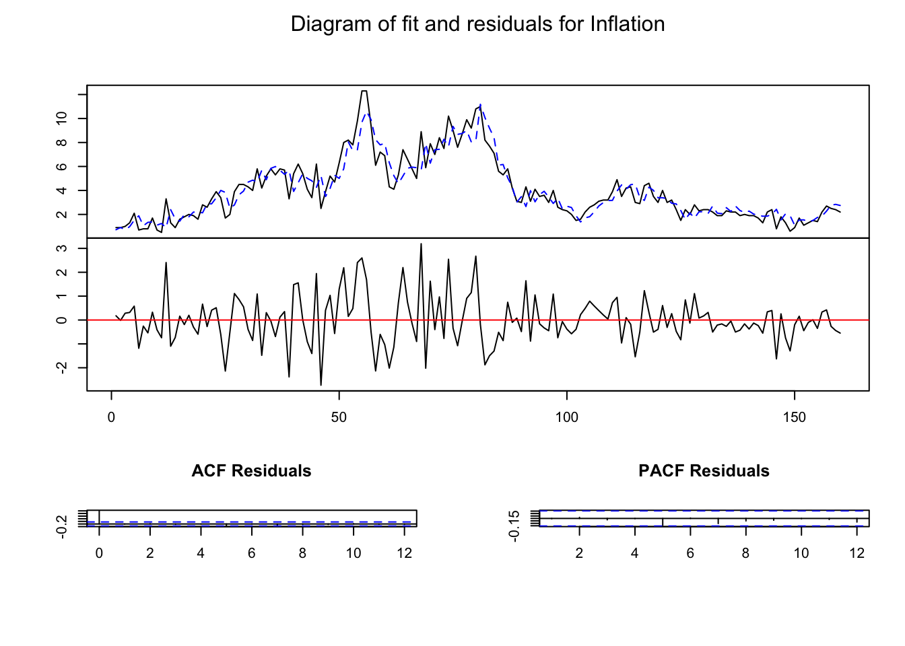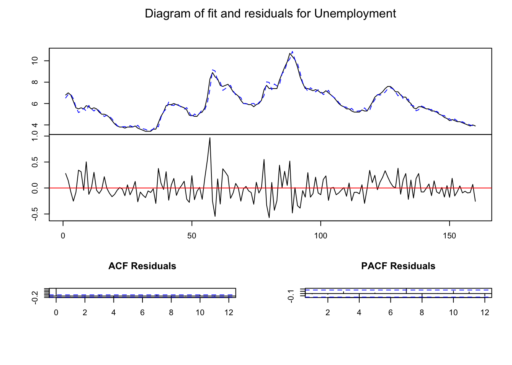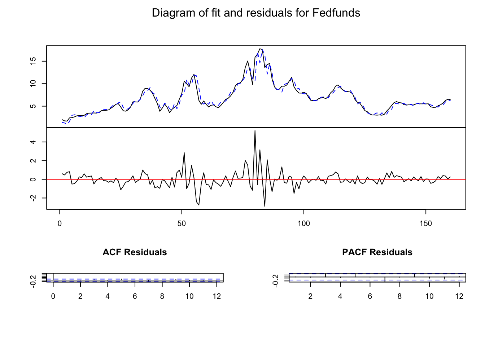

``` r
# Cross-correlations and the correlations of the squared residuals

res=resid(VAR_lag_p) 
colnames(res)=c("Inflation","Unemployment","FedFunds") # the SW_system

# Auto and cross-correlations as above 
acf(res,lag.max = 10, type="correlation")
```

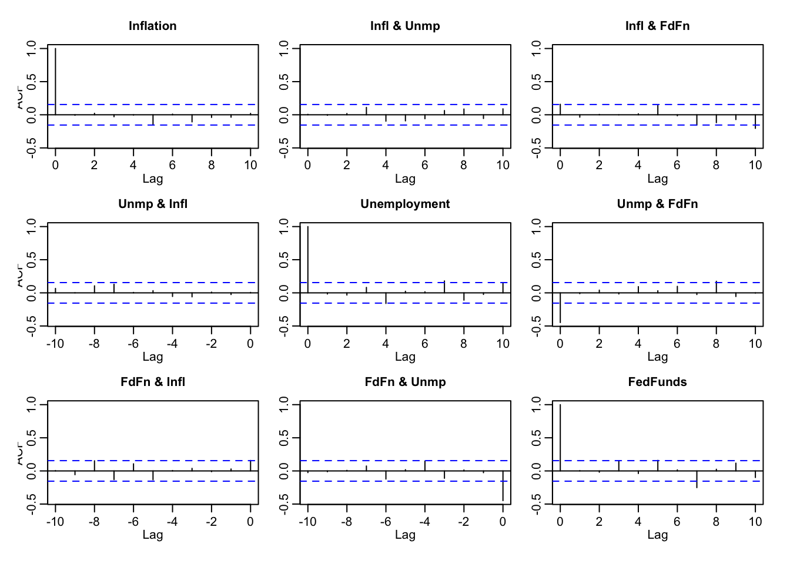

``` r
# Squared residuals 
colnames(res)=c("res_Inflation^2","res_Unemployment^2","res_FedFunds^2")
acf(res^2,lag.max = 10, type="correlation")  
```

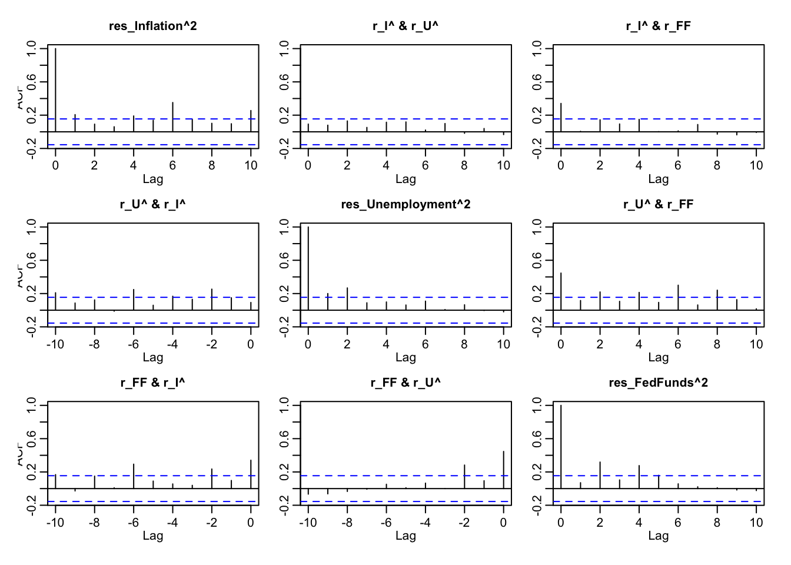

``` r
# Quantile-to-quantile plots. How well the residuals correspond the quantiles 
# of the normal distribution
# ?qqnorm # see details there

qqnorm(res[,1]) # the component to be considered must be specified. 
```

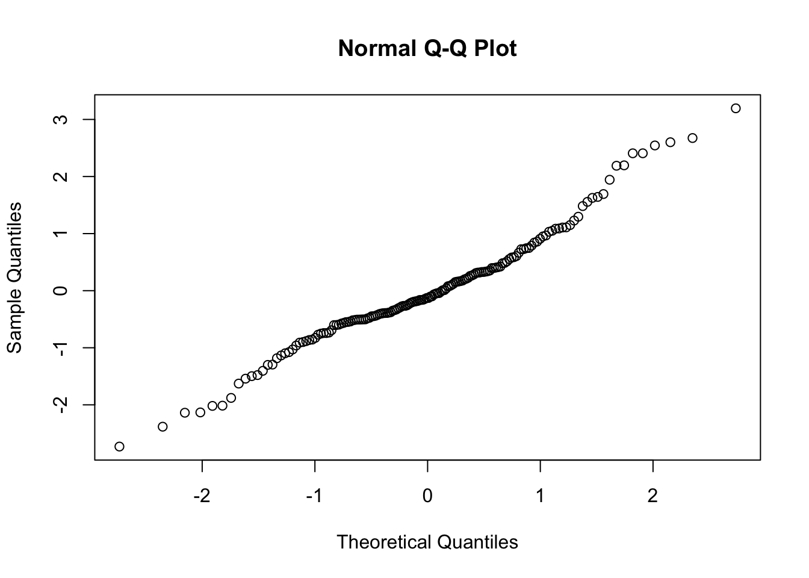

``` r
# Here the first variable (inflation in this case).


# The statistical significance of the auto and cross-correlations 
#  --> Portmanteau test

# ?serial.test

serial.test(VAR_lag_p, lags.pt = 12, type = "PT.adjusted") #
```

```
## 
## 	Portmanteau Test (adjusted)
## 
## data:  Residuals of VAR object VAR_lag_p
## Chi-squared = 132.39, df = 72, p-value = 1.904e-05
```

``` r
serial.test(VAR_lag_p, lags.pt = 15, type = "PT.adjusted") # 
```

```
## 
## 	Portmanteau Test (adjusted)
## 
## data:  Residuals of VAR object VAR_lag_p
## Chi-squared = 149.51, df = 99, p-value = 0.0007889
```

``` r
serial.test(VAR_lag_p, lags.pt = 6, type = "PT.adjusted") # 
```

```
## 
## 	Portmanteau Test (adjusted)
## 
## data:  Residuals of VAR object VAR_lag_p
## Chi-squared = 48.748, df = 18, p-value = 0.0001165
```

``` r
# ----------------------------- Forecasting --------------------------------

# Let us use the sample period of SW (up to 2000:Q4) to estimate 
# the parameters andconstruct forecasts for the next few observations

# - As output, we get forecast, forecast intervals based on the given upper 
# and lower bounds and "CI" which is the distance between the interval forecasts.

# - Forecasts are constructed using the iterative approach where, e.g., 
# two-period forecast is based on one-period forecasts, and so on 
# (see the equations in the lecture manuscript)

SW_forecasting=window(SW_system,end=c(2000,4))
VAR_p_forecasting=VAR(SW_forecasting, p = 4, type = c("const"),season = NULL, 
                      exogen = NULL, lag.max = NULL)
forecasts=predict(VAR_p_forecasting,n.ahead=4,ci=0.95) # forecasts 4-periods ahead
forecasts$fcst
```

```
## $infl
##          fcst     lower    upper       CI
## [1,] 2.902410 0.8377561 4.967063 2.064654
## [2,] 2.936851 0.4167294 5.456973 2.520122
## [3,] 3.053214 0.3107901 5.795638 2.742424
## [4,] 3.156726 0.1845968 6.128856 2.972130
## 
## $unemp
##          fcst    lower    upper        CI
## [1,] 3.937531 3.481547 4.393514 0.4559835
## [2,] 4.045763 3.235417 4.856108 0.8103454
## [3,] 4.180429 3.106765 5.254093 1.0736640
## [4,] 4.341953 3.083059 5.600848 1.2588942
## 
## $intr
##          fcst    lower     upper       CI
## [1,] 6.507526 4.762214  8.252838 1.745312
## [2,] 6.415671 3.722377  9.108964 2.693293
## [3,] 6.465216 3.238797  9.691635 3.226419
## [4,] 6.417915 2.696100 10.139730 3.721815
```

``` r
plot(forecasts)
```

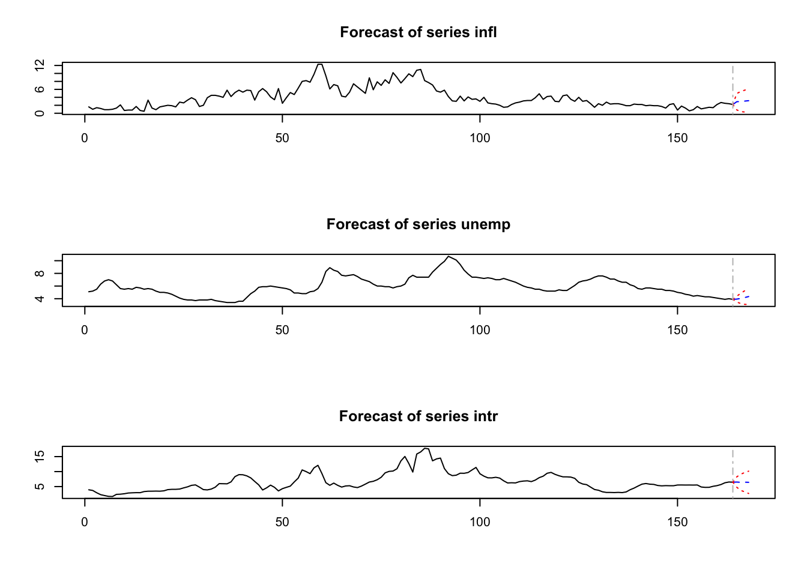

``` r
fanchart(forecasts) ## see http://www.jstatsoft.org/v27/i04/paper, p. 12.
```


``` r
#------- Granger causality tests  (+ instantaneous causality tests) --------

# Recall that H_0: "There is no Granger causality"

# Below, we first test that there is no Granger causality from inflation to 
# unemployment and Federal Funds

# Notice that the program computes the (approximate) p-values based on 
# the F-distribution (which has been found to be a good approximation in 
# some simulation experiments) instead of the chi^2-distribution.


Gc_inf=causality(VAR_lag_p, cause = "Inflation")
Gc_inf
```

```
## $Granger
## 
## 	Granger causality H0: Inflation do not Granger-cause Unemployment
## 	Fedfunds
## 
## data:  VAR object VAR_lag_p
## F-Test = 4.1184, df1 = 8, df2 = 441, p-value = 9.358e-05
## 
## 
## $Instant
## 
## 	H0: No instantaneous causality between: Inflation and Unemployment
## 	Fedfunds
## 
## data:  VAR object VAR_lag_p
## Chi-squared = 5.0489, df = 2, p-value = 0.0801
```

``` r
Gc_unem=causality(VAR_lag_p, cause = "Unemployment")
Gc_unem
```

```
## $Granger
## 
## 	Granger causality H0: Unemployment do not Granger-cause Inflation
## 	Fedfunds
## 
## data:  VAR object VAR_lag_p
## F-Test = 4.0828, df1 = 8, df2 = 441, p-value = 0.0001044
## 
## 
## $Instant
## 
## 	H0: No instantaneous causality between: Unemployment and Inflation
## 	Fedfunds
## 
## data:  VAR object VAR_lag_p
## Chi-squared = 27.417, df = 2, p-value = 1.113e-06
```

``` r
Gc_ff=causality(VAR_lag_p, cause = "Fedfunds")
Gc_ff
```

```
## $Granger
## 
## 	Granger causality H0: Fedfunds do not Granger-cause Inflation
## 	Unemployment
## 
## data:  VAR object VAR_lag_p
## F-Test = 2.813, df1 = 8, df2 = 441, p-value = 0.004739
## 
## 
## $Instant
## 
## 	H0: No instantaneous causality between: Fedfunds and Inflation
## 	Unemployment
## 
## data:  VAR object VAR_lag_p
## Chi-squared = 29.563, df = 2, p-value = 3.805e-07
```

``` r
Gc_infunem=causality(VAR_lag_p, cause = c("Inflation", "Unemployment"))
Gc_infunem
```

```
## $Granger
## 
## 	Granger causality H0: Inflation Unemployment do not Granger-cause
## 	Fedfunds
## 
## data:  VAR object VAR_lag_p
## F-Test = 4.8627, df1 = 8, df2 = 441, p-value = 9.185e-06
## 
## 
## $Instant
## 
## 	H0: No instantaneous causality between: Inflation Unemployment and
## 	Fedfunds
## 
## data:  VAR object VAR_lag_p
## Chi-squared = 29.563, df = 2, p-value = 3.805e-07
```

``` r
Gc_unemff=causality(VAR_lag_p, cause = c("Unemployment", "Fedfunds"))
Gc_unemff
```

```
## $Granger
## 
## 	Granger causality H0: Unemployment Fedfunds do not Granger-cause
## 	Inflation
## 
## data:  VAR object VAR_lag_p
## F-Test = 3.4015, df1 = 8, df2 = 441, p-value = 0.0008338
## 
## 
## $Instant
## 
## 	H0: No instantaneous causality between: Unemployment Fedfunds and
## 	Inflation
## 
## data:  VAR object VAR_lag_p
## Chi-squared = 5.0489, df = 2, p-value = 0.0801
```

``` r
Gc_ffinf=causality(VAR_lag_p, cause = c("Inflation", "Fedfunds"))
Gc_ffinf
```

```
## $Granger
## 
## 	Granger causality H0: Inflation Fedfunds do not Granger-cause
## 	Unemployment
## 
## data:  VAR object VAR_lag_p
## F-Test = 4.8236, df1 = 8, df2 = 441, p-value = 1.039e-05
## 
## 
## $Instant
## 
## 	H0: No instantaneous causality between: Inflation Fedfunds and
## 	Unemployment
## 
## data:  VAR object VAR_lag_p
## Chi-squared = 27.417, df = 2, p-value = 1.113e-06
```
</div>


&nbsp;
