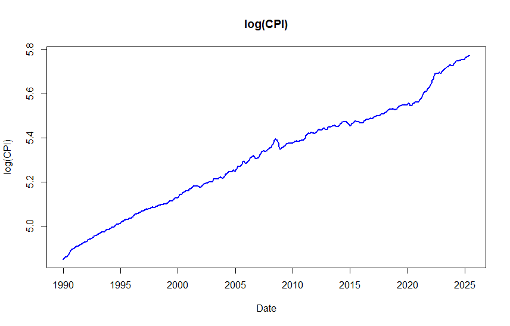
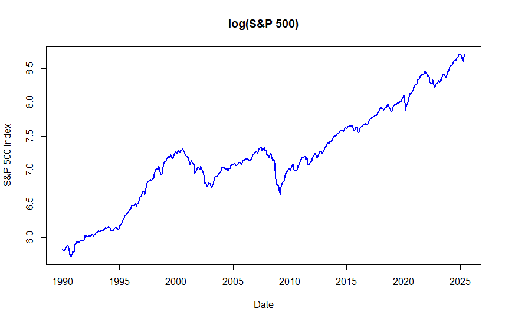
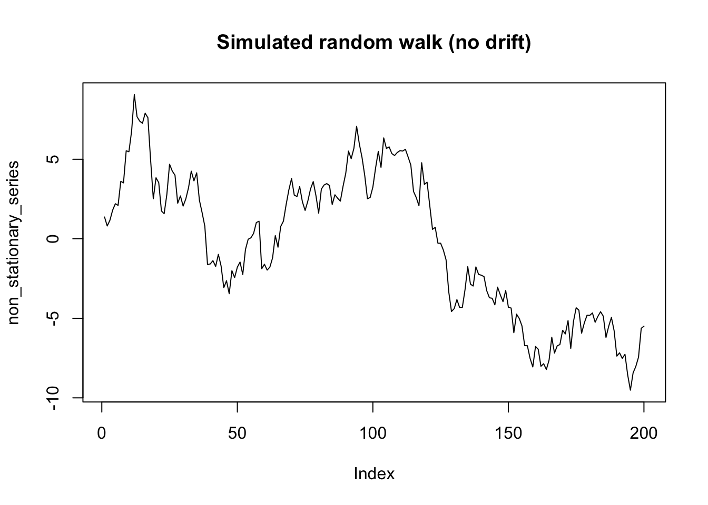
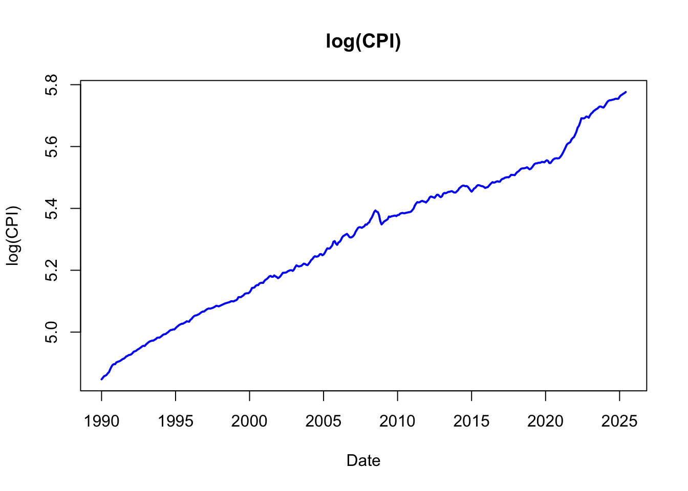
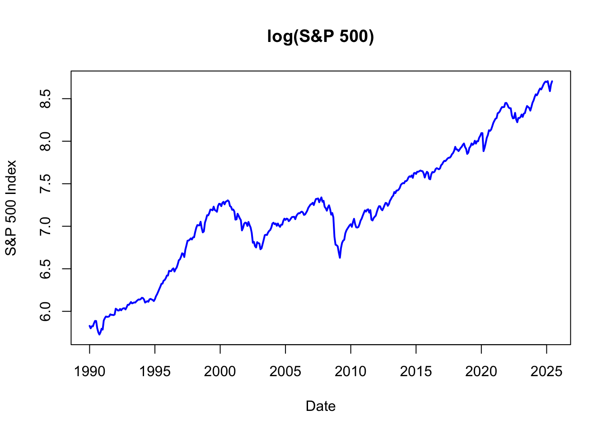

<div id="part-ch12" class="chapter-title">
# Nonstationary processes
</div>

<!-- ## Integrated and ARIMA($p$, $q$) processes -->
## Integrated process

In some application fields, such as economics and finance, the existence of trends in the analyzed time series is common. 

- Here the term "trend" is used quite generally. 

Earlier in this material, it was discussed that nonstationary time series containing a trend can be investigated using methods developed for stationary time series if the trend is first removed using a suitable transformation. The most popular of such transformations is taking differences, which amounts to modelling the differenced series $\Delta y_t = y_t-y_{t-1}$.


- Here $\Delta = 1-B$ is the difference operator. 

- These series might seem stationary and thus be modelled with stationary models reasonably well. If the differences still include some sort of trend, it is natural to extend this procedure to the difference of these differences $\Delta^2 y_{t} = y_t-2y_{t-1}+y_{t-2}$, and so on. This, however, is very rare in practice, and typically only first differences are considered when differencing data.

&nbsp;

Based on the aforementioned, let us introduce the following definition for univariate time series process:

**Integrated process**. Stochastic process $y_t$ $\{y_t, t=1,2,\dots\}$ is said to be **an integrated process of order $d$ or $I(d$) process** if the $d$ times differenced process 
\begin{equation*}
\Delta^d(y_t-\mathsf{E}(y_t)), \quad t=1,2,\dots
\end{equation*}
is stationary, but the $d-1$ times differenced process 
\begin{equation*}
\Delta^{d-1}(y_t-\mathsf{E}(y_t)), \quad t=1,2,\dots
\end{equation*}
is not. If $y_t$ is an $I(d)$ **process**, we denote 
\begin{equation*}
y_t\sim \mathrm{I}(d) \,\,\, (d\geq 1).
\end{equation*}
In this course, we will consider only $d=1$ and $d=0$.

&nbsp;

**Random walk**. The simplest example of an $I(1)$ process is **random walk**, which was briefly covered already in connnection to the AR(1) process. Here the random walk is defined with a drift term $\nu$:
\begin{equation*}
    \Delta y_t = \nu + u_t, \,\, t=1,2,\ldots
\end{equation*}
where $u_t\sim \mathsf{iid}(0,\sigma^2$). By recursive substitutions, we get
\begin{equation*}
    y_t=y_0+\nu t + \sum_{j=1}^{t}u_j, \,\,\, t=1,2,\dots
\end{equation*}
Sometimes, depending on the time series and application that we are considering. it is assumed that $\nu=0$, that is, we have **random walk without drift**, and hence the term $\nu t$ above vanishes. Moreover, in that case, differences $y_t-y_{t-1}=u_t$ from the process $y_t=y_0+\sum_{j=0}^{t-1}u_{t-j}$ are stationary, and this holds even if instead of $u_t\sim\mathsf{iid}(0,\sigma^2)$ we only assume $u_t$ is stationary. 

Assuming the initial (starting) value $y_0$ as constant, for the random walk we get (details are left as an exercise)
\begin{equation*}
    \mathsf{E}(y_t)=y_0+\nu t,
\end{equation*}
\begin{equation*}
    \mathsf{Var}(y_t)=\mathsf{Var}\left(\sum_{j=1}^{t}u_j\right)=\sigma^2t,
\end{equation*}
\begin{equation*}
    \mathsf{Cor}(y_t,y_{t+k})=\frac{1}{\sqrt{1+k/t}}, \,\, k\geq 0.
\end{equation*}
Here we can observe that random walk is not stationary even if the value of $y_0$ is altered. 

- As $\Delta y_t\sim\mathsf{iid}(\nu,\sigma^2)$ is stationary, we can conclude that the random walk is an $I(1)$ process.

- From the calculations above, we can observe that for random walk $\mathsf{Var}(y_t)\rightarrow\infty$ and $\mathsf{Cor}(y_t,y_{t+k})\rightarrow 1$ with any $k>0$ as $t\rightarrow\infty$. Therefore, random walk processes are strongly autocorrelated, and due to their wandering nature, they exhibit trend-like features.

&nbsp;

Random walk is the simplest example of so-called **ARIMA processes**, as introduced below. The letter $I$ in the middle refers to the term "integrated" as the sum $\sum_{j=0}^{t-1}u_{t-j}$ is interpreted as an integral. Furthermore, as the term $\sum_{j=1}^{t}u_j$ is stochastic (random), this trend component is often called a **stochastic trend**. 

- If $\nu\neq0$, this stochastic trend appears around the **deterministic trend** $y_0+\nu t$. A deterministic trend is a non-random function of time, such as a linear function. A time series fluctuates around its deterministic trend component.

- A **stochastic trend** is random and varies over time. A stochastic trend exhibits a prolonged period of increase followed by a prolonged period of decrease in the time series.

- Moreover, a process, say, $y_t = \alpha + \beta t + \psi(B) u_t$, where $\psi(B)$ refers to the MA($\infty$) presentation of the ARMA process (including the special case of $\psi(B) =1$, as discussed in Section 1), is sometimes described as a trend-stationary process, because if one subtracts the trend ($\alpha + \beta t$) the result is a stationary process. 

This brings us to the conclusion: As many economic (and other) time series exhibit a trend, it is important to distinguish whether a trend (persistent long-term movement over time) in a time series is generated by stochastic or deterministic trend.

- It turns out that it is often more appropriate to model economic (macroeconomic and financial) time series assuming that there is a stochastic trend rather than a deterministic trend.


Still in a nutshell, an $I(0)$ time series process fluctuates around its mean with a constant and infinite variance that does not depend on time, while $I(1)$ series **wanders** widely. 

- At times it is said that an $I(0)$ process is **mean reverting**, as there is tendency that the series returns to its mean. Furthermore, the process has a limited memory of its past behaviour and sample autocorrelations decay relatively rapidly to zero.

- In contrast, $I(1)$ process has an infinitely **long memory** (see, e.g., random walk case above). Each innovation has a permanent effect on the process. Estimated autocorrelations decay to zero very slowly.


&nbsp;


## ARIMA($p$,$d$,$q$) process

If the process $y_t, \, t=0,1,\dots$, is non-stationary, but the difference $\Delta y_t$ is stationary and follows an invertible ARMA($p,q$) process, $y_t$ is called an **ARIMA($p,1,q$) process**. 

- The order in the middle refers to the fact, that stationarity is achieved by differencing the process once. 

- If the process is non-stationary after being differenced once, but the second differences $\Delta^2y_t=(y_t-y_{t-1})-(y_{t-1}-y_{t-2})$ follow a stationary and invertible ARMA($p,q$) process, $y_t$ is called an ARIMA($p,2,q$) process. 

In general, $y_t$ is called an **ARIMA($p,d,q$) process** if it becomes a stationary and invertible ARMA($p,q$) process after differencing $d$ times.

- That is, $\Delta^d y_t \sim \mathrm{ARMA}(p,q)$. 

- In practice, $d=1$ is by far the most common case, $d=2$ can be encountered quite rarely, and $d>2$ can be safely ignored. 

- With $d=0$, we obtain the special case of an ARMA($p,q$) process.

<!-- - It is worth noting that the ARIMA($p,d,q$) process ($d>0$) has to be defined by fixing the starting point $t=1$, so that $y_1$ can be generated from the starting values $y_0,\dots, y_{1-p-d}$ and innovations $u_1,\dots,u_{1-q}$.  -->

The typical properties of an ARIMA($p$,1,$q$) process are generally the same as for random walk. The realizations exhibit a wandering nature explained by the variance growing as a function of $t$ and strong autocorrelation even though the autocorrelation function cannot be defined like with stationary processes.

&nbsp;

**A warning on overdifferencing**. While differencing is a fundamental tool for making a nonstationary time series stationary, applying it too many times, a problem known as **overdifferencing**, can be counterproductive. It is a common pitfall to assume that if one difference helps, a second one might help more. Even more often, **you should not mechanically difference a time series that is already "stationary enough"**. 

- Doing so without a strong theoretical justification (e.g., an economic model suggesting a process is integrated of order two, I(2)), is highly unlikely and can even harm your statistical/econometric analysis. 

Overdifferencing does not make a series "more stationary". Instead, it introduces new artificial patterns into the data that were not present in the original process. This complicates model building and can lead to poor analyses and forecasts.

- The most significant problem is that overdifferencing creates a specific, predictable correlation structure. Specifically, it often introduces a strong negative autocorrelation at lag 1. A model then has to be made more complex (e.g., by adding a moving average term, MA(1)) just to remove the artificial pattern you introduced. This violates the principle of parsimony.

- Increased Variance: Differencing a stationary series can actually increase its variance, making the series noisier and harder to model accurately.

**Illustration: Overdifferencing white noise**. Let see what happens when we difference a series that is already stationary: a white noise process, $y_t = \varepsilon_t$, where $\varepsilon_t \sim \mathsf{wn}(0, \sigma^2)$. This series has by definition zero autocorrelation at all lags. If we mistakenly difference it, we create a new series, $z_t= \Delta y_t = y_t - y_{t-1} = \varepsilon_t - \varepsilon_{t-1}$. This new series, $z_t$, is no longer white noise. Let's examine its properties:

- Variance: $\mathsf{Var}(z_t) = \mathsf{Var}(\varepsilon_t - \varepsilon_{t-1}) = \mathsf{Var}(\varepsilon_t) + \mathsf{Var}(\varepsilon_{t-1}) = \sigma^2 + \sigma^2 = 2\sigma^2$. We have doubled the variance!

- Autocorrelation: The autocovariance at lag 1 is $\mathsf{Cov}(z_t, z_{t-1}) = \mathsf{Cov}(\varepsilon_t - \varepsilon_{t-1}, \varepsilon_{t-1} - \varepsilon_{t-2}) = -\mathsf{Var}(\varepsilon_{t-1}) = -\sigma^2$.

The autocorrelation at lag 1 is therefore:
\begin{equation*}
\rho_1 = \frac{\mathsf{Cov}(z_t, z_{t-1})}{\sqrt{\mathsf{Var}(z_t)\mathsf{Var}(z_{t-1})}} = \frac{-\sigma^2}{\sqrt{2\sigma^2 \cdot 2\sigma^2}} = \frac{-\sigma^2}{2\sigma^2} = -0.5
\end{equation*}
By differencing a series with zero autocorrelation, we created a new series with a perfectly defined negative autocorrelation of -0.5 at lag 1. 

<!-- These two results suggest that some evidence for potential overdifferencing by looking for these tell-tale signs: 
- The ACF Plot: The most obvious sign is a large, significant negative spike at lag 1 in the autocorrelation function (ACF) plot of your differenced series. 
- Increased standard deviation: Calculate the standard deviation of your series before and after differencing. If it increases noticeably, you may have overdifferenced.-->

As we will discuss later on, always check for stationarity using tools like the ACF plot and unit root tests (e.g., ADF test, see the coming section) before applying another round of differencing. If the series already appears stationary enough, stop.


&nbsp;


## Unit root process

Let's consider the (univariate) AR($p$) process 
\begin{equation*}
a(B)z_t=u_t,
\end{equation*}
where $a(B)=1-a_1 B-\dots-a_p B^p$. 

- Here notation $z_t$ will be used when the unit root process is not assumed to have a constant or other deterministic trends. 

It can be shown (see the Extra tag below) that the polynomial $a(\mathsf{B})$ can be rewritten as
\begin{equation*}
a\left(B\right) =\Delta -\phi B - \phi _{1}\Delta B -\cdots -\phi _{p-1}\Delta B^{p-1}, \quad  \phi =-a\left( 1\right),
\end{equation*}
so the process $z_t$ can be represented as 
\begin{equation*}
\Delta z_{t}=\phi z_{t-1}+\phi _{1}\Delta z_{t-1}+\cdots +\phi _{p-1}\Delta z_{t-p+1}+ u _{t}, \quad t=1,2,\ldots,
\end{equation*}
where $u _{t}\sim \mathsf{iid}(0,\sigma ^{2})$. 

Let's assume that for $a(z)$ the following holds:
\begin{equation*}
    \text{If} \,\, a(z)=0, \,\, \mathrm{then} \,\, |z|>1 \,\, \mathrm{or} \,\, |z|=1.
\end{equation*}
In other words, the roots of the polynomial $a(z)$ lie outside or at the unit circle on the complex plane. 

- If all the roots lie outside the unit circle, $z_t$ is (at least) asymptotically stationary (as meeting the stationarity condition of the AR($p$) process).

Let us now assume there is exactly one **unit root**. From the known properties of polynomials, it follows that 
\begin{equation*}
a(z)=(1-z)b(z),
\end{equation*}
where $b(z)$ is a polynomial of the degree (at most) $p-1$ with its roots inevitably lying outside the unit circle (see the Extra below). 

- It is clear that this is equal to $\phi=0$ above. When $\phi=0$, the above-mentioned polynomial becomes $b(z) =1-\phi _{1}z-\cdots -\phi_{p-1}z^{p-1}:=\phi(z)$. 

Thus, $\Delta z_t$ is $I(0)$ and as the roots of the polynomial $\phi(z)$ lie outside the unit circle, such initial values $\Delta z_{t-1},...,\Delta z_{t-p+1}$ can be found that $\Delta z_t$ is stationary. 

- Therefore, the process $\Delta z_t$ can be written as $\Delta z_{t}=\phi(B)^{-1}u _{t}$, which is a special case of the random walk we looked at earlier but with the stationary AR($p-1$) process $\phi(\mathsf{B}) ^{-1}u _{t}$ replacing the innovation $u_t$.

&nbsp;

<div class="toggle-button" onclick="toggleCode('Extra9')">Extra: Polynomials and power series</div>
<div id="Extra9" style="display:none;">

Consider polynomial function of power $m$
\begin{equation*}
    p\left(z\right)=\sum_{k=0}^{m}a_{k}z^{k},
\end{equation*}
where $a_k$ and $z$ are real or complex numbers and $a_m\neq 0$. In the case of complex numbers $z\in\mathbb{C}$, by the \textit{fundamental theorem of algebra} the polynomial $p(z)$ can be given the form 
\begin{equation*}
    p\left(z\right)=a_{m}\left(z-\zeta_{1}\right) \cdots \left(z-\zeta_{m}\right) ,
\end{equation*}
where $\zeta _{1},...,\zeta_{m}$ are the roots of $p\left(z\right)$ and thus $p\left(\zeta _{k}\right) =0$. The case $\zeta_{k}=\zeta _{l}$ $\left(k\neq l\right)$ is possible and in the case of a real coefficient $a_k\in\mathbb{R}$ the roots occur as complex conjugates for all $k$; that is if $\zeta_{k}=x_{k}+iy_{k}$ $\left(i^{2}=-1\right)$, for some $l\neq k$ it holds $\zeta_{l}=x_{l}-iy_{k}=:\bar{\zeta}_{k}$.

Let's return to a normal polynomial $p\left(z\right)=\sum_{k=0}^{m}a_{k}z^{k}$. It is easy to conclude that $p(z)$ can be written as
\begin{equation*}
    p\left(z\right)=p\left(1\right)+\left(1-z\right)q\left(z\right),
\end{equation*}
where
\begin{equation*}
    q\left(z\right)=\sum_{k=0}^{m-1}b_{k}z^{k}, \quad b_{k}=-\sum_{j=k+1}^{m}a_{j} \quad k=1,...,m-1.
\end{equation*}
A corresponding alternative way to present this would be
\begin{equation*}
    p\left(z\right)=p\left(1\right) z+\left(1-z\right) r\left(z\right),
\end{equation*}
where
\begin{equation*}
    r\left(z\right)=\sum_{k=0}^{m-1}c_{k}z^{k}, \quad c_{0}=a_{0} \quad \mathrm{and} \quad c_{k}=-\sum_{j=k+1}^{m}a_{j}, \, k=1,...,m-1
\end{equation*}
These can be generalized to the power series, that is to say to the case
\begin{equation*}
    p\left(z\right)=\sum_{k=0}^{\infty }a_{k}z^{k} \quad \left(\left\vert z\right\vert \leq 1\right) .
\end{equation*}
If we assume
\begin{equation*}
    \sum_{k=1}^{\infty}k\left\vert a_{k}\right\vert<\infty ,
\end{equation*}
it can be easily concluded that the above equations hold when $\left\vert z\right\vert \leq 1$ and $m$ are replaced with $\infty$. In addition $\sum_{k=1}^{\infty}\left\vert b_{k}\right\vert<\infty$ and $\sum_{k=1}^{\infty}\left\vert c_{k}\right\vert<\infty$.

</div>

&nbsp;

As discussed above in connection to integrated and ARIMA processes, the presence of a unit root is particularly interesting question from an economic point of view. In models (and processes) with unit roots, shocks (such as policy or technological interventions and disruptions) have persistent effects that last forever, whereas with stationary cases such shocks have only a temporary effect. Therefore, it is of particular interest to test the unit root hypothesis in $y_t$.

&nbsp;

## Testing for a unit root

Let us continue with the autoregressive unit root process from the previous section
\begin{equation*}
    \Delta z_{t}=\phi z_{t-1}+u _{t}, \quad t=1,2,...,
\end{equation*}
where for the sake simplicity $z_0=0$ and $u_t \sim \mathsf{iid}(0,\sigma^2)$. The question of interest is to **test the unit root hypothesis**
\begin{equation*}
    H_{0}:\phi =0
\end{equation*}
against the stationary (or stable) alternative of $\phi<1$.

It seems natural to base the test on the least squares estimator (or maximum likelihood estimator, see the forthcoming section on parameter estimation) of $\phi$:
\begin{equation*}
\widehat{\phi}=\left(\sum_{t=1}^{T} z_{t-1}^{2}\right)^{-1} \sum_{t=1}^{T} z_{t-1} \Delta z_{t} \overset{H_0}{=} \left(\sum_{t=1}^{T} z_{t-1}^{2}\right)^{-1} \sum_{t=1}^{T} z_{t-1} u_{t},
\end{equation*}
where $T$ is the number of observations. The unit root test can be based directly on the estimator $\widehat{\phi}$, but it is more common to use the "t-ratio" printed by different statistical programs
\begin{equation*}
    \tau :=\frac{\sqrt{\sum_{t=1}^{T}z_{t-1}^{2}}}{\widehat{\sigma}}\widehat{\phi},
\end{equation*}
which follows, under the null (unit root) hypothesis, nonstandard asymptotic distribution. 

- The limiting distribution is independent of the unknown parameters and can be tabulated (tables are often presented in books and computer programs). 

- The percentage points of the limiting distributions usually require numerical methods or simulations. In fact both the estimator $\widehat{\phi}$ and the "t-ratio" $\tau$ have a non-Gaussian and left skewed asymptotic distribution. For example, with the $\tau$ test statistic the 5\%-percentage point is about -1.94 while with a $\mathsf{N}(0,1)$ it is -1.645, and thus the unit root hypothesis gets rejected too easily.

&nbsp;

The above unit root test can be generalized into a case with deterministic constant and trend (if appropriate due to shape of the time series or background information on it). A common model for this is
\begin{equation*}
    y_{t}=\mu_{t}+z_{t}, \quad t=1,2,\ldots,
\end{equation*}
where $z_t$ is as determined above (using $x_t$) and the deterministic trend is 
\begin{equation*}
\mu_{t}=\mu  \quad \mathrm{or} \quad \mu_{t}=\mu _{1}+\mu _{2}t.
\end{equation*}
Indicator variables can also be used to account for seasonal variation if necessary.

- The limiting distribution of the "t-ratio" can again be tabled. It deviates from the one with no constant and is more skewed to the left (5\% percentage point is now -2.86). 

- The skewedness of the asymptotic distribution keeps growing when the "t-ratio"-based test is generalized for the linear trend $d_{t}=\mu _{1}+\mu_{2}t$ (the details will be skipped now).


&nbsp;

<div class="toggle-button" onclick="toggleCode('Extra10')">Extra: Details on the above unit root test statistics</div> <div id="Extra10" style="display:none;">

Let's consider more details about unit root testing as described above.

The asymptotic distribution of the estimator $\widehat{\phi}$: Under the null hypothesis, then $z_{t}=\sum_{j=1}^{t}u _{j}$ is a (Gaussian) random walk, so the usual limit theorems do not hold. Moreover, it can be shown that the "t-ratio" follows the following (non-standard) asymptotic distribution
\begin{equation*}
    \tau :=\frac{\sqrt{\sum_{t=1}^{T}z_{t-1}^{2}}}{\widehat{\sigma}}\widehat{\phi}
    \overset{d}{\rightarrow }\left( \int_{0}^{1}W\left( u\right) ^{2}du\right)^{-1/2}\int_{0}^{1}W\left( u\right) dW(u),
\end{equation*}
where $\widehat{\sigma}^{2}=(T-1)^{-1}\sum_{t=1}^{T}(\Delta z_{t}-\widehat{\phi}z_{t-1})^{2}$ is the usual regression estimator for the error variance $\sigma^2$ ($T$ can also be used as the denominator) and $W(u)$ is standard Brownian motion.

In the latter case with the trend component, by multiplying the equation above on both sides by $\Delta -\phi \mathsf{B}$, reorganizing the terms and setting $\mu_t=\mu$ we get
\begin{equation*}
    \Delta y_{t}=\nu +\phi y_{t-1}+u _{t},\,\, t=1,2,...,
\end{equation*}
where $u_{t}\sim \mathsf{nid}\left( 0,\sigma^{2}\right)$ and $\nu =-\phi \mu$. When the unit root hypothesis holds, for the "t-ratio" $\tau_\mu$ of the parameter $\phi$ holds
\begin{equation*}
    \tau _{\mu }\overset{d}{\rightarrow }\left( \int_{0}^{1}\bar{W}\left(
    u\right) ^{2}du\right) ^{-1/2}\int_{0}^{1}\bar{W}\left( u\right) dW(u),
\end{equation*}
where $\bar{W}$ is the centered version of the standard Brownian motion.

</div>

&nbsp;

**Augmented Dickey-Fuller (ADF) test**. For now we should point out that the unit root test above can be generalized into the AR($p$) case. 

- Unlike additional deterministic components (as we saw above), additional lags (i.e. higher degree $p$) of the AR process do not impact the asymptotic distributions of the test statistics (assuming that the process is $I(1)$ when the null hypothesis holds). 

For example, given $y_t=\mu+z_t$ where $z_t\sim$ AR($p$), and hence $y_t$ also follows AR($p$), we can use the test regression model
\begin{equation*}
    \Delta y_{t}=\nu +\phi y_{t-1}+\sum_{j=1}^{p-1}\phi _{j}\Delta y_{t-j}+u _{t}, \quad t=1,2,...,
\end{equation*}
where (see the notation and discussion above) 
\begin{equation*}
u _{t}\sim \mathsf{nid}\left( 0,\sigma ^{2}\right) \quad \mathrm{and} \quad \nu= -\phi \mu.
\end{equation*}
and the null hypothesis $H_0:\phi=0$ implies the unit root process. 

- The "t-ratio" $\tau \mu$ of the parameter $\phi$ with the same asymptotic distribution as above can be used here as the test statistic. All of the asymptotic assumptions hold also without Gaussian assumptions (so $u _{t}\sim \mathsf{iid}\left( 0,\sigma ^{2}\right)$ is enough).

The test regression model and the null hypothesis $\phi=0$ is called the **Augmented Dickey-Fuller (ADF) test**. If the null hypothesis of unit root cannot be rejected, according to the above equation, an AR($p-1$) model can be built on the differences. 

- In other words, this implies the need to take first differences to get stationary time series.

- Executing the ADF test regression requires the lag length $p$ to be specified, which could be done by information criteria or consecutive tests, covered in the next section, or basing it some common fixed choice(s), possibly linked to the data frequency. All in all, it is recommended to consider a few different choices of $p$ and compare the resulting testing results.

- Moreover, as discussed above, we can also extend the ADF test regression by deterministic trend component. That is, we would have then deterministic term $\mu_1 + \mu_2 t$.

- **Determining the deterministic terms** included in the ADF test is an important and necessary step. It can be based on graphical inspection of the time series and/or theoretical or other experience on the application of interest. That is whether including a trend is reasonable or not, while a constant term is almost always included in the test regression.

&nbsp;


**Empirical examples**. Let us consider unit root testing for a few time series considered above in different parts. As discussed above, the first thing in the ADF test is to determine which deterministic terms to include in the test regression. Basically you should always include a constant term, but whether the deterministic trend component should be included as well should be determined based on visual inspection and background knowledge on the time series at hand.

In the following illustrations, we fix the number of lagged differenced lags $p$ in the ADF test to 8 lags.

(i) Consider log of the CPI time series (Introduction): In this case, there is clearly an upward trend present but is it deterministic? Well, it seems reasonable to argue that due to different (economic) reasons we can think that price level is steadily going up and a deterministic trend seems reasonable to be included in the ADF test. 


<center>
<span style="color: #0069d9;">Figure: Monthly log(CPI) time series (1990--2025).</span></center>

&nbsp;

```markdown
Test Statistic: -1.1129 
P-value: 0.924528 
```


(ii) Log of the S&P 500 index. Increasing stock prices point out very well a possible stochastic trend, but it seems difficult to argue that there is deterministic upward trend in stock prices. Therefore, including a constant is surely good choice, but for robustness we will also examine the unit root hypothesis also when including deterministic trend as well (together with the constant) in the ADF regression.



<center>
<span style="color: #0069d9;">Figure: Monthly log(S\&P 500) time series (1990-2025).</span>
</center>

&nbsp;

```markdown
Test Statistic: -0.7689838 
P-value: 0.8262138 
```

(iii) Taking the log-differences of the CPI and S&P 500 indices results in the time series previously shown in the Introduction. A visual inspection alone suggests that the unit root hypothesis is no longer reasonable for these differenced series. To confirm this, let's examine the Augmented Dickey-Fuller (ADF) test results below. The test includes a constant, as a deterministic trend is clearly no longer present in the data.

The ADF tests fail to reject the unit root hypothesis for the original level series of both the CPI and the S&P 500.

- For the CPI levels, even after including a constant and a linear trend in the test regression, we still cannot reject the null hypothesis of a unit root. This strongly suggests that the CPI can be treated as an $I(1)$ process (integrated of order one).

- A similar conclusion holds for the S&P 500 index.

These conclusions are reinforced by the test results for their log-differences, which appear to be stationary (i.e., $I(0)$ variables). This provides a consistent picture: the original series are non-stationary, but their first differences are stationary.

```markdown
logdiff(CPI):
Test Statistic: -7.744163 
P-value: 1.248182e-11 

logdiff(S&P 500)
Test Statistic: -6.094829 
P-value: 1.302771e-07 
```

<!-- Especially after taking the log-differences, the persistence of the autocorrelation implicates the unit root hypothesis not to be believable. -->

&nbsp;

**A critical limitation: The Low Power of the ADF Test**. An important limitation of the ADF test is its low statistical power. In practical terms, this means:

**The ADF test often fails to reject the null hypothesis of a unit root, even when the time series is actually stationary**.

In other words, the test is not always very good at correctly identifying a stationary process, especially if the process is close to non-stationary (e.g., an AR(1) process where the autoregressive coefficient is close to 1). If we are unable to reject the presence of a unit root, it does not necessarily mean that it is true and the process is necessarily $I(1)$. It could just be (but of course not always!) that there is not sufficient amount of informationin the data to reject the unit root.

The practical takeaway is that it's common for a truly stationary time series to produce a p-value from the ADF test that is too high to be considered statistically significant. You can observe this phenomenon by running the following code, which simulates AR(1) processes, with varying AR(1) coefficients, and ADF test.

From empirical point of view, the choice whether the process is a unit root process (nonstationary) or a "near" unit root process (stationary) is interesting but at times complicated.

- Particularly ambiguous are, e.g., interest rates. Interest rates are highly persistent and the unit root hypothesis cannot often be rejected, although nonstationary interest rates do not seem to be very plausible from an economic point of view.


```markdown
# Simulating AR(1) process with different values of phi_1 
# - Change T and phi_1

# Load the libraries
library(urca)
library(tseries)

T=200         # number of observations
phi_1=0.98    

epsilon=rnorm(T)  # random draws from nid(0,1)
y=epsilon
y[1]=0 # for simplicity and E(y_t) = 0
for(i in 2:T) y[i] = phi_1*y[i-1]+epsilon[i]
plot(y,type="l", main="Simulated realization")

test_ur_none <- ur.df(y, type = "none", lags = adf_lags)
stat_none <- test_ur_none@teststat[1, 1]
p_val_none <- punitroot(q = stat_none, N = length(test_ur_none@res), trend = "nc")
cat("P-value:", p_val_none, "\n")
```

&nbsp;

## R Lab

All the R codes considered in this section are compiled in the following link:

<button class="toggle-button toggle-button-r" onclick="toggleCode('r-code13')">R Lab: Unit root testing (ADF test)</button>
<div id="r-code13" style="display:none;">

``` r
# Unit root testing (ADF test)

# Install packages if you haven't already
# install.packages("urca")
# install.packages("tseries")

# Load the libraries
library(urca)
library(tseries)
library(zoo) # Used for handling year.month date formats in this Shiller data


# Create a reproducible non-stationary series (a random walk!)
set.seed(42)
non_stationary_series <- cumsum(rnorm(200))

# It's always a good idea to plot the data first
plot(non_stationary_series, type = 'l', main = "Simulated random walk (no drift)")
```



``` r
# ------------------ Going back to Introduction -------------------------

# --- Define/select data and sample period ---

# Set the sample period. The format (for this monthly data) is "YYYY-MM".
start_period <- "1990-01"
end_period <- "2025-06"

# Define the data file name
data_file <- "Shiller_data_031025.txt"


# --- Load and prepare data ---

# Read the data from the text file. This assumes a tab-separated file with a header.
# If your separator is different (e.g., a comma), use read.csv() instead.
tryCatch({
  shiller_data <- read.delim(data_file, header = TRUE)
}, error = function(e) {
  stop(paste("Error reading the file:", 
             data_file, ". Make sure it's in the same folder as the script."))
})

# Convert the 'Date' column to a proper time series date object
shiller_data$Date_ts <- as.yearmon(as.character(shiller_data$Date), "%Y.%m")

# Filter the data to the desired sample period
data_subset <- subset(shiller_data, Date_ts >= as.yearmon(start_period) & 
                        Date_ts <= as.yearmon(end_period))


# --- Create Time Series Objects for Base R plotting ---

# Get the start year and month from the first data point in our subset
start_year <- floor(as.numeric(data_subset$Date_ts[1]))
start_month <- cycle(data_subset$Date_ts[1])

# Create 'ts' (time series) objects, here monthly data
cpi_ts <- ts(data_subset$CPI, start = c(start_year, start_month), frequency = 12)
p_ts <- ts(data_subset$P, start = c(start_year, start_month), frequency = 12)

# (i) Base R Implementation for CPI using plot.ts
plot.ts(log(cpi_ts),col = "blue",lwd = 2,main = "log(CPI)",xlab = "Date",ylab = "log(CPI)")
```



``` r
# (ii) Base R Implementation for S&P 500 (P) using plot.ts
plot.ts(log(p_ts),col = "blue",lwd = 2,main = "log(S&P 500)",
        xlab = "Date", ylab = "S&P 500 Index")
```



``` r
data_subset$cpi_log_diff_1m <- c(NA, 1200*diff(log(data_subset$CPI))) # annualized
data_subset$p_log_diff <- c(NA, 100*diff(log(data_subset$P)))

cpi_log_diff_1m_ts <- ts(data_subset$cpi_log_diff_1m, start = c(start_year, 
                                                                start_month), frequency = 12)
p_log_diff_ts <- ts(data_subset$p_log_diff, start = c(start_year, 
                                                      start_month), frequency = 12)

plot.ts(cpi_log_diff_1m_ts, col = "blue", lwd = 2, 
        main = "Annualized monthly inflation", xlab = "Date",
        ylab = "(Annualized) 1. log-difference of U.S. CPI")
```


``` r
plot.ts(p_log_diff_ts,col = "blue",lwd = 2, main = "S&P 500 monthly returns",
        xlab = "Date",
        ylab = "log-difference of P")
```


``` r
# ----------------- Select the time series to be tested --------------------

y <- log(cpi_ts)
y <- log(p_ts)
y <- cpi_log_diff_1m_ts[2:length(cpi_log_diff_1m_ts)]
y <- p_log_diff_ts[2:length(cpi_log_diff_1m_ts)]

y = non_stationary_series


# Manually set the number of lags in the ADF test
adf_lags <- 8


# --- 2. ur.df() EXAMPLES ---

# # Case 1: No constant, no trend (not typically used)
#cat("--- ur.df() | type = 'none' ---\n")
#test_ur_none <- ur.df(y, type = "none", lags = adf_lags)
#stat_none <- test_ur_none@teststat[1, 1]
#p_val_none <- punitroot(q = stat_none, N = length(test_ur_none@res), trend = "nc")
#cat("Test Statistic:", stat_none, "\n")
#cat("P-value:", p_val_none, "\n")


# Case 2: Constant (drift) only
cat("\n--- ur.df() | type = 'drift' ---\n")
```

```
## 
## --- ur.df() | type = 'drift' ---
```

``` r
test_ur_drift <- ur.df(y, type = "drift", lags = adf_lags)
stat_drift <- test_ur_drift@teststat[1, 1]
p_val_drift <- punitroot(q = stat_drift, N = length(test_ur_drift@res), trend = "c")
cat("Test Statistic:", stat_drift, "\n")
```

```
## Test Statistic: -1.417984
```

``` r
cat("P-value:", p_val_drift, "\n")
```

```
## P-value: 0.5727686
```

``` r
# Case 3: Constant and trend
cat("\n--- ur.df() | type = 'trend' ---\n")
```

```
## 
## --- ur.df() | type = 'trend' ---
```

``` r
test_ur_trend <- ur.df(y, type = "trend", lags = adf_lags)
stat_trend <- test_ur_trend@teststat[1, 1]
p_val_trend <- punitroot(q = stat_trend, N = length(test_ur_trend@res), trend = "ct")
cat("Test Statistic:", stat_trend, "\n")
```

```
## Test Statistic: -2.087435
```

``` r
cat("P-value:", p_val_trend, "\n")
```

```
## P-value: 0.5490816
```

``` r
# --- adf.test() ---

# ?adf.test

# Manually set the number of lags to adf_lags
# Note: This function has no argument to control for constant/trend.
# - This procedure contains the constant and trend

k <- adf_lags

cat("\n--- adf.test() | Deterministic terms are implicit ---\n")
```

```
## 
## --- adf.test() | Deterministic terms are implicit ---
```

``` r
test_adf <- adf.test(y, k = adf_lags)
print(test_adf)
```

```
## 
## 	Augmented Dickey-Fuller Test
## 
## data:  y
## Dickey-Fuller = -2.0874, Lag order = 8, p-value = 0.5395
## alternative hypothesis: stationary
```
</div>


&nbsp;
