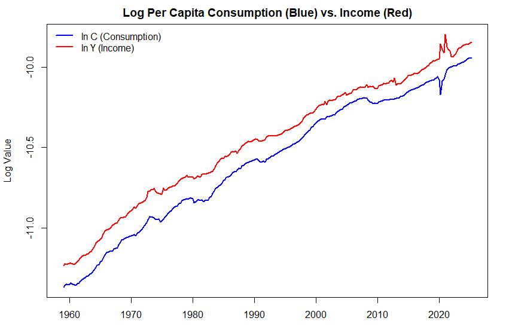
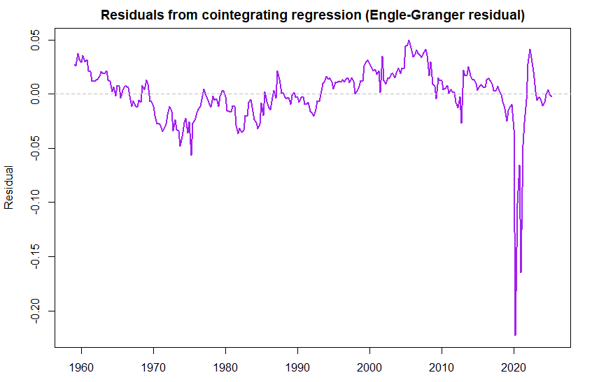
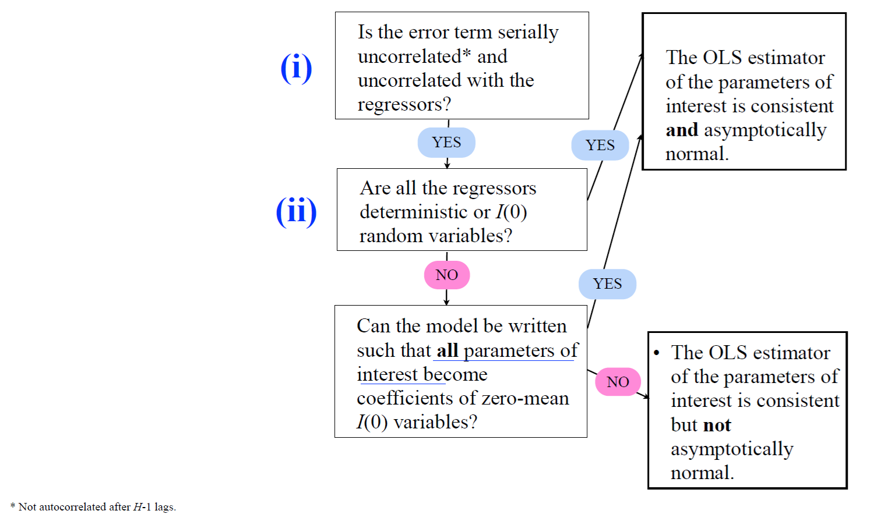
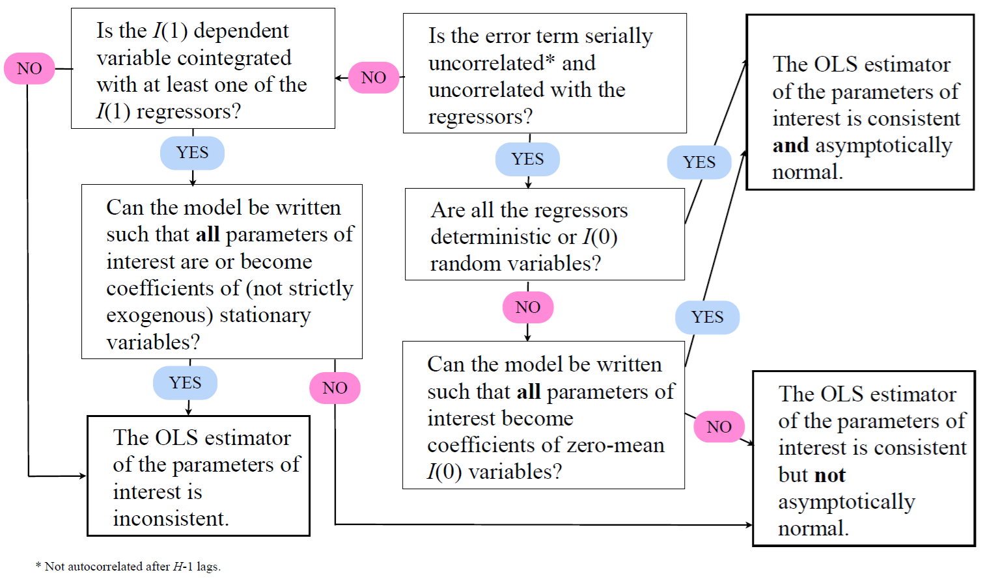
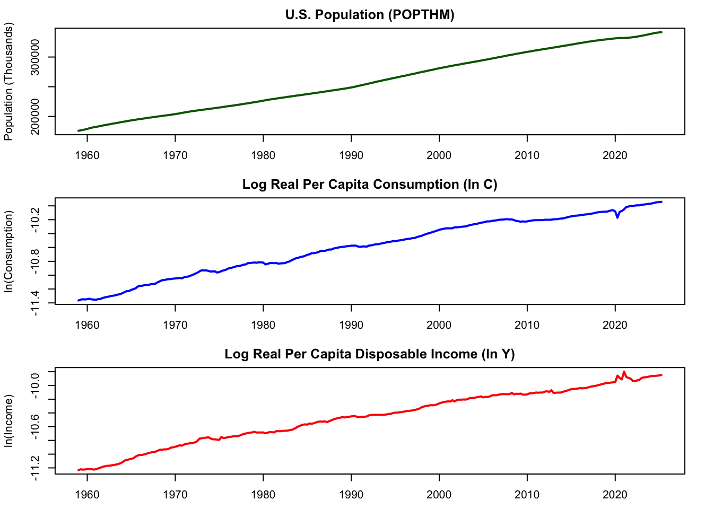
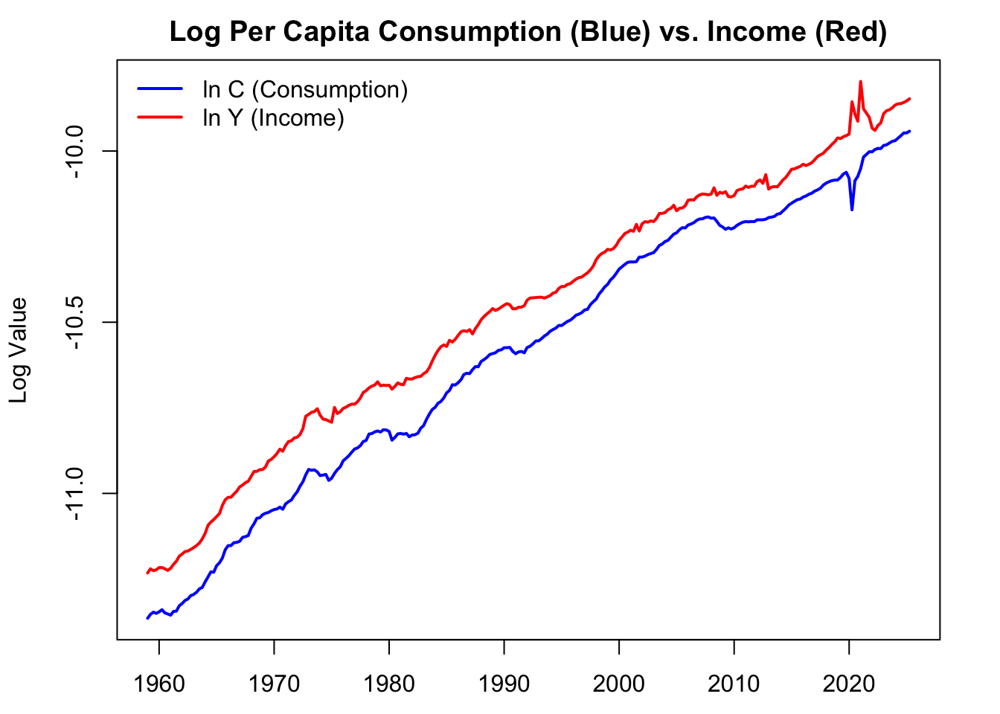
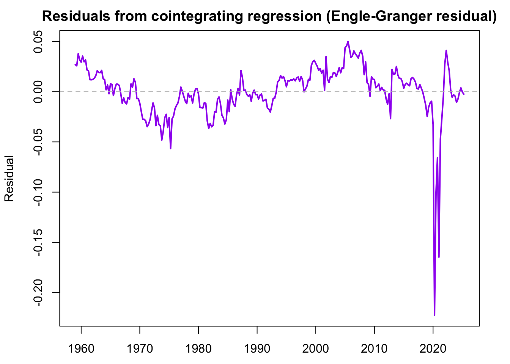
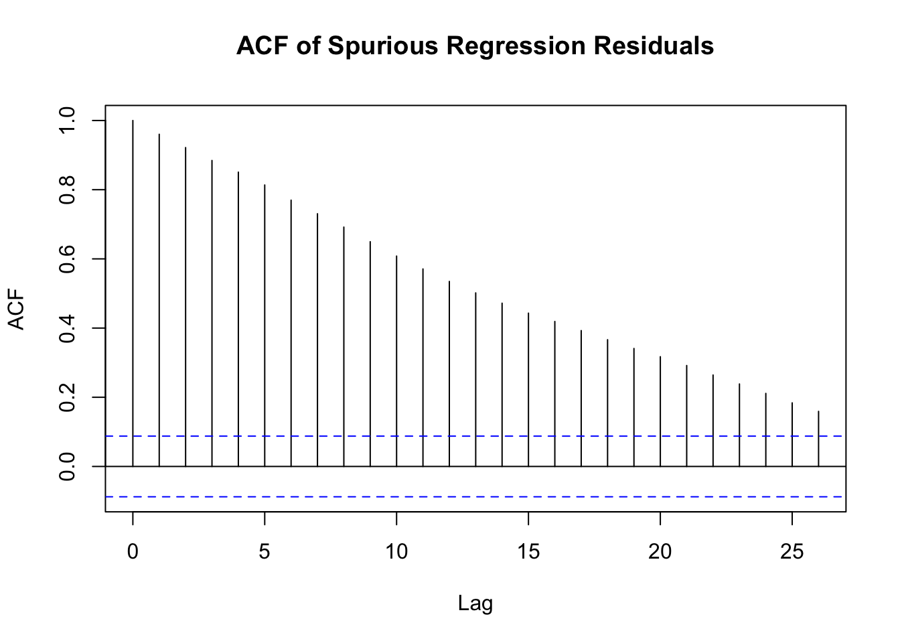
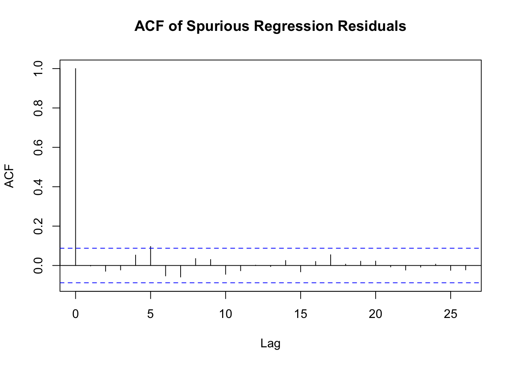

<div id="part-ch13" class="chapter-title">
# Linear regressions with I(1) variables 
</div>

Instead of stationary variables, as considered in the earlier Section 10, let us now assume that there are two variables, $y_t$ and $x_t$, and either of them or both are nonstationary and specifically $I(1)$ variables. 

- $y_t$ is again the dependent variable and $x_t$ is the predictive/explanatory variable

<!-- - In general, when considering a linear regression model between $y_t$ and $x_t$, the OLS estimator $\widehat{\boldsymbol{\beta}}$ is not generally consistent estimator for the parameter vector. -->

Before continuing to examine linear (predictive) regressions between $y_t$ and $x_t$ in different cases, let us introduce an important concept of cointegration.

&nbsp;

## Basics of cointegration

An important special case of the linear regression between $y_t$ and $x_t$, where $y_t$ and $x_t$ are nonstationary $I(1)$ variables, arises when there is a common stochastic trend in both series. 

In other words, suppose that there is a linear relationship between variables so that there exists some value $\delta$ such that $y_t - \delta x_t$ is stationary ($I(0)$) although $y_t$ and $x_t$ are nonstationary ($I(1)$).

- In such case, it is said that $y_t$ and $x_t$ are **cointegrated** and they share the common trend. 

In principle, an alternative way to construct a linear regression model, when $y_t$ and $x_t$ are $I(1)$, is based on the differences $\Delta y_t$ and $\Delta x_t$ which are then stationary ($I(0)$).

- This is not an optimal strategy if there is indeed a cointegration relationship between the variables.

- Cf. the discussion on overdifferencing in Section 12.

&nbsp;

Let us examine cointegration more detail. If $y_t$ and $x_t$ are $I(1)$ and cointegrated, then 
\begin{equation*}
z_t= y_t - \delta x_t = [y_t \quad x_t] [1 \quad -\delta]^{\prime} \thicksim I(0).
\end{equation*}
The vector $[1 \quad -\delta]^{\prime}$ is called the **cointegration vector**. 

- Cointegration is often interpreted as a long-run relationship between the variables. Assume that the equilibrium of the variables $y_t$ and $x_t$ is defined by the relationship $y_t= \tilde{\delta} x_t$ for some fixed $\tilde{\delta}$. Then $\widehat{z}_t= y_t - \widehat{\delta} x_t$ is the "equilibrium error" which measures the extent $y_t$ deviates from its "equilibrium value". 

- As $z_t$ is $I(0)$, the equilibrium error is stationary and fluctuating around zero. In other words, on average, the system is in equilibrium.  
&nbsp;

Notice that we can also use a slightly modified definition of cointegration for the above, especially when there will be more than two variables involved. We will consider this definition, and cointegration in connection to the VAR model more detail in the **Advanced Time Series Econometrics course**.  
<!-- (Lutkepohl's definition). -->


<!-- [TSEK. Periaatteessa kai seuraavaa määritelmää ei ehkä tarvittaisi tällä kurssilla (JOS VECM-mallia ei esitellä) ja jäisi ATSE:n puolelle. Voi vaan sotkea tilannetta kun muuten yi on nyt esitetty y_t:n ja x_t:n välillä] 

**A slightly modified definition of cointegration** where all the variables are included in vector $\boldsymbol{y}_t = (y_{1t},\ldots, y_{nt})$ (such as both $y_t$ and $x_t$ above): The $I(d)$ process $\boldsymbol{y}_t = (y_{1t},\ldots, y_{nt})$ (where $n$ can be larger than 2 as above) is called **cointegrated** if there is a linear combination $\boldsymbol{\beta}^{\prime} \boldsymbol{y}_t$ with $\boldsymbol{\beta} \neq \boldsymbol{0}$ which is integrated of order less than $d$.

- In a typical case, $\boldsymbol{y}_t \thicksim I(1)$ and hence the `order less than $d$' implies $I(0)$. 

- A consequence of this definition is that if there is just one $I(d)$ component in $y_t$ and all the other components are stable (= $I(0)$), then the vector $\boldsymbol{y}_t$ is $I(d)$ and $\boldsymbol{\beta}^{\prime} \boldsymbol{y}_t$ involves a cointegration relation according to this definition.

-->

&nbsp;


## Testing cointegration between two variables

From the discussion above, it is obvious that it is important to distinguish whether there is a cointegration relationship between the variables. 

Consider a "cointegration regression" between two $I(1)$ variables $y_t$ and $x_t$:
\begin{equation*}
y_t= \alpha + \delta x_t + u_t.
\end{equation*}
If $y_t$ and $x_t$ are cointegrated, then $u_t$ is $I(0)$. If not, $u_t$ will be $I(1)$. Therefore, after the model is estimated by OLS, the presence of a possible cointegration relationship can be evaluated by testing for a unit root in the residuals $\widehat{u}_t$.

&nbsp;

**Testing for cointegration with a known coefficient**. In some applications, the cointegration coefficient $\delta$ (and the intercept $\alpha$) is known in advance due to economic theory or other application-specific knowledge. When the coefficient is known, the cointegration relationship can be tested as follows. For the sake of simplicity, we will assume $\alpha=0$ in the procedure described below

- Construct the series $z_t = y_{t} - \delta x_t$.

- Use the ADF test for the null hypothesis, which implies $z_t \thicksim I(1)$. If $H_0$ is rejected, then there is a cointegration relationship.

&nbsp;

**Testing for cointegration with unknown coefficients**. If $\delta$ (and $\alpha$) are unknown, then we can proceed as follows (Engle-Granger ADF-test):

- Estimate the following model by using OLS
\begin{equation*}
y_t = \alpha + \delta x_t + u_t.
\end{equation*}

- The series $\widehat{u}_t= y_t - \widehat{\alpha} - \widehat{\delta} x_t$ is the residual of the regression.

- Test the null hypothesis implying $\widehat{u}_t \thicksim I(1)$.

- Critical values are now different than in the above case (and ADF test) as unit root testing is based on the residuals.

&nbsp;

If $y_t$ and $x_t$ are indeed cointegrated, OLS yields a consistent estimator for the cointegration coefficient $\delta$. However, the OLS estimator of $\delta$ has a non-normal asymptotic distribution, and the inferences based on the standard $t$-test statistic can be misleading.  

&nbsp;

**Example: Consumption and income**. Let us consider an empirical question derived from Hall's (1978) Permanent Income Hypothesis (PIH) in the context of cointegration. 

- R. E. Hall (1978). Stochastic implications of the life cycle-permanent income hypothesis: Theory and evidence. Journal of Political Economy, 86(6), 971--987.

The testable hypothesis is that there is a stable long-run relationship exist between real consumption and real income, such that the difference between them (the cointegrating residual) is stationary.

- In other words, the cointegration theory predicts that since consumption is proportional to permanent income (the present value of expected future income), and both are driven by a common stochastic trend (permanent income shocks), they should be cointegrated.

<!-- - In other words, one can think that consumption $c_t$ is related to the income $y_t$ so that $c_t=a \, y_t, \, 0 \le a \le 1$. Therefore, it seems reasonable to assume that there is a long-term equilibrium between $c_t$ and $y_t$. If $c_t$ and $y_t$ are now $I(1)$ processes, then there should be a cointegration relationship between the variables. -->

So, let us test the prediction of the PIH that real per capita consumption (log($c_t$) and real per capita disposable income (log($y_t$) share a single cointegrating relationship.

- Hypothesis: The two variables ($\log(c_t)$ and $\log(y_t)$) are $I(1)$ and cointegrated.

- Long-run equation: $\log(c_t) = \beta_0 + \beta_1 \log(y_t) + u_t$ 

- PIH implication: The cointegrating vector should be $(1,-\beta_1)$, where $\beta_1$ is theoretically close to 1 (or exactly 1 in the simplest PIH model) because, in the long run, consumption should grow proportionally with permanent income. The error term $u_t$ and the resulting residuals $\widehat{u}_t$ must be $I(0)$ (stationary).


<center>
<span style="color: #0069d9;">Figure: Monthly U.S. data (sample period 1959:1--2025:8) on (log) consumption and income.</span>
</center>

&nbsp;

Check first the unit root hypothesis for the two time series:
```markdown
log(c_t)
Test Statistic: -2.005634 
P-value: 0.595

log(y_t)
Test Statistic: -2.582764 
P-value: 0.289 
```

Estimation result of the cointegration regression:

```markdown
Coefficients:
            Estimate Std. Error t value Pr(>|t|)    
(Intercept) 0.383122   0.044448    8.62 6.29e-16 ***
ln_Y        1.048293   0.004244  246.99  < 2e-16 ***
---
Signif. codes:  0 ‘***’ 0.001 ‘**’ 0.01 ‘*’ 0.05 ‘.’ 0.1 ‘ ’ 1

Residual standard error: 0.02692 on 264 degrees of freedom
Multiple R-squared:  0.9957,	Adjusted R-squared:  0.9957 
F-statistic: 6.1e+04 on 1 and 264 DF,  p-value: < 2.2e-16
```

&nbsp;

Based on the Engle-Granger two-step procedure, the null hypothesis of no cointegration can be rejected at 5\% level (see testing result below).

&nbsp;



<center>
<span style="color: #0069d9;">Figure: PIH residual time series (from the estimated cointegrated model..</span>
</center>

&nbsp;

```markdown
Test Statistic: -4.561388 
> cat("P-value:", p_val_drift, "\n")
P-value: 0.000197051 
```

&nbsp;


## Linear regressions containing I(1) variables

Recall the linear regression 
\begin{equation*}
y_t= \boldsymbol{x}^{\prime}_t \boldsymbol{\beta} + u_t,
\end{equation*}
and the two assumptions $\mathrm{(i)}$--$\mathrm{(ii)}$ set in the previous section:

- $\mathrm{(i)}$ The error term $u_t$ is serially uncorrelated and uncorrelated with the regressors included in $\boldsymbol{x}_t$.

- $\mathrm{(ii)}$ All the regressors in $\boldsymbol{x}_t$ are either deterministic or stationary random variables.

**Assume now that only $\mathrm{(i)}$ holds**, that is the error term $u_t$ is serially uncorrelated and uncorrelated with the regressors included in $\boldsymbol{x}_t$.

- Even if the model cannot be written in this way, the OLS estimator of the coefficients of the $I(1)$ regressors $\boldsymbol{x}_t$ is consistent. However, its asymptotic distribution is, in general, nonstandard such that usual inference does not apply.

- If the model can be written such that all the parameters of interest are coefficients of mean zero stationary variables, their OLS estimator is consistent and asymptotically normal.

To examine these points more detail, let us consider again the following relatively simple regression model
\begin{equation*} 
y_t= \beta_0 + \beta_1 x_{t-1} + \beta_2 x_{t-2} + u_t, 
\end{equation*} 
where $x_t \thicksim I(1)$. The model can be rewritten as
\begin{equation*} 
y_t= \beta_0 + (\beta_1+\beta_2) x_{t-1} - \beta_2 (x_{t-1} - x_{t-2}) + u_t, 
\end{equation*}
or
\begin{equation*} 
y_t= \beta_0 + \beta_1 (x_{t-1}-x_{t-2}) + (\beta_1 + \beta_2) x_{t-2} + u_t.
\end{equation*}
As $(x_{t-1} - x_{t-2}) \thicksim I(0)$, and hence, standard inference on $\beta_2$ (or $\beta_1$) holds. Therefore, both $\beta_1$ and $\beta_2$ cannot simultaneously be written as coefficients of $I(0)$ variables (unless higher lags are included in the model).

- The OLS estimator of $\beta_1$ and $\beta_2$ is not, in general, jointly asymptotically normal.

- The test statistic on a hypothesis concerning both coefficients (for instance $H_0: \beta_1 = \beta_2$), in general, does not have the usual asymptotic $\chi^2$ distribution.

These remarks are compiled to the next figure. 



&nbsp;

<center>
<span style="color: #0069d9;">Figure: Cheat sheet on inference in OLS regression models with $I(1)$ variables (References: Stock and Watson (1988) and lecture notes by Markku Lanne).</span>
</center>

&nbsp;

Let us continue with linear regression where now also the assumption $\mathrm{(i)}$ does not hold and the dependent variable is $I(1)$.

- If the dependent variable is not cointegrated with any of the regressors, the OLS estimator of the coefficients of the $I(1)$ regressors is inconsistent.

- If the dependent variable is cointegrated with at least one of the regressors, the OLS estimator of the parameters of interest
 
  -  that can be written as coefficients of stationary variables, is inconsistent.

  - that cannot be written as coefficients of stationary variables, is consistent, but not asymptotically normal.


For instance, consider the following regression model:
\begin{equation*}
y_t = \beta_0 + \beta_1 x_{1t} + \beta_2 x_{2t} + u_t, 
\end{equation*}
where all variables are $I(1)$, and $y_t$ and $x_{2t}$ are cointegrated and assumption $\mathrm{(i)}$ does not hold.

- If $x_{1t}$ and $x_{2t}$ are cointegrated such that $(x_{1t} - \gamma x_{2t}) \thicksim ~ I(0)$, the model can be written as
\begin{equation*}
y_t = \beta_0 + \beta_1 (x_{1t} - \gamma x_{2t}) + (\beta_1 \gamma + \beta_2) x_{2t} + u_t,
\end{equation*}
and the OLS estimator of $\beta_1$ is inconsistent.

- If $x_{1t}$ is not cointegrated with $x_{2t}$, $\beta_1$ cannot be written as a coefficient of an $I(0)$ variable, and hence, its OLS estimator is consistent, but not asymptotically normal.

&nbsp;

The complete *cheat sheet* on linear regression with $I(0)$ and $I(1)$ variables is summarized hereby:




<center>
<span style="color: #0069d9;">Figure: Complete cheat sheet on inference in OLS regression models with $I(1)$ variables.</span>
</center>

&nbsp;

**A spurious regression** emerges when a statistically significant relationship between two $I(1)$ variables $y_t$ and $x_t$ is found although those are completely unrelated. Assume that a researcher estimates a linear regression
\begin{equation*}
y_t = \beta_0 + \beta_1 x_t + u_t,
\end{equation*}
but assuming wrongly that the variables $y_t$ and $x_t$ are stationary. Instead, they are generated by two independent random walks (i.e., $y_t$ and $x_t$ are $I(1)$ variables)
\begin{eqnarray*}
y_t &=& y_{t-1} + u_{1t}, \quad u_{1t} \thicksim \mathsf{iid}(0, \sigma^2_1) \\
x_t &=& x_{t-1} + u_{2t}, \quad u_{2t} \thicksim \mathsf{iid}(0, \sigma^2_2).
\end{eqnarray*}
This typically leads to the estimation result of the above linear regression characterized by a fairly high $R^2$ (the coefficient of determination), highly autocorrelated residuals $\widehat{u}_t$ and a (highly) statistically significant estimate of $\beta_2$. This result is clearly spurious given that the variables are completely independent!

- Estimation results like this should not be taken seriously.

- The reason is that with $y_t$ and $x_t$ being $I(1)$ variables, the error term $u_t$ will also be $I(1)$, not stationary ($I(0)$). 

Solution to this problem is to include both the lags of $y_t$ and $x_t$ as predictors in the model. In other words, we end up a model
\begin{equation*}
y_t = \beta_0 + \beta_1 x_t + \beta_2 y_{t-1} + \beta_3 x_{t-1} +  u_t.
\end{equation*}
In this case the OLS estimator is consistent. Thus, in general, including lagged values in the regression is sufficient to solve many of the problems associated with possibly spurious regressions.

An example of a spurious regression situation can be replicated with the following program code below in R lab.


&nbsp;

## R Lab

All the R codes considered in this section are compiled in the following link:


<button class="toggle-button toggle-button-r" onclick="toggleCode('r-code14')">R Lab: Cointegration (PIH example)</button>
<div id="r-code14" style="display:none;">

``` r
# Load required libraries
# install.packages(c("quantmod", "tseries")) # Uncomment and run if not installed
library(quantmod)
library(tseries)
library(urca)


# ===============================================
# Fetch and Prepare Data
# ===============================================
# 1. Fetch Data from FRED (Corrected Income Code: DPIC96)
# PCECC96: Real Personal Consumption Expenditures
# DPIC96: Real Disposable Personal Income
# POPTHM: Population (Thousands)
getSymbols(c("PCECC96", "DPIC96", "POPTHM"), src = "FRED")
```

```
## [1] "PCECC96" "DPIC96"  "POPTHM"
```

``` r
# 2. Align and Transform Data (Log, Per Capita, Quarterly)
# Merge series and remove any periods with missing data
data.raw <- na.omit(merge(PCECC96, DPIC96, POPTHM))

# Convert to 'ts' object with quarterly frequency
start.year <- as.numeric(format(index(head(data.raw, 1)), "%Y"))
data.ts <- ts(data.raw, start = start.year, frequency = 4)

# Calculate real, per capita, log-transformed variables
POP_THOUSANDS <- data.ts[, "POPTHM"]
POP <- POP_THOUSANDS * 1000 # Convert from thousands to single units

# Log Per Capita Consumption (ln_C)
ln_C <- log(data.ts[, "PCECC96"] / POP)

# Log Per Capita Income (ln_Y)
ln_Y <- log(data.ts[, "DPIC96"] / POP)


# ===============================================
# Plotting the Variables
# ===============================================

# Set up the plotting window to display all three graphs
par(mfrow=c(3, 1), mar=c(2.5, 4, 2, 2) + 0.1) 

# --- Plot 1: Population ---
plot(POP_THOUSANDS, 
     main = "U.S. Population (POPTHM)",
     ylab = "Population (Thousands)",
     col = "darkgreen", 
     lwd = 2)
# Observation: Population shows a clear deterministic and stochastic trend (non-stationary).

# --- Plot 2: Log Per Capita Real Consumption (ln_C) ---
plot(ln_C, 
     main = "Log Real Per Capita Consumption (ln C)",
     ylab = "ln(Consumption)",
     col = "blue", 
     lwd = 2)
# Observation: ln_C shows a strong upward trend, typical of an I(1) process.

# --- Plot 3: Log Per Capita Real Disposable Income (ln_Y) ---
plot(ln_Y, 
     main = "Log Real Per Capita Disposable Income (ln Y)",
     ylab = "ln(Income)",
     col = "red", 
     lwd = 2)
```



``` r
# Observation: ln_Y also shows a strong upward trend. Visually, ln_C and ln_Y 
# appear to move together, suggesting a common stochastic trend, a prerequisite for cointegration.

# Reset plot layout
par(mfrow=c(1, 1))

# Optionally, plot the two log series together to visually confirm they share a trend
cat("\n--- Visual Cointegration Check (Overlay) ---\n")
```

```
## 
## --- Visual Cointegration Check (Overlay) ---
```

``` r
plot(ln_C, 
     main = "Log Per Capita Consumption (Blue) vs. Income (Red)", 
     ylab = "Log Value", 
     col = "blue", 
     lwd = 2,
     ylim = range(c(ln_C, ln_Y)))
lines(ln_Y, col = "red", lwd = 2)
legend("topleft", 
       legend = c("ln C (Consumption)", "ln Y (Income)"), 
       col = c("blue", "red"), 
       lwd = 2, 
       bty = "n")
```



``` r
# ===============================================
# Unit Root Pre-Checks (Confirm I(1) for both)
# ===============================================

# cat("\n--- ADF Test on LOG(Consumption) Levels (ln_C) ---\n")
# print(adf.test(ln_C, k = 4)) # k=4 for quarterly data is a common starting point

# ADF-test: Constant and trend
adf_lags <- 4
cat("\n--- ur.df() | type = 'trend' ---\n")
```

```
## 
## --- ur.df() | type = 'trend' ---
```

``` r
test_ur_trend <- ur.df(ln_C, type = "trend", lags = adf_lags)
stat_trend <- test_ur_trend@teststat[1, 1]
p_val_trend <- punitroot(q = stat_trend, N = length(test_ur_trend@res), trend = "ct")
cat("Test Statistic:", stat_trend, "\n")
```

```
## Test Statistic: -2.005634
```

``` r
cat("P-value:", p_val_trend, "\n")
```

```
## P-value: 0.5951187
```

``` r
#cat("\n--- ADF Test on LOG(Income) Levels (ln_Y) ---\n")
#print(adf.test(ln_Y, k = 4))
# # NOTE: If p-value is > 0.05 for both, the I(1) condition is met to proceed.

# ADF-test: Constant and trend
adf_lags <- 4
cat("\n--- ur.df() | type = 'trend' ---\n")
```

```
## 
## --- ur.df() | type = 'trend' ---
```

``` r
test_ur_trend <- ur.df(ln_Y, type = "trend", lags = adf_lags)
stat_trend <- test_ur_trend@teststat[1, 1]
p_val_trend <- punitroot(q = stat_trend, N = length(test_ur_trend@res), trend = "ct")
cat("Test Statistic:", stat_trend, "\n")
```

```
## Test Statistic: -2.582764
```

``` r
cat("P-value:", p_val_trend, "\n")
```

```
## P-value: 0.2886401
```

``` r
# ===============================================
# The Engle-Granger Cointegration Test
# ===============================================

# Estimate the Long-Run Relationship (The Cointegrating Regression)
# Model: ln_C = alpha + beta * ln_Y + epsilon
cointegrating_regression <- lm(ln_C ~ ln_Y)

cat("\n--- Cointegrating Regression (ln_C ~ ln_Y) ---\n")
```

```
## 
## --- Cointegrating Regression (ln_C ~ ln_Y) ---
```

``` r
print(summary(cointegrating_regression))
```

```
## 
## Call:
## lm(formula = ln_C ~ ln_Y)
## 
## Residuals:
##       Min        1Q    Median        3Q       Max 
## -0.222565 -0.011066  0.001933  0.013846  0.049964 
## 
## Coefficients:
##             Estimate Std. Error t value Pr(>|t|)    
## (Intercept) 0.383122   0.044448    8.62 6.29e-16 ***
## ln_Y        1.048293   0.004244  246.99  < 2e-16 ***
## ---
## Signif. codes:  0 '***' 0.001 '**' 0.01 '*' 0.05 '.' 0.1 ' ' 1
## 
## Residual standard error: 0.02692 on 264 degrees of freedom
## Multiple R-squared:  0.9957,	Adjusted R-squared:  0.9957 
## F-statistic: 6.1e+04 on 1 and 264 DF,  p-value: < 2.2e-16
```

``` r
# Extract the residual series (the potential long-run equilibrium error)
resids <- ts(residuals(cointegrating_regression), start = start.year, frequency = 4)

# Plot the residuals (to visually check for stationarity)
# The time indexing (year and quarters) is correctly inherited from the 'ln_C' and 'ln_Y' ts objects
plot(resids, 
     main = "Residuals from cointegrating regression (Engle-Granger residual)", 
     ylab = "Residual", 
     xlab = "Time", 
     type="l",
     col = "purple",
     lwd = 2)
abline(h = 0, col = "gray", lty = 2)
```



``` r
# Observation: If the series appears mean-reverting around zero, it visually supports stationarity (I(0)).


# 3b. Test the Residuals for Stationarity (The Cointegration Test)
# Null Hypothesis (H0): Residuals are Non-Stationary (No cointegration)
# Alternative (HA): Residuals are Stationary (Cointegration exists)


# Case 2: Constant (drift) only
cat("\n--- ur.df() | type = 'drift' ---\n")
```

```
## 
## --- ur.df() | type = 'drift' ---
```

``` r
test_ur_drift <- ur.df(resids, type = "drift", lags = adf_lags)
stat_drift <- test_ur_drift@teststat[1, 1]
p_val_drift <- punitroot(q = stat_drift, N = length(test_ur_drift@res), trend = "c")
cat("Test Statistic:", stat_drift, "\n")
```

```
## Test Statistic: -4.561388
```

``` r
cat("P-value:", p_val_drift, "\n")
```

```
## P-value: 0.000197051
```
</div>


<button class="toggle-button toggle-button-r" onclick="toggleCode('r-code15')">R Lab: Spurious regression simulation</button>
<div id="r-code15" style="display:none;">

``` r
# Spurious regression

# Setup: Set length (T) and simulate innovations (epsilon)
T <- 500
set.seed(42) # For reproducibility
epsilon_1 <- rnorm(T)
epsilon_2 <- rnorm(T)

# 1. Simulate two independent Random Walks (I(1) processes)
# Cumulative sum creates the random walk (y_t = y_{t-1} + epsilon_t)
y <- cumsum(epsilon_1)
x <- cumsum(epsilon_2)

# Optional: Plot the random walks (to show non-stationarity)
# par(mfrow=c(2, 1))
# plot(y, type="l", main="Random Walk y")
# plot(x, type="l", main="Random Walk x")
# par(mfrow=c(1, 1))

# 2. Estimate Spurious Regression (y on x)
estim_model <- lm(y ~ x)
print("--- Spurious Regression Summary (y ~ x) ---")
```

```
## [1] "--- Spurious Regression Summary (y ~ x) ---"
```

``` r
summary(estim_model)
```

```
## 
## Call:
## lm(formula = y ~ x)
## 
## Residuals:
##      Min       1Q   Median       3Q      Max 
## -10.7504  -2.9024  -0.0052   3.0015  11.1311 
## 
## Coefficients:
##             Estimate Std. Error t value Pr(>|t|)    
## (Intercept) -1.91838    0.24019  -7.987 9.66e-15 ***
## x            0.28525    0.01399  20.394  < 2e-16 ***
## ---
## Signif. codes:  0 '***' 0.001 '**' 0.01 '*' 0.05 '.' 0.1 ' ' 1
## 
## Residual standard error: 3.974 on 498 degrees of freedom
## Multiple R-squared:  0.4551,	Adjusted R-squared:  0.454 
## F-statistic: 415.9 on 1 and 498 DF,  p-value: < 2.2e-16
```

``` r
# 3. Analyze Spurious Regression Residuals (should look non-stationary/autocorrelated)
resid_1 <- resid(estim_model)
print("--- ACF of Spurious Regression Residuals ---")
```

```
## [1] "--- ACF of Spurious Regression Residuals ---"
```

``` r
acf(resid_1, main="ACF of Spurious Regression Residuals") 
```



``` r
# 4. Optional: Augmented Regression (with lags)
# Prepare lagged variables (removes the first observation)
y_lag1 <- y[1:(T-1)]
x_lag1 <- x[1:(T-1)]
y_t <- y[2:T]
x_t <- x[2:T]

estim_model_2 <- lm(y_t ~ x_t + x_lag1 + y_lag1)
print("--- Augmented Regression Summary (y_t ~ x_t + x_{t-1} + y_{t-1}) ---")
```

```
## [1] "--- Augmented Regression Summary (y_t ~ x_t + x_{t-1} + y_{t-1}) ---"
```

``` r
summary(estim_model_2)
```

```
## 
## Call:
## lm(formula = y_t ~ x_t + x_lag1 + y_lag1)
## 
## Residuals:
##      Min       1Q   Median       3Q      Max 
## -2.91745 -0.63821  0.01122  0.66164  2.98589 
## 
## Coefficients:
##              Estimate Std. Error t value Pr(>|t|)    
## (Intercept) -0.089030   0.062250  -1.430    0.153    
## x_t         -0.007609   0.042138  -0.181    0.857    
## x_lag1       0.013689   0.042090   0.325    0.745    
## y_lag1       0.975694   0.011006  88.648   <2e-16 ***
## ---
## Signif. codes:  0 '***' 0.001 '**' 0.01 '*' 0.05 '.' 0.1 ' ' 1
## 
## Residual standard error: 0.9692 on 495 degrees of freedom
## Multiple R-squared:  0.9677,	Adjusted R-squared:  0.9675 
## F-statistic:  4943 on 3 and 495 DF,  p-value: < 2.2e-16
```

``` r
resid_2 <- resid(estim_model_2)
print("--- ACF of Spurious Regression Residuals With Lags ---")
```

```
## [1] "--- ACF of Spurious Regression Residuals With Lags ---"
```

``` r
acf(resid_2, main="ACF of Spurious Regression Residuals") 
```


</div>

