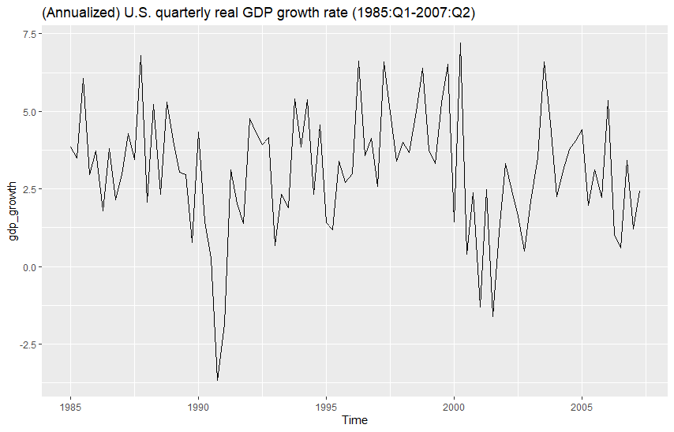
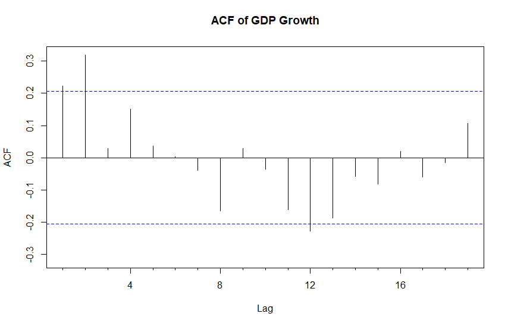
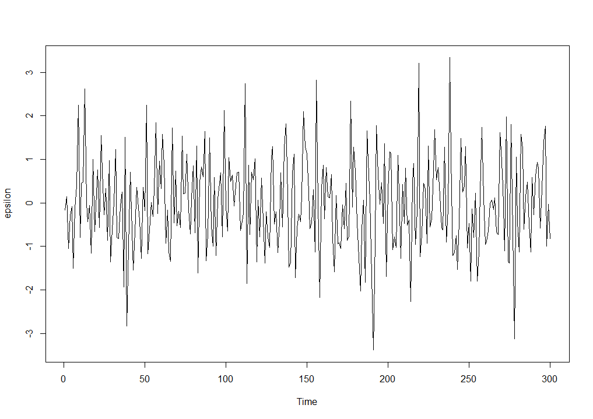
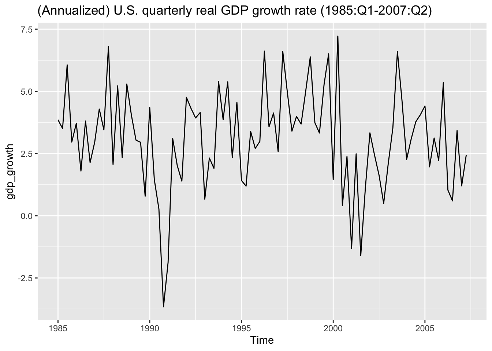
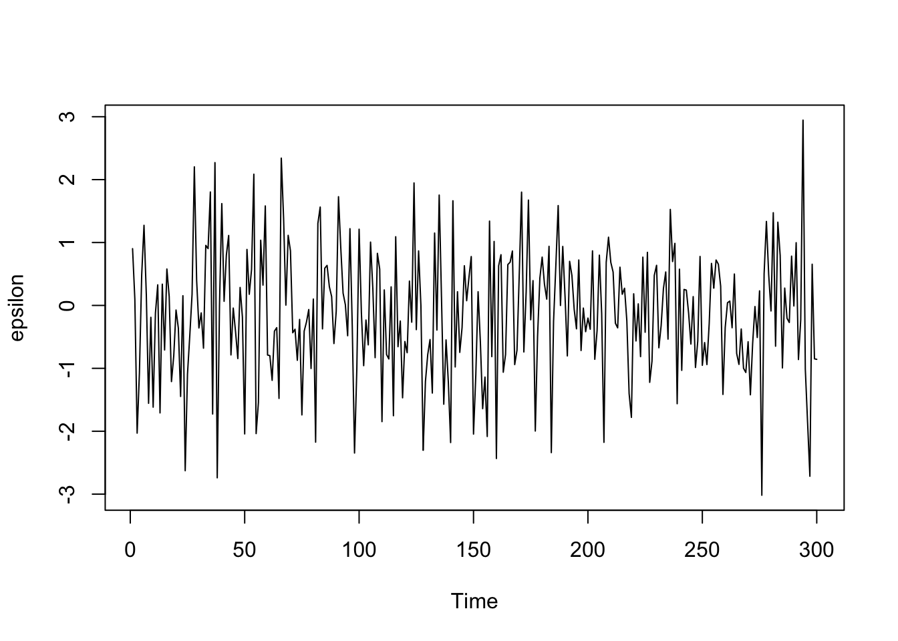

<div id="part-ch3" class="chapter-title">
# Stationary processes
</div>

## Basic concepts

The aim is to build a statistical model for the observed time series $y_{1},\ldots,y_{T}$. At this stage, and in Sections 3--9 and 12, we assume that we have one, univariate, time series. Multiple time series and multivariate models will be briefly considered later in Sections 10--11 and 13.
 
On a rather general level, the observed time series can be interpreted as the observed value of the random vector $\boldsymbol{y}=\left(y_{1},\ldots,y_{T}\right)$ or, in other words, the **realization** of this random vector. 

- Recall the notation: Here the random vector interpretation emphasizes the fact that $y_t$ will be interpreted as a random variable. Notice that We do not make a distinction between random variables and their realizations; the difference should be clear from the context.

When building a statistical model, we would attempt to specify the probability distribution of the $T$--dimensional random vector $\boldsymbol{y}=\left(y_{1},\ldots,y_{T}\right)$ that produced the observed time series. 

- Note and recall that in a time series, the observations are (typically) not independent as in the conventional linear regression, and therefore it is not enough to specify the marginal distributions of the components $y_{t}$ $\left(t=1,\ldots,T\right)$. 

- Instead, we indeed need to specify the $T$--dimensional joint distribution. 

A concrete and often used way to specify the joint distribution of $\boldsymbol{y}$ in time series analysis is to: 

- Specify a model equation that characterises the dependence structure of consecutive observations, and 

- combine this with a *suitable* distributional assumption.

Before we proceed to such concrete model equations, it is useful to first briefly study some basic concepts of probability theory that form the foundation of time series analysis.


&nbsp;


## Stochastic processes

In statistical and econometric modelling of time series, one concentrates on the observed time series. That is the realization of a random vector $\boldsymbol{y}=\left(y_{1},\ldots,y_{T}\right)$. 

From a mathematical point of view, however, it is more convenient to consider an "extension" of this vector to all time indices when defining time series models. This leads us to the concept of (a discrete time) **stochastic process** (or just simply **process**), which is a collection of random variables $\left\{y_{t};t=0,\pm1,\pm2,\ldots\right\}$. 

- Occasionally, the cases $t=0,1,2,\ldots$ or $t=1,2,\ldots$ are also considered. 

- Because the set of values the time index takes is usually known, it does not need to be emphasized, and often we can simply denote the stochastic process by $y_{t}$, or $\left\{y_{t}\right\}$ if one wants to emphasize the distinction to a single component of the process. 

- The terms "**process**" and "**model**" are often used interchangeably in time series analysis. In this material, "process" emphasizes to the underlying theoretical mechanism (that is, the stochastic process) we aim to capture with an empirical and estimated "model" for the time series.

From a practical point of view, it is important to note that **we have only a single realization available**, the observations $\left(y_{1},\ldots,y_{T}\right)$, of the process $\left\{y_{t}\right\}$. 

- In other words, we have only one realization from the process and that is only partial, that is observations are available only for the time periods $t=1,\ldots,T$. 

These above-mentioned points imply that in order to investigate the properties of $y_t$ by making use of the observed data $y_{1},\ldots,y_{T}$ only, one must make some restrictive assumptions about $y_t$ for this to be possible.


&nbsp;


## Weak stationarity

To illustrate the final remarks in the previous section, consider the **expected value function** of the process $y_{t}$ (assume here $\mathsf{E}\left(y_{t}^{2}\right)<\infty$ for all $t$)
\begin{equation*}
\mu_{t}=\mathsf{E}\left(y_{t}\right),\quad t=0,\pm1,\pm2,\ldots
\end{equation*}
as well as the **covariance function** of $y_{t}$
\begin{equation*}
\gamma_{s,t}=\mathsf{Cov}\left(y_{s},y_{t}\right)=\mathsf{E}\left[\left(y_{s}-\mu_{s}\right)\left(y_{t}-\mu_{t}\right)\right], \quad t=0,\pm1,\pm2,\ldots\text{.}
\end{equation*}

Estimating these functions by making use of one realization $y_{1},\ldots,y_{T}$ only is of course impossible, unless we somehow restrict/limit their dependence on time. **The situation simplifies if it is assumed that these quantities do not depend on time**. Indeed, it is common to assume that such a dependence on time does not (in a particular sense) exist. 

A process $y_{t}$ is called **weakly stationary**, or **covariance stationary**, if
\begin{equation*}
\mathsf{E}\left(y_{t}\right)=\mu < \infty \quad \mathrm{for\,\, all} \quad t=0,\pm1,\pm2,\ldots
\end{equation*}
and
\begin{equation*}
\mathsf{Cov}\left(y_{t},y_{t+h}\right)=\gamma_{t,t+h}=\gamma_{0,h} < \infty \,\, \text{for all }\,\, h,\text{ }t=0,\pm1,\pm2,\ldots\text{ .}
\end{equation*}
In other words, a form of **time invariance** holds: The expected value function $\mu_{t}$ is constant over time, and the covariance function $\gamma_{s,t}$ does not depend on the time indices $s$ and $t$ but only on their distance $t-s$.

- For brevity, denote $\gamma_{0,h} \equiv \gamma_{h}$.

- When $h$ is fixed, $\gamma_{h}$ is called the **autocovariance (coefficient)** of $y_{t}$ at lag $h$. As a function of $h$, the $\gamma_{h}$ is called the **autocovariance function** of $y_{t}$. 

- The $\mu$ is called the **expected value** or the **mean**.

&nbsp;

To summarize, a characteristic feature of weakly stationary process is that the first and second moments are finite and independent of time. Unless otherwise mentioned, in what follows (in this and coming few sections), **we assume that weak stationarity holds**.

&nbsp;

A useful **practical aspect** of weak stationarity is that the plausibility of this assumption can be easily investigated by looking at a graph of the observed time series: If the observations vary with constant variance around a fixed level, then weak stationarity appears a plausible assumption. 

Let us consider an example related to U.S. real GDP growth during the period 1985–2007, commonly referred to as the **Great Moderation** time period.

- More on The Great Moderation, see https://www.federalreservehistory.org/essays/great-moderation

- Real Gross Domestic Product (GDP) is the total value of a country's goods and services produced in a specific period, adjusted for inflation.

This figure (see below) illustrates that the time series fluctuates around a relatively stable mean and exhibits approximately constant variance over time. As discussed, this behavior is typical for a weakly stationary process.

It is important to note that **weak stationarity does not imply the absence of variability**. Even in a weakly stationary process, individual observations can vary substantially due to random shocks. What matters is that the statistical properties — the mean, variance, and autocovariance structure — remain constant over time. So, occasional high or low values in the series are entirely consistent with weak stationarity, as long as they are the result of random variation and not due to major structural changes in the process.

- We will soon see more examples of weakly stationary time series through simulations.

- In Section 1, the time series depicting the U.S. inflation rate can also be interpreted as realizations from weakly stationary processes.


<center>
<span style="color: #0069d9;">Figure: (Annualized) U.S. quarterly real GDP growth rate (1985:Q1-2007:Q2) (ggplot2 figure).</span>
</center>

&nbsp;

Because $\gamma_{0}=\mathsf{Var}\left(y_{t}\right)$, it holds that $\gamma_{0}\geq0$. Furthermore, the familiar properties of the covariance function imply that

- $\left\vert \gamma_{h}\right\vert \leq\gamma_{0}$. 

- In this univariate (single time series) case, we have (under weak stationary)  
\begin{equation*}
\mathsf{Cov}\left(y_{t},y_{t+h}\right)=\mathsf{Cov}\left(  y_{t-h},y_{t}\right) = \mathsf{Cov}\left(y_t, y_{t-h}\right),
\end{equation*}
which also implies that $\gamma_{h}=\gamma_{-h}$. This expression shows where the term *lag* (*lag length*) $h$ is coming from.

Putting the above properties together, the autocovariance function has the properties
\begin{equation*}
\gamma_{0}\geq0, \,\, \left\vert \gamma_{h}\right\vert \leq\gamma_{0} \quad \mathrm{and} \quad \gamma_{h}=\gamma_{-h}.
\end{equation*}
The case $\gamma_{0}=0$ is obviously not of interest, and in what follows we assume that $\gamma_{0}>0$.


&nbsp;


## Autocorrelation function

In practice, a more convenient concept than autocovariance function is the **autocorrelation function**
\begin{equation*}
\rho_{h}=\mathsf{Cor}\left(y_{t},y_{t+h}\right)= \mathsf{Cor}\left(y_t, y_{t-h}\right)=\gamma_{h}/\gamma_{0}.
\end{equation*}
The **autocorrelation coefficients** $\rho_{h}$ obviously then have the properties
\begin{equation*}
\rho_{0}=1, \,\, \left\vert \rho_{h}\right\vert \leq1, \, \mathrm{and} \,\,  \rho_{h}=\rho_{-h}.
\end{equation*}
Therefore, it suffices to consider the autocovariance and autocorrelation functions only for the lag lengths $h\geq 0$ 

- The latter just for the lags $h>0$

Due to the time invariance guaranteed by weak stationarity, it now seems evident that $\mathsf{E}\left(y_{t}\right)=\mu$ and $\mathsf{Cor}\left(y_{t},y_{t+h}\right)=\gamma_{h}$ can be estimated. One more problem remains: The autocorrelation function, in general, has an infinite number of quantities to be estimated. In practice, all of these cannot be estimated (without further restrictions). However, typically we can assume that
\begin{equation*}
\gamma_{h}\rightarrow0, \,\, \mathrm{when} \,\, h\rightarrow\infty.
\end{equation*} <!-- (#eq:Acfdecay) -->
In this case, the random variables $y_{t}$ and $y_{t+h}$ become **nearly uncorrelated when the distance $h$ is "large"** -- that is, when $y_{t}$ and $y_{t+h}$ are "far" from each other in time. 

- Therefore, in practice it suffices to estimate the autocorrelation function $\rho_{h}$, when $h=1,\ldots,H$, and $H$ is so large that $\rho_{h}\approx0$ for $h>H$.


&nbsp;


## Sample autocorrelation function

**Assume that the process $y_{t}$ is weakly stationary**. Then $\mathsf{E}\left(y_{1}\right)=\cdots=\mathsf{E}\left(y_{T}\right)=\mu$. Therefore, a natural estimator of the (population) mean is the **sample mean**
\begin{equation*}
\bar{y}=\frac{1}{T}\sum_{t=1}^{T}y_{t}.
\end{equation*}

Because (under weak stationarity) $\mathsf{Cov}\left(y_{1},y_{1+h}\right)=\cdots=\mathsf{Cov}\left(y_{T-h},y_{T}\right)=\gamma_{h}$ $\left(h\geq0\right)$, it also seems natural to estimate the population autocovariance coefficient $\gamma_{h}$ using the sample covariance of the observations $\left(y_{1},y_{1+h}\right),\ldots,\left(y_{T-h},y_{T}\right)$. Because $\mathsf{E}\left(y_{t}\right)=\mathsf{E}\left(y_{t+h}\right)$ (again under weak stationary), a commonly used estimator is
\begin{equation*}
\mathsf{c}_{h}=\frac{1}{T-h}\sum_{t=1}^{T-h}(y_{t}-\bar{y})\left(y_{t+h}-\bar{y}\right), \quad 0\leq h<T,
\end{equation*}
which is called the ($h$th) **sample autocovariance coefficient**. Sometimes, the denominator $T-h$ is replaced by $T$. 

- When $\mathsf{c}_{h}$ is interpreted as a function of $h$ (i.e. $c_1, c_2,\ldots$), it is called the **sample autocovariance function**. 

A natural estimator of the autocorrelation coefficient $\rho_{h}$ is hence
\begin{equation*}
\mathsf{r}_{h}=\mathsf{c}_{h}/\mathsf{c}_{0}, \qquad 0\leq h<T,
\end{equation*}
which is called the **sample autocorrelation coefficient** and $\mathsf{r}_1, \mathsf{r}_2, \ldots$ define the **sample autocorrelation function**.

<!-- - Note that the condition $\left\vert \mathsf{r}_{h}\right\vert \leq1$\ does not necessarily always hold for certain processes for which $\mathsf{r}_{h}$ will be constructed in a different way. -->

- Notice that by definition $\mathsf{r}_0=1$. Some statistical program packages report this uninteresting case.

&nbsp;

As an example, consider the quarterly U.S. real GDP growth rate (1985:Q1--2007:Q2). Its sample autocorrelation function is plotted below for the lags $h=0,\ldots,20$. The two horizontal lines represent certain "confidence bands". 

- If $\rho_{h}=0$ for all $h>0$, then any individual estimator $\mathsf{r}_{h}$ has an approximately 95\% probability of lying between the confidence bands $(-1.96/\sqrt{T}, 1.96/\sqrt{T})$ where $T$ is the number of observations. These confidence bands are depicted below and typically in corresponding figures. 

- If the individual sample autocorrelation coefficient $\mathsf{r}_h$ does not fall between these bands, there is statistically significant autocorrelation at the 5% significance level at the lag $h$.

<!-- - We will return to a more detailed discussion of these confidence bands later on.  -->


<center>
<span style="color: #0069d9;">Figure: Sample autocorrelation function (ACF) of the quarterly U.S. real GDP growth rate ($T=90$, and hence $1.96/\sqrt{T} \approx 0.207$.)</span>
 </center>

&nbsp;

This time series exhibit clear autocorrelation, which generally dampens (slowly) as the lag length $h$ increases.

- This dampening effect depends on the time series (process) considered

- Notice that above the first depicted lag (in this R function) is $\mathsf{r}_1$. At times in different functions and packages $\mathsf{r}_0=1$ is depicted, but that is of course not of interest.

- If there is some (remaining) seasonal variation, say in monthly time series after seasonal adjustment (if applicable), it causes rather strong autocorrelations at lags $h=12,$ $24$ and $36$. Similar behaviour can also happen if the time series contain some other cyclical pattern. 


&nbsp;


## White noise process {#weakWN}

Weak stationarity is not a strong enough assumption to allow statistical analysis of time series. It alone does not suffice for the construction of a likelihood function, nor is it enough to derive distributions of estimators or test statistics. For this reason, we need to define another concept of stationarity that is stronger than weak stationarity, **strict stationarity**. We will consider that in the next section. 

Before that, let us consider first a **white noise process**, which is the simplest possible example of a weakly stationary process. Let $u_{t}$ be a process for which it holds that

- $\mathsf{E}\left(u_{t}\right)  =\mu < \infty$, often $\mathsf{E}(u_t)=0$, 

- $\mathsf{Var}\left(u_{t}\right)=\sigma^{2}<\infty$, and 

- $\mathsf{Cov}\left(u_{s},u_{t}\right)=0$, when $s\neq t$. 

This process is often called a **(weak) white noise** process and denoted by $u_{t}\sim\mathsf{wn}\left( \mu,\sigma^{2}\right)$.

- By definition, it is clear that a white noise process is weakly stationary

- Despite their simplicity, as we will see later on, white noise processes play a central role in time series analysis because they can be used to construct more complicated processes and eventually models.


&nbsp;


## Strictly stationary process {#strictstationarity}

Let us now define the above-mentioned more stringent form of stationarity. A process $\left\{y_{t};t=0,\pm1,\pm2,\ldots\right\}$ is called **strictly stationary** (sometimes **strongly stationary**) if the collections of random variables $y_{t_{1}},\ldots,y_{t_{m}}$ and $y_{t_{1}+h},\ldots,y_{t_{m}+h}$ have the same $m-$dimensional joint distribution for all integers $t_{1},\ldots,t_{m}$, $h$ and $m$ $\left(  m>0\right)$. 

- That is, **the entire probability structure of the process $y_{t}$ is time-invariant**, not just the first and second-order moments.

&nbsp;

**Properties**. A strictly stationary stochastic process has the following properties (that follow straightforwardly from the definition):

- **SS1**: The random variables $y_{t}$ have the same distribution for all $t$.

- **SS2**: The random vectors $(y_{t},y_{t+h})$ and $(y_{s},y_{s+h})$ have the same distribution for all $t$ and $s$ and all (fixed) $h$.

- **SS3**: $y_{t}$ is weakly stationary if $\mathsf{E}\left(y_{t}^{2}\right)<\infty$ holds.

It is clear that weak stationarity does not, in general, imply strict stationarity.

- For instance, weak stationarity says nothing about moments of order 3 and above. 

<div class="toggle-button" onclick="toggleCode('Extra1')">Extra: Gaussian processes</div>
<div id="Extra1" style="display:none;">

In the case of so-called Gaussian processes, weak stationarity implies strict stationarity. A process $y_{t}$ (not necessarily stationary in any sense) is called *normal* or *Gaussian*, if the $m$--dimensional probability distribution of the random variables $y_{t_{1}},\ldots,y_{t_{m}}$ is multivariate normal (Gaussian) for all integers $t_{1},\ldots,t_{m}$ and $m$ $\left(m>0\right)$ (for simplicity, occasionally we will simply say normal when meaning multivariate normal distribution). Recall that a multivariate normal distribution is fully determined by its first and second moments. Therefore, weak stationarity and normality together do imply strict stationarity.

</div>

A very useful property of strict (but not weak) stationarity is that it is conserved in transformations. In other words,

- **SS4**: If $x_{t}$ is a strictly stationary process, then so is also the process $y_{t}=g\left(x_{t+m},\ldots,x_{t-n}\right), m,n\geq0$, for any "well-behaving" (e.g. continuous or, more generally, measurable) function $g$. Moreover, $m$, $n$, or both can be replaced with $\infty$. 

<!-- When $m$ and $n$ are both finite, property SS4 is a "reasonably direct" consequence of the definition of strict stationarity (skip details). As we shall see later on, the cases where one of $m$ or $n$ (typically $n$) is infinite can be quite useful.  -->

&nbsp;

**"Stationarity" in this material**. Unless otherwise stated, stationarity will be interpreted as strict stationarity from now on. 

- From practical time series analysis perspective, as introduced above, visual inspection of the time series is related to the theoretical implications of weakly stationary processes (i.e. mean, variance and autocovariances of the series are not dependent on time) is of interest.


&nbsp;


## IID and NID processes

Let $u_{t}$\ be a sequence of **independent and identically distributed** (IID) random variables. 

- The strict stationarity of this process is easy to check.

<div class="toggle-button" onclick="toggleCode('Extra2')">Extra: Some further results</div>
<div id="Extra2" style="display:none;">

The cumulative distribution function of the random vector $\left(u_{t_{1}},\ldots,u_{t_{m}}\right)$ evaluated at $\left(x_{1},\ldots,x_{m}\right)$ is $F\left(x_{1}\right)  \cdots F\left(x_{m}\right)$. Clearly, this is also the cumulative distribution function of the random vector $(u_{t_{1}+h},\ldots,u_{t_{m}+h})$ evaluated at $\left(x_{1},\ldots,x_{m}\right)$. 

If $\mathsf{E}\left(u_{t}^{2}\right)<\infty$, then $u_{t}$ is also weakly stationary, and in this case it has the same moment properties as the (weak) white noise process above.

</div>

This IID process is also called white noise, or sometimes **strong white noise**. We will use the shorthand notation
\begin{equation*}
u_{t}\sim\mathsf{iid}\left(\mu,\sigma^{2}\right) \quad \mathrm{or} \quad u_{t}\sim\mathsf{IID}\left(\mu,\sigma^{2}\right) 
\end{equation*}
where $\mathsf{iid}$ $\leftrightarrow$ refers to "independently and identically distributed"),  $\mu=\mathsf{E}\left(u_{t}\right)$ and $\sigma^{2}=\mathsf{Var}\left(u_{t}\right)$ (in what follows, most often $\mu=0$).

If it is additionally assumed that $u_{t}\sim\mathsf{N}\left(\mu,\sigma^{2}\right)$, one denotes
\begin{equation*}
u_{t}\sim\mathsf{nid}\left(\mu,\sigma^{2}\right) \quad \mathrm{or} \quad u_{t}\sim\mathsf{NID}\left(\mu,\sigma^{2}\right)$
\end{equation*}
where $\mathsf{nid}$ $\leftrightarrow$ **normally and independently distributed**.

- In the following, the above standard notation for the $\mathsf{iid}$, $\mathsf{nid}$ and $\mathsf{wn}$ processes are used in these lecture notes from now on.

&nbsp;

<div class="toggle-button" onclick="toggleCode('Extra3')">Extra: Some (somewhat peculiar) example cases</div>
<div id="Extra3" style="display:none;">

The first example demonstrates that the mathematical definition of weak stationarity allows for processes that may feel awkward and surprising. Define the process
\begin{equation*}
y_{t}=A\cos\left(\lambda t\right)+B\sin\left(\lambda t\right),
\end{equation*}
where $\lambda\in\lbrack0,\pi)$ is a constant and the random variables $A$ and $B$ satisfy $\mathsf{E}\left(A\right)=\mathsf{E}\left(B\right)=0$, $\mathsf{Var}\left(A\right)=\mathsf{Var}\left(B\right)=\sigma^{2}$ and $\mathsf{Cov}\left(A,B\right)=0$. Obviously, $\mathsf{E}\left(y_{t}\right)=0$ holds. Using properties of trigonometric functions, straightforward calculation can be used to establish that 
\begin{equation*}
\mathsf{Cov}\left(y_{t},y_{t+h}\right)=\sigma^{2}\cos\left(\lambda h\right).
\end{equation*}
Therefore, $y_{t}$ is weakly stationary (details are left as an exercise). This process is peculiar in that its realizations are quite regular functions of time (linear combinations of $\cos\left(  \lambda t\right)$ and $\sin\left(\lambda t\right)$). Note also that for this process, condition \@ref(eq:Acfdecay) does not hold. $\square$

&nbsp;

The second example: Define the process $y_{t}=u_{t}\sqrt{\omega+\alpha u_{t-1}^{2}}$, where $\omega>0$, $\alpha\geq0$ and $u_{t}$ is (weak) white noise process and satisfies $\mathsf{E}\left(u_{t}\right)=0$ and $\mathsf{E}\left(u_{t}^{2}\right)<\infty$. It is easy to see that $y_{t}$ is weak white noise (justification as an exercise). Because $y_{t-1}=u_{t-1}\sqrt{\omega+\alpha u_{t-2}^{2}}$, it is clear that $y_{t}$ is not strong white noise (unless $\alpha=0$). $\square$

</div>

&nbsp;

As an illustration of nid process, below we depict a simulated realization from the $\mathrm{nid}(0,1)$ process. The length of the time series is 300 observations ($T=300$). In other words, we can state that $z_t \sim \mathsf{nid}(0,1), \, t=1,\ldots,300$. The simulated time series exhibits completely random variation.

<center>
<span style="color: #0069d9;">Figure: A simulated realization of nid(0,1) process ($T=300$).</span>
</center>

&nbsp;


## R Lab

<button class="toggle-button toggle-button-r" onclick="toggleCode('r-code3')">R Lab, Section 2</button>
<div id="r-code3" class="code-section-wrapper" style="display:none;">

``` r
#  LOAD LIBRARIES
# -------------------------------------------------------------------
packages_to_load <- c("tseries", "forecast", "ggplot2", "readxl", "dplyr", 
                      "lubridate", "astsa", "TSA")
for (pkg in packages_to_load) {
  if (!require(pkg, character.only = TRUE)) {
    install.packages(pkg)
    library(pkg, character.only = TRUE)
  }
}


#  DATA ACQUISITION AND PREPARATION
# -------------------------------------------------------------------
start_date <- "1984-10-01"
end_date   <- "2007-04-01"

full_data <- read_excel("GDPC1-qdata.xlsx")

raw_data <- full_data %>%
  rename(date = Date, value = GDPC1) %>%
  filter(date >= as.Date(start_date) & date <= as.Date(end_date))

gdp_ts <- ts(raw_data$value, 
             start = c(year(raw_data$date[1]), quarter(raw_data$date[1])), 
             frequency = 4)

gdp_growth <- diff(log(gdp_ts)) * 400  # Annualized growth rate
gdp_growth <- na.omit(gdp_growth)


#  VISUALIZATION AND MANUAL IDENTIFICATION
# -------------------------------------------------------------------
autoplot(gdp_growth) + ggtitle("(Annualized) U.S. quarterly real GDP growth rate (1985:Q1-2007:Q2)")
```



``` r
# Simulate nid(0,1) process

epsilon=rnorm(300); plot(epsilon, type="l", xlab="Time")
```


</div>


&nbsp;
