<div id="part-ch7" class="chapter-title">
# Model selection of ARMA model
</div>

## Starting point

Consider an observed time series $y_{1},\ldots,y_{T}$, which is assumed (e.g., judging by its graph) to be generated by a stationary process, and whose modelling as some ARMA($p,q$) process appears reasonable. 

- As has been mentioned above, to achieve this some preliminary transformations may be required, such as via differencing related to ARIMA($p,d,q$) and/or nonstationary (unit root) processes (to be introduced later on this material). The most common examples of such transformations are taking differences (potentially combined with taking logarithms) and eliminating a deterministic trend by relevant detrending method.

- In the case of a process following a linear trend, the model would then be $y_{t}= \nu +  \delta t + z_{t}$, $t$ $=1,\ldots,T$, where $z_{t}$ is an ARMA($p,q$) process (cf. the decomposition $y_t = \mu_t + z_t$). The idea is to estimate the parameters $\nu$ and $\delta$ using least squares, and then move on to consider the obtained series of residuals. From the point of view of parameter estimation, this amounts to modelling the deterministic part via parameters $\nu$ and $\delta$ (related to $\mu_t$)), and the parameters of the ARMA($p,q$) process $z_{t}$ separately. An obvious alternative would be to estimate all these parameters jointly. 

<!-- This alternative is not discussed in this course, except for the special case where $\beta$ is restricted to equal zero, and the residual series equals demeaned time series $y_{t}-\bar{y}$! -->

&nbsp;

Finding a suitable ARMA($p,q$) process or, using terminology often used in connection with statistical modelling, an **ARMA($p,q$) model**, traditionally consists of the following stages (that are partially related with each other):

1) Specifying (selecting) the model orders $p$ and $q$


2) Estimation of model parameters (including initial values and possibly preliminary estimation of parameters)

3) Evaluating the sufficiency of the estimated model by model diagnostic checks and at times forecasting performance

If the estimated model is found insufficient in Step 3, one has to select a new model, that is new orders $p$ and $q$, re-estimate the parameters and evaluate sufficiency of the model. As mentioned above, Steps 1--3 are related with each other and are not always performed separately or in this order. 

**In practice, one can never know with certainty whether the true (correct) orders of the ARMA($p,q$) model have been found**. 

- If the orders are chosen too small, then some aspects of the autocorrelation structure of the time series remain unmodelled, which is obviously not optimal, especially from the strict modelling and perhaps also forecasting perspective. This may lead one to think, to be on the safe side, that it would be best to choose the orders large that there is no possibility of having chosen them too small. However, using orders that are too large leads to inefficiency in parameter estimation. As especially forecasting is based on an estimated model this may often lead to decreasing forecast accuracy. 

- It is particularly harmful if both orders $p$ and $q$ are chosen too large, because this leads to a model in which $\phi_{p}=0=\theta_{q}$ so that the model parameters are not identified (see the identification condition of the ARMA processes) and meaningful estimation of them is not possible. 

For these reasons, it is often advisable to follow the **principle of parsimony** and choose a model that is as simple as possible while being sufficiently large and adequate for the data.

&nbsp;

**In what follows in this section**, the error term is assumed to satisfy $u_{t}\sim\mathsf{iid}\left(0,\sigma^{2}\right)$, and in connection with maximum likelihood estimation, the even stronger assumption $u_{t}\sim\mathsf{nid}\left(0,\sigma^{2}\right)$. 

- Unless otherwise mentioned, it is also assumed that the stationarity and invertibility conditions hold. 

&nbsp;

**Constant term or demeaning?**. As discussed, the mean $\mathsf{E}(y_t)=\mu$ is typically nonzero, which means that we need to include a constant term to the model, or alternatively considered demeaned time series. Some clarifying points from empirical modelling perspective:

- The mean is typically estimated using the sample mean $\bar{y}$, after which one may consider the **centered time series** $y_{t}-\bar{y}$, $t=1,\ldots,T$, and acts as if $\bar{y}$\ would exactly equal the unknown $\mu$. This leads to a slight error, but it can be shown that in large samples this error is negligible. 

- **If not centering the time series process, you should always include in the constant term** to the model equation, as followed in our notation above when introducing different ARMA processes.


&nbsp;


## Sample autocorrelations and partial autocorrelations

A good second step after visualizing the series is to investigate the autocorrelation structure of the time series using the estimated (sample) autocorrelation function (ACF) and partial autocorrelation function (PACF). In many cases, these functions may contain clues regarding the suitable lag lengths $p$ and $q$ concerning an adequate ARMA($p,q$) model.  

In particular, recall what we have learned about the properties of AR, MA and ARMA processes! That is, **one should look for potential breaks ("sudden drops to zero") in the sample autocorrelation and sample partial autocorrelation functions**. 

- A break in the sample autocorrelation function, but not in the sample partial autocorrelations, suggests an MA model may be a suitable. 

- With an AR case, the properties are completely other way round. That is, we should see a break in the sample partial autocorrelations but not in the sample autocorrelations.

- If there are no clear breaks (and behavior as described above for MA or AR processes), an ARMA process appears as a likely candidate model. 

In other words, in summary, an AR($p$) process is described by an ACF that is infinite in extent (it tails off), but a PACF that is (close to) zero for lags larger than $p$. Moreover, for an MA($q$) process we have and ACF that is (close to) zero for lags larger than $q$ and a PACF that is infinite in extent (it tails off). In the absence of either of these two situations, an ARMA model might be an adequate model.

This is so called **Box-Jenkins model selection procedure**. Although quite often this procedure does not point to a single particular candidate model, it may help by ruling out some model alternatives and may be helpful as a tool to be used jointly with other model selection criteria to be introduced below.


&nbsp;


## Information criteria and sequential tests

Likewise using sample ACF and PACF, the purpose here is to select the orders $p$ and $q$ of the ARMA($p,q$) model after one has first set "sufficiently large" maximum lag lengths $p^{\ast}$\ and $q^{\ast}$. This preliminary selection can be made, for instance, by making use of the sample autocorrelation and partial autocorrelation functions. 

- Let $\tilde{\sigma}_{p,q}^{2}$\ ($0\leq p\leq p^{\ast}$, $0\leq q\leq q^{\ast}$) be the estimator of the innovation variance $\sigma^{2}$ of an ARMA($p,q$) process. 

- Suppose also that the quantity $m>\max\left(p^{\ast},q^{\ast}\right)$ used in this estimation method is held constant for all attempted values of $p$ and $q$. 

As discussed, it is preferable to avoid choosing $p$ and $q$ too large. 

- One possible way to choose $p$ and $q$ would be to minimize $\tilde{\sigma}_{p,q}^{2}$\ over the possible values $0\leq p\leq p^{\ast}$, $0\leq q\leq q^{\ast}$. However, this approach does not work, because due to the nature of the least squares or maximum likelihood method, this would lead one to choose orders too large.

To fix this obvious problem, one approach to select the orders $p$ and $q$ is to minimize the function
\begin{equation}
    C\left(p,q\right)  =\log\tilde{\sigma}_{p,q}^{2}+ \frac{\left(p+q+1\right)  g\left(  T\right)}{T}, \quad 0\leq p\leq p^{\ast},0\leq q\leq q^{\ast},
\end{equation}
where the so-called **penalty function** $g\left(\cdot\right)$ is positive valued and satisfies $g\left(  T\right)  /T\rightarrow0$ as $T\rightarrow \infty$ ("+1" due to the inclusion of the constant term $\nu$). The idea behind the penalty function is to penalize for using an unnecessarily large model. If increasing the order $p$ or $q$ does not make $\tilde{\sigma}_{p,q}^{2}$ sufficiently much smaller, then one does not choose the larger model. 

Typically used penalty functions (which have been derived based on different principles) are:

- AIC: $g\left( T\right) =2$ (Akaike information criterion)

- HQ: $g\left( T\right) =2\log (\log T)$ (Hannan and Quinn information criterion)

- BIC: $g\left( T\right) =\log T$ (Schwarz information criterion/Bayesian information criterion)

The first of these (AIC) penalizes the least (favors larger models) and the last (BIC) the most (favors smaller models). 

- We note that of the HQ penalty function, there exist also other versions in which the constant 2 has been replaced by some other constants.

&nbsp;

In practice, it is often advisable to use the criteria described above only as one tool to help in model selection, and not base the selection only on mechanical minimization of the criterion $C\left(  p,q\right)$. In principle, the final selection of the model should always be done after successful parameter estimation (i.e. when there are clearly no suspicious behavior in some estimates) and inspection of diagnostic check to evaluate the sufficiency of the model (see the next subsection).

However, **a modern** and partly also **machine learning perspective**, information criteria or equivalent tools are often used quite mechanically to select lag lengths of the ARMA model. Even though not completely advisable, in the era of large datasets, it is not always possible (or reasonable) to perform diagnostic checking in each step.

&nbsp;

**Neighbouring models**. In case of time series that appear difficult to model and select a suitable ARMA($p,q$) model, it may be useful to consider as alternatives also models in which lag lengths $p$ and $q$ are one larger than in the model that minimizes the criterion function.

- Keeping, however, in mind that selecting both orders too large can lead to identification problems as was mentioned in connection to the identification condition of the ARMA processes

One may also choose a few models that correspond to the smallest values of the information criterion function (see above), and continue with these models to more detailed investigation. Finally, it is common to use several of the above-mentioned criterion functions simultaneously and see whether they indicate the same model or not.

&nbsp;

**Sequential tests**. One way to choose the AR($p$) or ARMA($p,q$) model orders is based on sequential tests. In what follows, we will consider an AR($p$) model for simplicity, but the following procedure can be generalized into ARMA models too.

- Start by choosing a relatively large model order $p*$

- Estimate an AR($p*$) model
    \begin{equation*}
         y_t = \nu + \phi_1 y_{t-1} + \cdots + \phi_{p^*-1} y_{t- p^* +1} + \phi_{p^*} y_{t-p^*} + u_t.
    \end{equation*}

- Test (evaluate) constraint $H_0:\phi_{p*}=0$

- If the null hypothesis cannot be rejected, estimate an AR($p*-1$) model, and test for $H_0:\phi_{p*-1}=0$

- This sequential testing procedure is carried out until we can reject the null hypothesis (get the first rejection).  

The sequential testing above can be used mechanically (notice the obvious multiple testing problem and its impact on p-values, but this is often ignored in this context) using $t$-test or the Wald test statistics or using information criteria.


&nbsp;


## Evaluating the adequacy of the estimated model

In the previous sections, it is assumed that the lag lengths (orders) $p$ and $q$ of the ARMA($p,q$) model have been chosen, in one way or another, that the model is adequate/sufficient. This means that the error term $u_{t}$ satisfies at least the assumption $u_{t}\sim\mathsf{iid}\left(0,\sigma^{2}\right)$, but at the same time $p$ and $q$ are not, at least simultaneously, unnecessarily large. 

- If also assuming the normality of the error term, then satisfying preferably the assumption $u_{t}\sim\mathsf{nid}\left(0,\sigma^{2}\right)$

As discussed above, one often follows **the principle of parsimony** when choosing the model, which can sometimes leads to a model in which at least one of the orders has been chosen too small. In such a case, the error term of that selected model would remain autocorrelated, and moving to a larger model to incorporate this remaining correlation may improve, for instance, forecasting performance of the model. 

<!-- - Even if one has chosen the correct model orders, it may be the case that the errors are only uncorrelated, but not independent nor normally distributed, and it would be advantageous to know if this is the case. -->

<!-- When investigating the adequacy (sufficiency) of the estimated ARMA($p,q$) model, one should pay special attention to the "neighbouring" larger models ARMA($p+1$,$q$) and ARMA($p,q+1$). One could estimate these models and check whether the added AR or MA parameter is significantly different from zero. Due to the identification problem mentioned above, conventional tests do not work if the orders $p$ and $q$ are increased simultaneously (say, comparing to ARMA($p+1$,$q+1$) model), although even in this case one can use model selection criteria. -->

&nbsp;

**Residuals**. A natural way to investigate the adequacy of an estimated model is to use residuals, whose properties should resemble those of the theoretical error terms $u_{t}$. As with linear regression models, residuals are acquired as the difference of the observed time series ($y_t$) and its fitted values $\widehat{y}_t$ of the selected and estimated (ARMA) adequate model
\begin{equation*}
\widehat{u}_t = y_t - \widehat{y}_t.
\end{equation*}
In practice, one can also perform a further scaling and divide the residuals $\widehat{u}_{t}$\ with their estimated standard error $\widehat{\sigma}$. The **standardized residuals** obtained in this way, $\widehat{u}_{t}/\widehat{\sigma}$, should in the case of a correctly specified model be approximately independent with mean zero and variance one.

&nbsp;

**Graphical and formal residual analysis**. The first step in the investigation of the properties of the residuals is to plot their time series graph. If the estimated model is correct (or more realistically "adequate/sufficient"), the time series of the residuals should not exhibit trends, cyclical components, systematic variation in their level over time, variation of the variance over time (that is, heteroskedasticity), too many outlying observations, etc. 

- That is due to the fact that residuals $\widehat{u}_t$ should resemble assumptions made on the error term $u_t$.

In the next step, one can investigate whether the residuals are not autocorrelated. This is essentially performed in the same way as testing and investigating whether there is autocorrelation in the observed time series. In this case, the observed time series is the residual series.

- It should be noted, though, that for the autocorrelation coefficients computed from residuals, the critical bounds $\pm1.96/\sqrt{T}$\ are not valid, not even asymptotically. 

- Expressions for the asymptotically correct critical bounds do exist, but are complicated, although some computer programs plot them automatically. If such correct bounds are not (easily) available, the somewhat incorrect bounds $\pm1.96/\sqrt{T}$\ are sometimes used to give at least a rough measure of the significance of the autocorrelation coefficients computed from the residuals. 

In testing remaining autocorrelation in the residuals, the **Ljung-Box test statistic** (introduced earlier) can also be used.

- However, when considering an ARMA($p,q$) model with a constant term, instead of the (asymptotic) $\chi_{H}^{2}$--distribution used earlier, one should now use the $\chi_{H-p-q-1}^{2}$--distribution where one has to choose $H$ "large enough" for this (asymptotic) distribution to be valid.

- In practice, $H$ is chosen somewhere around 10--20 depending on the sample size $T$. Moreover, typically a couple of different selections of $H$ are considered to see whether the testing results are similar for different selections.

&nbsp;

**Possible (remaining) nonlinearities**. Although the errors of the chosen model could be considered to have no autocorrelation, they are not necessarily independent. In line with earlier discussion on possible nonlinearities, one but clearly restricted way of investigating potential nonlinear dependencies in the errors is to use autocorrelations of the squared residuals. 

It can be shown that when errors satisfy the assumption $u_{t}\sim\mathsf{nid}\left(  0,\sigma^{2}\right)$, the sample autocorrelation coefficients of the squared residuals $\widehat{u}_{t}^{2}$\ ($t=1,\ldots.,T$) are approximately independent and $\mathsf{N}\left(  0,1/T\right)$--distributed. Therefore, to sample autocorrelation coefficients of squared residuals $\widehat{u}_{t}^{2}$, one can apply the critical bounds $\pm1.96/\sqrt{T}$\ as well as the **McLeod-Li test** presented (that is, Ljung-Box test applied to squared residuals). 
<!--without the need of the lag $H$\ being too large.  -->

<!-- (As a remark, McLeod and Li have shown these results to hold even when only assumptions $u_{t}\sim\mathsf{iid}\left(0,\sigma^{2}\right)$ and $\mathsf{E}\left(u_{t}^{8}\right)<\infty$ hold.) -->

- If one notices that the errors are not autocorrelated, but that their squares are autocorrelated, one can also conclude that the errors can not be Gaussian (for Gaussian processes, being not autocorrelated is equivalent with being independent). Although the asymptotic results of the estimators presented in the previous section do hold even without the normality of the errors, it is still useful to investigate how realistic the normality assumption is by checking the histogram of the residuals or using quantile-quantile plot.

- If the errors are only serially uncorrelated, but not independent, the covariance matrix of the maximum likelihood estimator $\boldsymbol{\widehat{\boldsymbol{\beta}}}$ is not necessarily the one given in parameter estimation section. The consistency and asymptotic normality of $\boldsymbol{\widehat{\boldsymbol{\beta}}}$ can still hold under more general assumptions, but the estimated standard errors or test statistics are not necessarily valid.

&nbsp;

**Empirical example**. Let us take a look at the sufficiency of the AR(2) model estimated for the U.S. real GDP growth series. Below we depict the residual time series from the fitted model, as well as their sample autocorrelations and histogram. 

- It turns out that there is no (substantial) statistically significant residual autocorrelation left in the residuals. In addition to the sample autocorrelations, the Ljung-Box test statistics for different lag lengths $H$ generally also confirm this conclusion (at least at the 5% or higher significance level).

- As an example, the Ljung-Box test statistic gets the value $17.546$ from the first 16 lags. That is, to say, $H=16$ and the corresponding $p$-value from the $\chi_{13}^{2}$--distribution is $0.176$ (degrees of freedom: $H-p-q-1=13$. 

The histogram of the residuals suggest that the normality assumption is reasonable (see bottom right). Residual histograms typically strictly matching the density function of the normal distribution (as depicted also in the figure below), but in this case the normality assumption seems relatively adequate. 

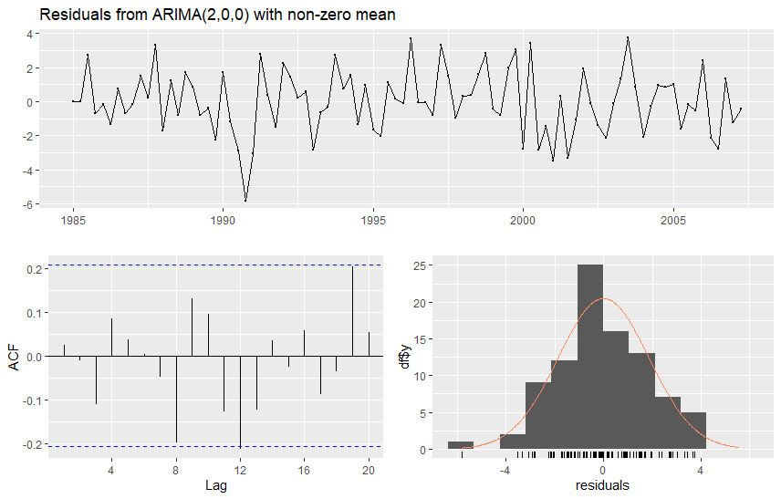
<center>
<span style="color: #0069d9;">Figure: The residual time series of the AR(2) model estimated for the US real GDP growth series (upper figure), their estimated autocorrelation function ($h=0,\ldots,20$, bottom left) and their histogram (bottom right).</span>
</center>

&nbsp;

The main conclusions from residual diagnostics do not substantially change if using the AIC to select the lag length of the AR model. In the resulting AR(3) model the third lag ($y_{t-3}$) is not statistically significant predictor in terms of the estimated t-value. Moreover, when considering ARMA models, the AIC selects MA(2) model, with essentially the same conclusions from residual diagnostics as in the AR(2) model.

When considering squared residuals and the McLeod-Li test statistics for different lag lengths, it turns out that basically with any lag length selection the resulting p-values are very high (typically higher than 0.50). Therefore, for the Great Moderation time period in the U.S. economy, there is no initial evidence for strong nonlinearities in the real GDP growth. 

&nbsp;

## R Lab

<button class="toggle-button toggle-button-r" onclick="toggleCode('r-code8')">R Lab, Sections 5-7: ARMA modelling</button>
<div id="r-code8" style="display:none;">

``` r
# ARMA MODELLING

# U.S. GDP GROWTH ANALYSIS: DETAILED SELECTION & EXTENDED DIAGNOSTICS
# Final version with restored comparative model selection (AR vs. ARMA)
# and a dedicated step for the user to choose the final model.


#  LOAD LIBRARIES
# -------------------------------------------------------------------
packages_to_load <- c("tseries", "forecast", "ggplot2", "readxl", "dplyr", 
                      "lubridate", "astsa", "TSA")
for (pkg in packages_to_load) {
  if (!require(pkg, character.only = TRUE)) {
    install.packages(pkg)
    library(pkg, character.only = TRUE)
  }
}


#  DATA ACQUISITION AND PREPARATION
# -------------------------------------------------------------------
start_date <- "1984-10-01"
end_date   <- "2007-04-01"

full_data <- read_excel("GDPC1-qdata.xlsx")

raw_data <- full_data %>%
  rename(date = Date, value = GDPC1) %>%
  filter(date >= as.Date(start_date) & date <= as.Date(end_date))

gdp_ts <- ts(raw_data$value, 
             start = c(year(raw_data$date[1]), quarter(raw_data$date[1])), 
             frequency = 4)

gdp_growth <- diff(log(gdp_ts)) * 400  # Annualized growth rate
gdp_growth <- na.omit(gdp_growth)


#  VISUALIZATION AND MANUAL IDENTIFICATION
# -------------------------------------------------------------------
autoplot(gdp_growth) + ggtitle("(Annualized) U.S. quarterly real GDP growth rate (1985:Q1-2007:Q2)")
```


``` r
par(mfrow=c(1,2))
Acf(gdp_growth, main="ACF of GDP Growth")  # forecast package
Pacf(gdp_growth, main="PACF of GDP Growth") # forecast package
```

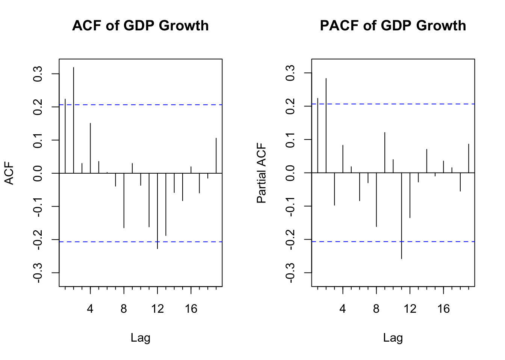

``` r
par(mfrow=c(1,1))

# --- Extended Ljung-Box Test ---
cat("\nExtended Ljung-Box Test for multiple lags:\n")
```

```
## 
## Extended Ljung-Box Test for multiple lags:
```

``` r
lags_to_test <- c(4, 8, 12, 16, 20)
lb_results <- data.frame(Lag=integer(), "Q-statistic"=double(), "p-value"=double())
for (l in lags_to_test) {
  test <- Box.test(gdp_growth, type = "Ljung-Box", lag = l, fitdf = 0)
  lb_results[nrow(lb_results) + 1,] <- c(l, round(test$statistic, 3), round(test$p.value, 3))
}
print(lb_results)
```

```
##   Lag Q.statistic p.value
## 1   4      16.487   0.002
## 2   8      19.494   0.012
## 3  12      27.942   0.006
## 4  16      32.897   0.008
## 5  20      34.679   0.022
```

``` r
# --- McLeod-Li Test ---
cat("\nExtended McLeod-Li Test for multiple lags:\n")
```

```
## 
## Extended McLeod-Li Test for multiple lags:
```

``` r
ml_results <- data.frame(
  Lag = integer(),
  p_value = numeric()
)

for (l in lags_to_test) {
  test <- TSA::McLeod.Li.test(y = gdp_growth, gof.lag = l)
  pval <- test$p.values[l] # Extract p-value for the current lag
  ml_results[nrow(ml_results) + 1, ] <- c(l, round(pval, 3)) # Append row: lag and p-value
}
```

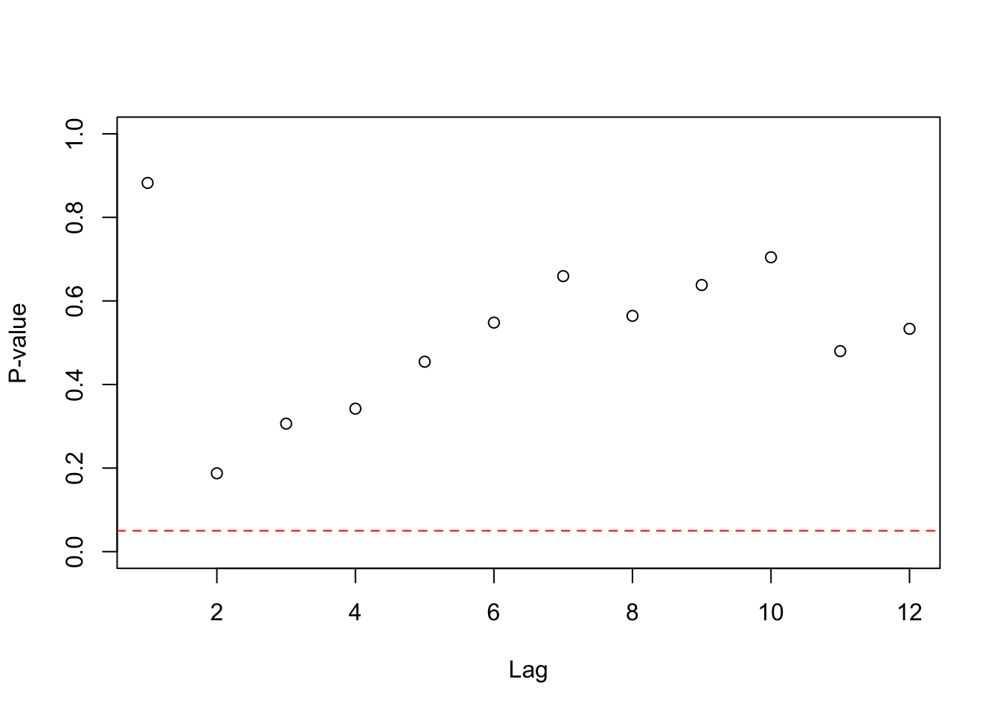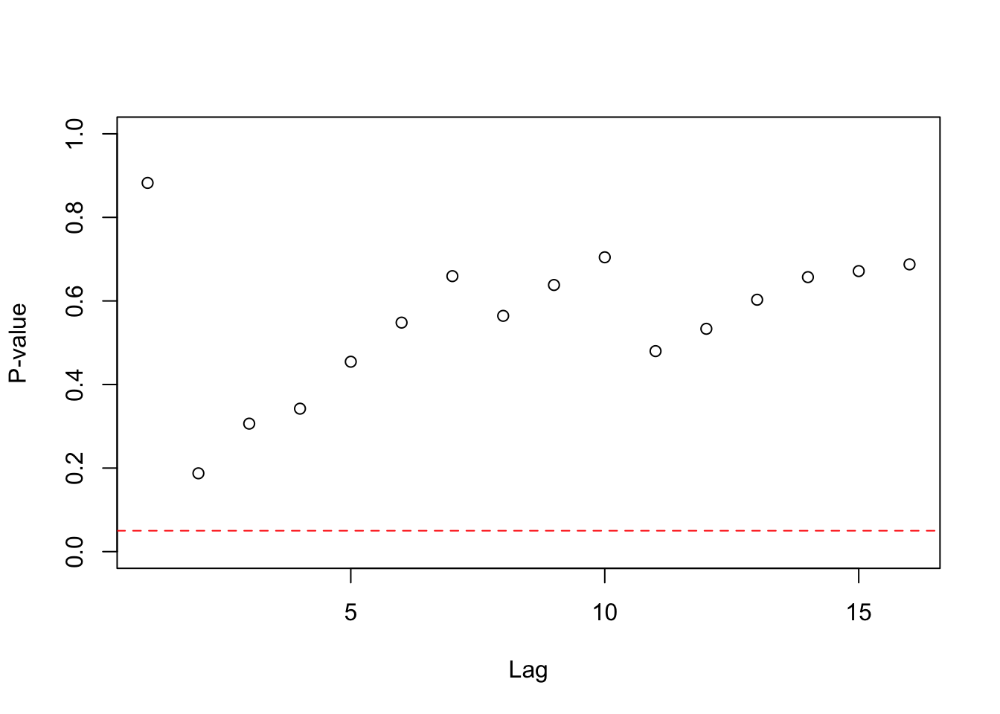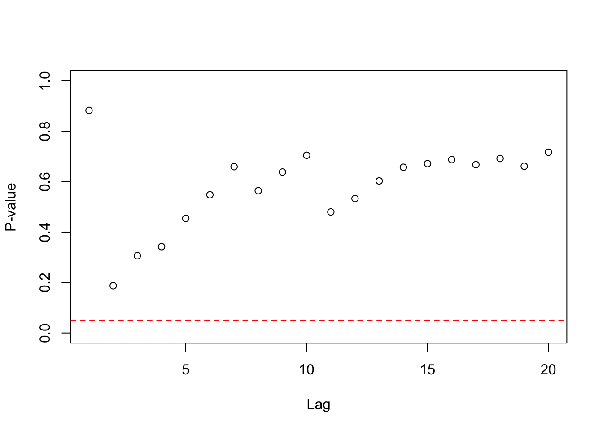

``` r
print(ml_results) # This package does not print out the values of the test 
```

```
##   Lag p_value
## 1   4   0.342
## 2   8   0.564
## 3  12   0.533
## 4  16   0.688
## 5  20   0.717
```

``` r
# statistic (only p-values)


#  DETAILED MODEL SELECTION (using Conditional MLE)
# -------------------------------------------------------------------
cat("\n--- Running Detailed Model Selection ---\n")
```

```
## 
## --- Running Detailed Model Selection ---
```

``` r
# --- (i) - Restricting to AR Models Only ---
cat("\n--- SCENARIO 1: AR-ONLY MODELS ---\n")
```

```
## 
## --- SCENARIO 1: AR-ONLY MODELS ---
```

``` r
ar_aic <- auto.arima(gdp_growth, seasonal = FALSE, max.q =0, method = "CSS", ic = "aic")
cat("\nBest AR model selected by AIC:\n")
```

```
## 
## Best AR model selected by AIC:
```

``` r
print(ar_aic)
```

```
## Series: gdp_growth 
## ARIMA(3,0,0) with non-zero mean 
## 
## Coefficients:
##          ar1     ar2      ar3    mean
##       0.1855  0.2976  -0.0966  3.0185
## s.e.  0.1037  0.1012   0.1042  0.3184
## 
## sigma^2 = 3.458:  log likelihood = -183.02
```

``` r
ar_bic <- auto.arima(gdp_growth, seasonal = FALSE, max.q = 0, method = "CSS", ic = "bic")
cat("\nBest AR model selected by BIC:\n")
```

```
## 
## Best AR model selected by BIC:
```

``` r
print(ar_bic)
```

```
## Series: gdp_growth 
## ARIMA(2,0,0) with non-zero mean 
## 
## Coefficients:
##          ar1     ar2    mean
##       0.1599  0.2872  3.0614
## s.e.  0.1010  0.1015  0.3567
## 
## sigma^2 = 3.536:  log likelihood = -184.02
```

``` r
# --- (ii) - Allowing ARMA Models ---
cat("\n--- SCENARIO 2: ARMA MODELS ---\n")
```

```
## 
## --- SCENARIO 2: ARMA MODELS ---
```

``` r
arma_aic <- auto.arima(gdp_growth, seasonal = FALSE, method = "CSS", ic = "aic")
cat("\nBest ARMA model selected by AIC:\n")
```

```
## 
## Best ARMA model selected by AIC:
```

``` r
print(arma_aic)
```

```
## Series: gdp_growth 
## ARIMA(0,0,2) with non-zero mean 
## 
## Coefficients:
##          ma1     ma2    mean
##       0.2047  0.2998  3.0893
## s.e.  0.1031  0.0964  0.2919
## 
## sigma^2 = 3.556:  log likelihood = -183.27
```

``` r
arma_bic <- auto.arima(gdp_growth, seasonal = FALSE, method = "CSS", ic = "bic")
cat("\nBest ARMA model selected by BIC:\n")
```

```
## 
## Best ARMA model selected by BIC:
```

``` r
print(arma_bic)
```

```
## Series: gdp_growth 
## ARIMA(0,0,0) with non-zero mean 
## 
## Coefficients:
##         mean
##       3.1001
## s.e.  0.2089
## 
## sigma^2 = 3.97:  log likelihood = -189.25
```

``` r
#  CHOOSE YOUR FINAL MODEL
# -------------------------------------------------------------------
# After reviewing the 4 models above, assign your choice to 'final_model'.
# The default is the AR model selected by AIC.
cat("\n\n--- Selecting Final Model for Detailed Analysis ---\n")
```

```
## 
## 
## --- Selecting Final Model for Detailed Analysis ---
```

``` r
#final_model <- ar_aic   # <--- SET YOUR CHOICE HERE
final_model <- ar_bic
# final_model <- arma_aic
# final_model <- arma_bic  


#  FINAL MODEL ESTIMATION AND DUAL OUTPUT
# -------------------------------------------------------------------
cat("\n\n--- Final Model Estimation Results ---\n")
```

```
## 
## 
## --- Final Model Estimation Results ---
```

``` r
# --- Output with Mean (µ) ---
cat("\nVERSION 1: Model Output Reporting the MEAN (µ)\n")
```

```
## 
## VERSION 1: Model Output Reporting the MEAN (µ)
```

``` r
print(summary(final_model))
```

```
## Series: gdp_growth 
## ARIMA(2,0,0) with non-zero mean 
## 
## Coefficients:
##          ar1     ar2    mean
##       0.1599  0.2872  3.0614
## s.e.  0.1010  0.1015  0.3567
## 
## sigma^2 = 3.536:  log likelihood = -184.02
## 
## Training set error measures:
##                        ME     RMSE      MAE       MPE     MAPE      MASE
## Training set 2.690307e-06 1.848811 1.457363 -36.02403 83.33033 0.7123962
##                   ACF1
## Training set 0.0254192
```

``` r
# --- Output with Constant (\nu) ---
cat("\n\nVERSION 2: Model Output Reporting the CONSTANT (c)\n")
```

```
## 
## 
## VERSION 2: Model Output Reporting the CONSTANT (c)
```

``` r
# Build the results table from scratch
estimates <- final_model$coef
std_errors <- sqrt(diag(final_model$var.coef))
t_values <- estimates / std_errors
p_values <- 2 * pnorm(-abs(t_values))

mean_form_table <- data.frame(
  Estimate = estimates, `Std. Error` = std_errors,
  `t value` = t_values, `Pr(>|t|)` = p_values, check.names = FALSE
)

ar_coefs <- mean_form_table[grepl("^ar", rownames(mean_form_table)), "Estimate"]
mean_est <- mean_form_table["intercept", "Estimate"]
se_mean <- mean_form_table["intercept", "Std. Error"]

constant_c <- mean_est * (1 - sum(ar_coefs))
se_constant_approx <- abs(1 - sum(ar_coefs)) * se_mean
t_val_c <- constant_c / se_constant_approx
p_val_c <- 2 * pnorm(-abs(t_val_c))

constant_form_table <- mean_form_table[!grepl("intercept", rownames(mean_form_table)), ]
constant_row <- data.frame(
  Estimate = constant_c, `Std. Error` = se_constant_approx,
  `t value` = t_val_c, `Pr(>|t|)` = p_val_c,
  row.names = "constant", check.names = FALSE
)
constant_form_table <- rbind(constant_row, constant_form_table)

cat("\nDerived Constant-Form Coefficient Table:\n")
```

```
## 
## Derived Constant-Form Coefficient Table:
```

``` r
print(round(constant_form_table, 6))
```

```
##          Estimate Std. Error  t value Pr(>|t|)
## constant 1.692506   0.197211 8.582201 0.000000
## ar1      0.159899   0.101006 1.583071 0.113405
## ar2      0.287243   0.101454 2.831270 0.004636
```

``` r
#  EXTENDED RESIDUAL DIAGNOSTICS
# -------------------------------------------------------------------
cat("\n\n--- Performing Extended Residual Diagnostics on Final Model ---\n")
```

```
## 
## 
## --- Performing Extended Residual Diagnostics on Final Model ---
```

``` r
checkresiduals(final_model)
```

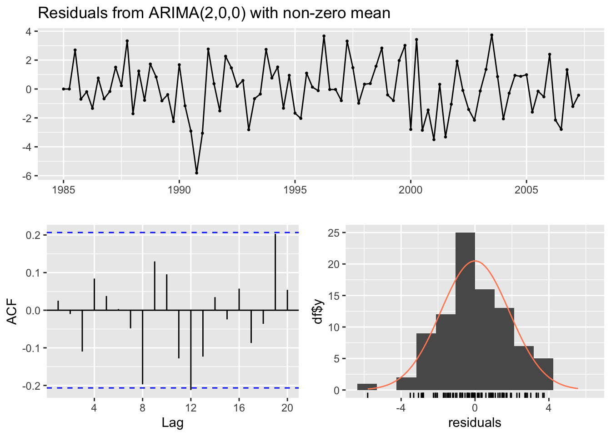

```
## 
## 	Ljung-Box test
## 
## data:  Residuals from ARIMA(2,0,0) with non-zero mean
## Q* = 6.1896, df = 6, p-value = 0.4023
## 
## Model df: 2.   Total lags used: 8
```

``` r
model_residuals <- residuals(final_model) # Here for ARIMA model

resid_lagmax <- 16 # Maximum lag length for residual autocorrelations and tests

# Plot ACF without default x-axis
acf(model_residuals, lag.max = resid_lagmax, main = "ACF of residuals", xaxt = "n")
# Manually add x-axis ticks at correct positions
axis(1, at = 0:resid_lagmax, labels = 0:resid_lagmax * frequency(model_residuals))
```

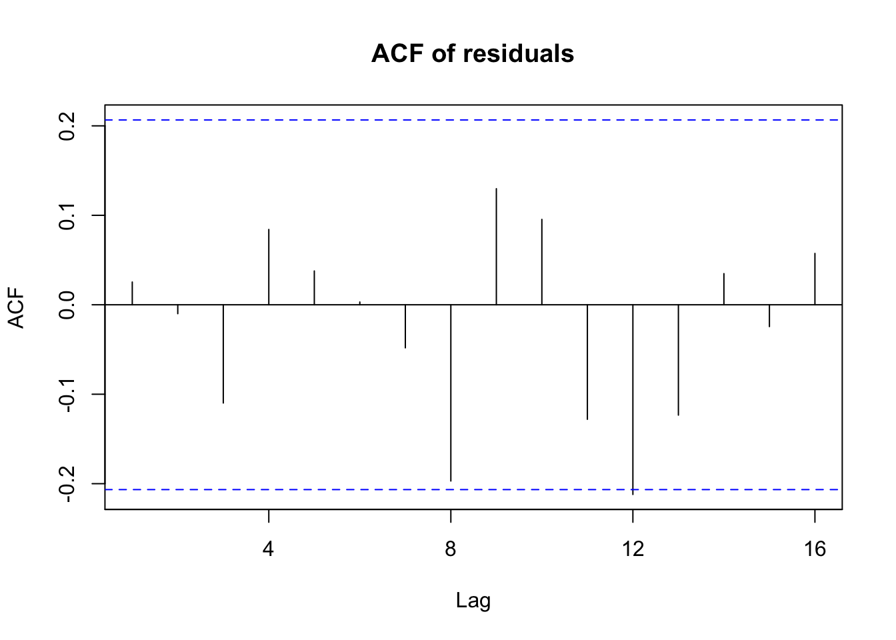

``` r
# Perform Ljung-Box test
lb_test <- Box.test(model_residuals, lag = resid_lagmax, type = "Ljung-Box", 
                    fitdf = length(final_model$coef))
cat("\nLjung-Box test p-value:", round(lb_test$p.value, 3), "\n")
```

```
## 
## Ljung-Box test p-value: 0.176
```

``` r
# --- Extended Ljung-Box Test ---
cat("\nExtended Ljung-Box Test for multiple lags:\n")
```

```
## 
## Extended Ljung-Box Test for multiple lags:
```

``` r
lags_to_test <- c(4, 8, 12, 16, 20)
lb_results <- data.frame(Lag=integer(), "Q-statistic"=double(), "p-value"=double())
for (l in lags_to_test) {
  test <- Box.test(model_residuals, type = "Ljung-Box", lag = l, fitdf = length(final_model$coef))
  lb_results[nrow(lb_results) + 1,] <- c(l, round(test$statistic, 3), round(test$p.value, 3))
}
print(lb_results)
```

```
##   Lag Q.statistic p.value
## 1   4       1.899   0.168
## 2   8       6.190   0.288
## 3  12      15.344   0.082
## 4  16      17.546   0.176
## 5  20      23.709   0.128
```

``` r
# --- McLeod-Li Test ---
cat("\nExtended McLeod-Li Test for multiple lags:\n")
```

```
## 
## Extended McLeod-Li Test for multiple lags:
```

``` r
ml_results <- data.frame(
  Lag = integer(),
  p_value = numeric()
)

for (l in lags_to_test) {
  test <- TSA::McLeod.Li.test(y = model_residuals, gof.lag = l)
  pval <- test$p.values[l] # Extract p-value for the current lag
  ml_results[nrow(ml_results) + 1, ] <- c(l, round(pval, 3)) # Append row: lag and p-value
}
```

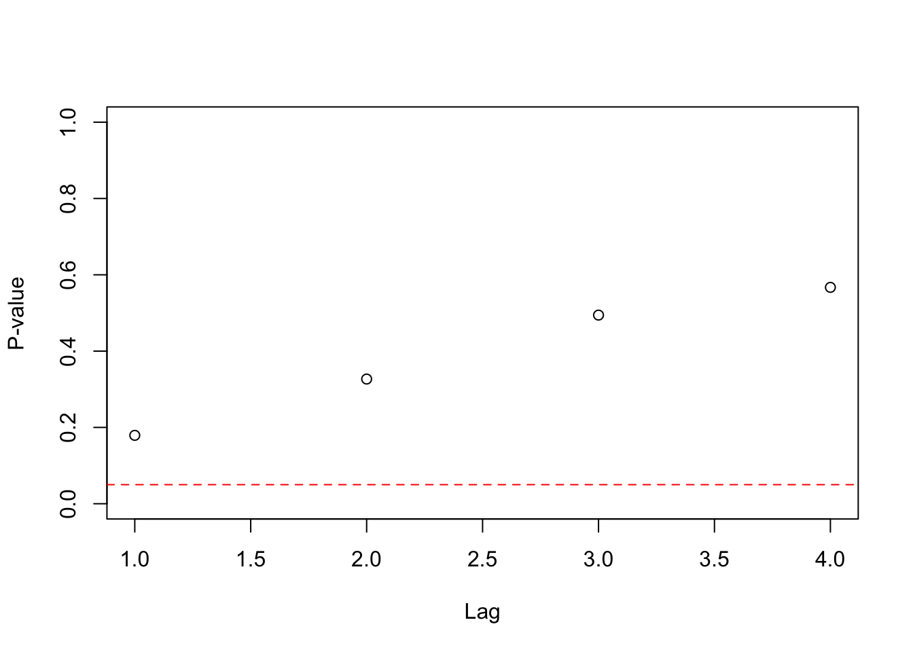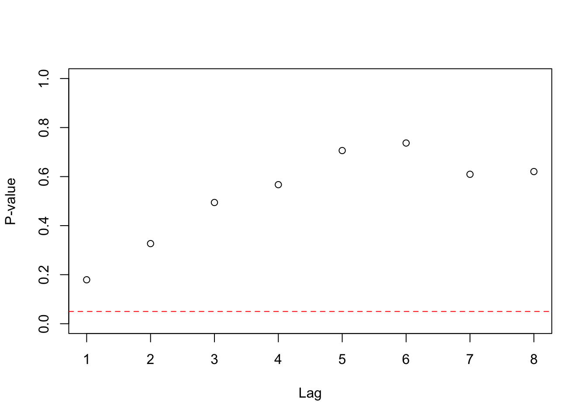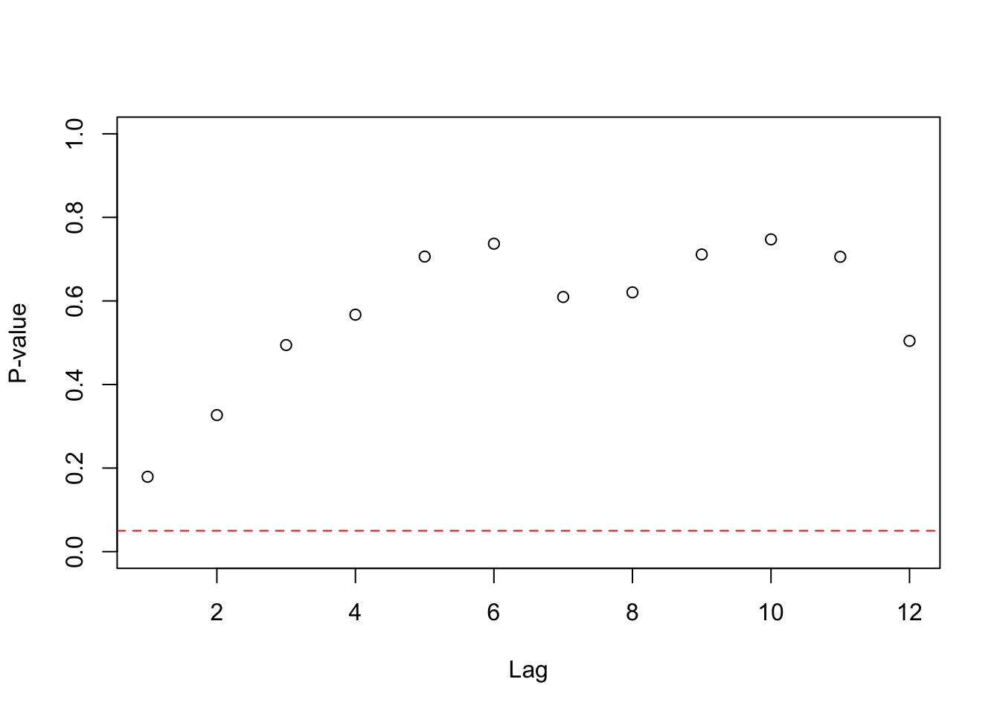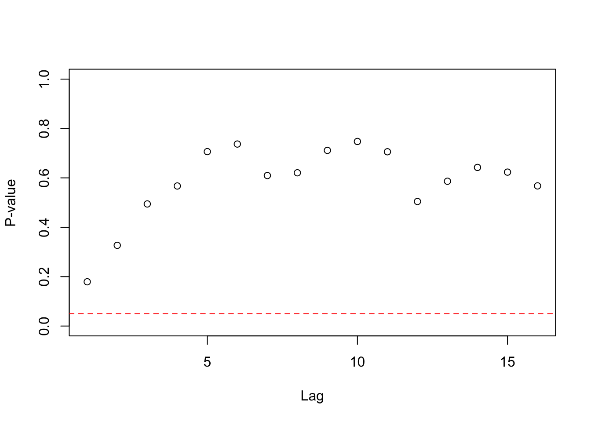

``` r
print(ml_results) # This package does not print out the values of the test 
```

```
##   Lag p_value
## 1   4   0.567
## 2   8   0.621
## 3  12   0.504
## 4  16   0.567
## 5  20   0.472
```

``` r
                  # statistic (only p-values)
```
</div>


&nbsp;
